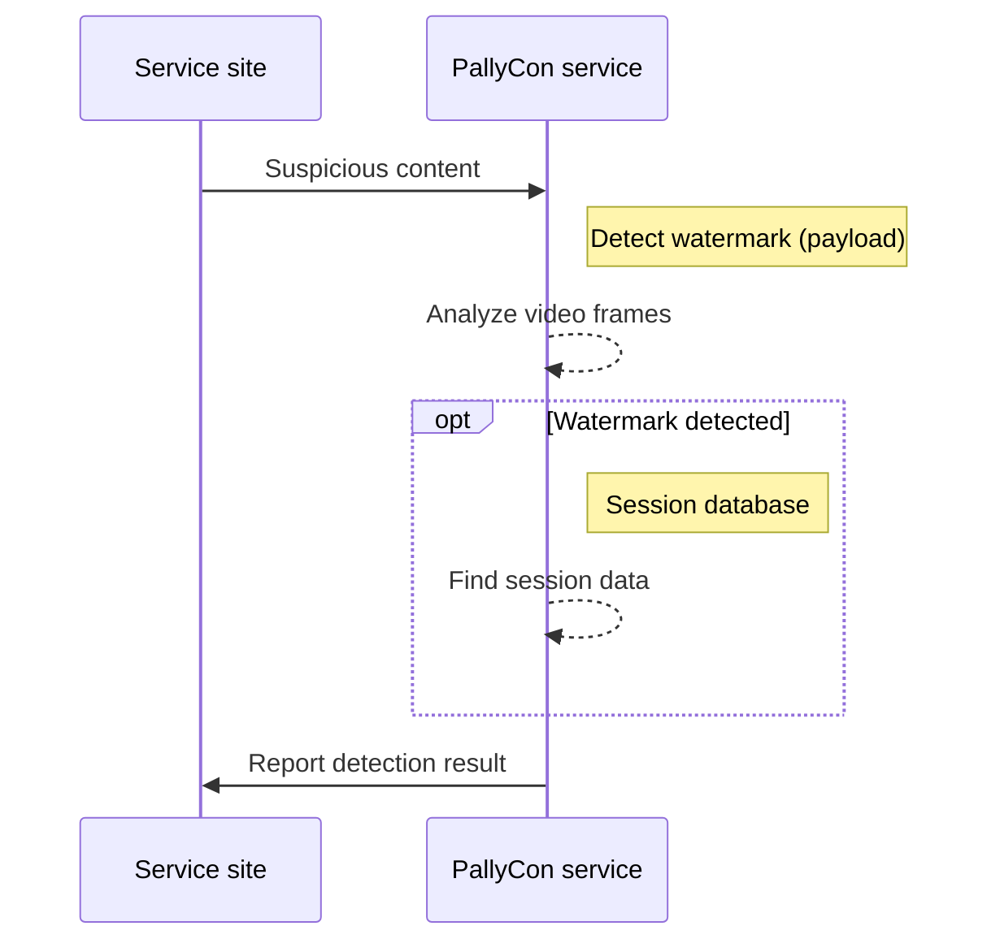

# Watermark Detecting

If the watermarked video is leaked and distributed illegally, you can request the PallyCon service to detect the suspicious content. Watermark detection analyzes each frame of the video to detect the original watermark pattern and decrypts the data with the secret key used at the time of insertion.

If the watermark payload is found through the detection process, the session database finds the session information whose key value is the payload and reports it as the detection result.

Please contact us for detailed information on watermark detection service.

<a href="https://www.pallycon.com/contact/" target="_blank" class="btn btn-default">Contact Us</a>

***