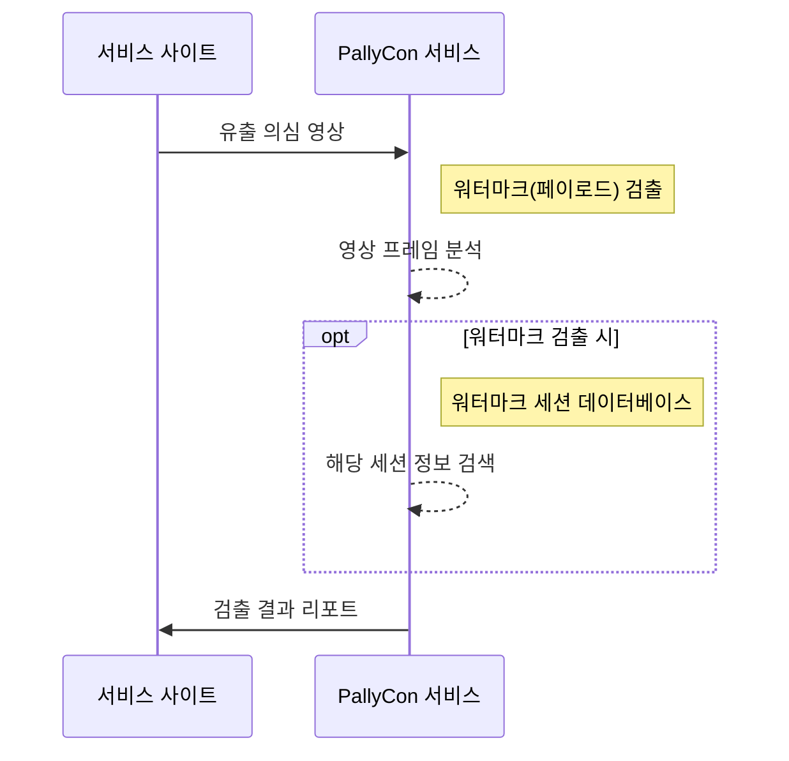

---
# Course title, summary, and position.
linktitle: 4. 워터마크 검출
summary: 워터마크 검출은 영상의 각 프레임을 분석하여 원본 워터마크 패턴을 감지하고, 삽입 시 사용한 비밀 키로 데이터를 해독합니다.
weight: 40

# Page metadata.
title: 워터마크 검출
date: "2018-09-09T00:00:00Z"
lastmod: "2020-10-18T00:00:00Z"
draft: false  # Is this a draft? true/false
toc: false  # Show table of contents? true/false
type: book  # Do not modify.

# Add menu entry to sidebar.
# - name: Declare this menu item as a parent with ID `name`.
# - weight: Position of link in menu.
menu:
  watermarking:
    weight: 40
    parent: 포렌식 워터마킹
    name: 워터마크 검출
---

워터마킹된 영상이 유출되어 불법 배포되는 경우, 유출이 의심되는 영상을 PallyCon 서비스에 검출 의뢰할 수 있습니다. 워터마크 검출은 영상의 각 프레임을 분석하여 원본 워터마크 패턴을 감지하고, 삽입 시 사용한 비밀 키로 데이터를 해독합니다.

검출 과정을 통해 워터마크 페이로드를 찾아내면, 세션 데이터베이스에서 해당 페이로드를 키 값으로 하는 세션 정보를 찾아 검출 결과로 리포트합니다.

워터마크 검출 서비스에 대한 상세 안내는 별도 문의해 주시기 바랍니다.

<a href="https://www.pallycon.com/contact/?lang=ko" target="_blank" class="btn btn-primary">문의하기</a>
