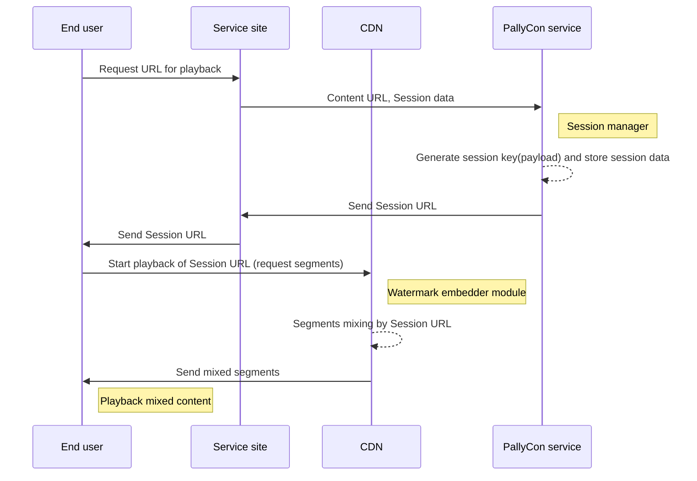

---
# Course title, summary, and position.
linktitle: 3. Watermark Embedding
summary: This document describes how to embed unique information about the playback session invisibly in the video.
weight: 30

# Page metadata.
title: Watermark Embedding
date: "2018-09-09T00:00:00Z"
lastmod: "2020-10-18T00:00:00Z"
draft: false  # Is this a draft? true/false
toc: false  # Show table of contents? true/false
type: book  # Do not modify.

# Add menu entry to sidebar.
# - name: Declare this menu item as a parent with ID `name`.
# - weight: Position of link in menu.
menu:
  watermarking:
    weight: 30
    parent: Forensic Watermarking
    name: Watermark Embedding
---

PallyCon Forensic Watermarking combines two versions of videos marked '0' and '1' in real-time at playback. It converts session information, such as user ID, to binary format, and thus composes the output stream by combining segments from the DASH or HLS content.

As a result, unique information about the playback session is inserted invisibly in the video and sent to the client.

> The segment list of the DASH manifest (.mpd) or HLS playlist (.m3u8) passed as a Session URL applies the same path and filename to all users, regardless of session information. Therefore, it is **safe from segment naming attack** which is mixing the segment lists of multiple sessions for the same content.

You can use the following documents to integrate the watermark embedder module with the session manager API.

  

    

      

        <h3 class="card-title">Session Manager API Guide</h3>
        
This document describes how to integrate the session URL for the watermark embedding through PallyCon session manager API.

        <a href="./session-manager/" class="btn btn-primary">Read More</a>
      

    

  

  

    

      

        <h3 class="card-title">CloudFront CDN Embedder Module</h3>
        
This document describes the Lambda@Edge embedder module that works with Amazon CloudFront CDN.

        <a href="./cloudfront-embedder/" class="btn btn-primary">Read More</a>
      

    

  

