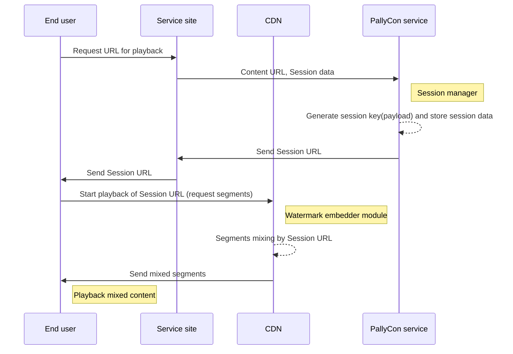

# Watermark Embedding

PallyCon Forensic Watermarking combines two versions of videos marked '0' and '1' in real-time at playback. It converts session information, such as user ID, to binary format, and thus composes the output stream by combining segments from the DASH or HLS content.

As a result, unique information about the playback session is inserted invisibly in the video and sent to the client.

> The segment list of the DASH manifest (.mpd) or HLS playlist (.m3u8) passed as a Session URL applies the same path and filename to all users, regardless of session information. Therefore, it is **safe from segment naming attack** which is mixing the segment lists of multiple sessions for the same content.

You can use the following documents to integrate the watermark embedder module with the session manager API.

<article class="card">
    

        <h3>Session Manager API Guide</h3>
        This document describes how to integrate the session URL for the watermark embedding through PallyCon session manager API.

        <a href="" target="_self" class="btn btn-default">Read More</a>
    

</article>
<article class="card">
    

        <h3>CloudFront CDN Embedder Module</h3>
        This document describes the Lambda@Edge embedder module that works with Amazon CloudFront CDN.

        <a href="" target="_self" class="btn btn-default">Read More</a>
    

</article>

***