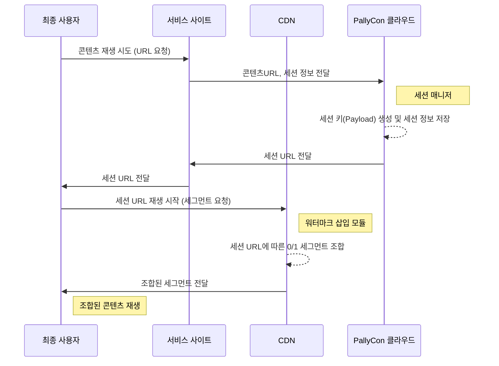

---
# Course title, summary, and position.
linktitle: 3. 워터마크 삽입
summary: 재생 세션에 대한 고유 정보를 영상에 보이지 않게 삽입하는 방법에 대해서 설명합니다.
weight: 30

# Page metadata.
title: 워터마크 삽입
date: "2018-09-09T00:00:00Z"
lastmod: "2020-10-18T00:00:00Z"
draft: false  # Is this a draft? true/false
toc: false  # Show table of contents? true/false
type: book  # Do not modify.

# Add menu entry to sidebar.
# - name: Declare this menu item as a parent with ID `name`.
# - weight: Position of link in menu.
menu:
  watermarking:
    weight: 30
    parent: 포렌식 워터마킹
    name: 워터마크 삽입
---

PallyCon 포렌식 워터마킹은 '0'과 '1'로 각각 마크된 두 가지 버전(A/B Variants)의 영상을 재생 시점에 실시간으로 조합합니다. 사용자 ID와 같은 세션 정보를 이진 형식으로 변환하고, 이에 따라 DASH 또는 HLS 스트림의 세그먼트를 조합하여 출력 스트림을 구성합니다.

결과적으로 재생 세션에 대한 고유 정보가 영상에 보이지 않게 삽입되어 클라이언트에 전송됩니다.

> 세션 URL로 전달되는 DASH manifest(.mpd )또는 HLS playlist(.m3u8)의 세그먼트 목록은 세션 정보와 무관하게 모든 사용자에 동일한 경로 및 파일명이 적용됩니다. 따라서 동일 콘텐츠를 대상으로 여러 세션의 세그먼트 목록을 조합해 워터마킹을 무력화하는 **세그먼트 네이밍 공격으로부터 안전하게 보호**됩니다.

아래 문서들을 참고하여 워터마크 삽입에 필요한 세션 매니저 API와 워터마크 삽입 모듈을 연동할 수 있습니다.

  

    

      

        <h3 class="card-title">세션 매니저 API 가이드</h3>
        
본 문서는 PallyCon 세션 매니저 API를 통하여 워터마크 삽입에 필요한 세션 URL을 연동하는 방법을 설명합니다. 

        <a href="./session-manager/" class="btn btn-primary">바로가기</a>
      

    

  

  

    

      

        <h3 class="card-title">CloudFront 워터마크 삽입 모듈 가이드</h3>
        
본 문서는 Amazon CloudFront CDN에 연동되는 Lambda@Edge 방식의 워터마크 삽입 모듈에 대하여 설명합니다. 

        <a href="./cloudfront-embedder/" class="btn btn-primary">바로가기</a>
      

    

  

