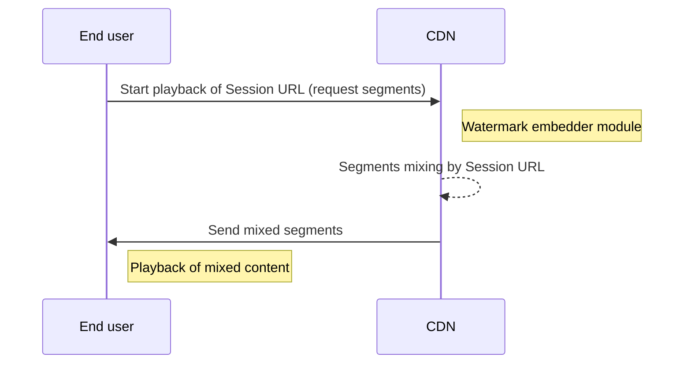

---
# Course title, summary, and position.
linktitle: CloudFront CDN Embedder
summary: This document describes how to apply PallyCon watermark embedder with Lambda@Edge for service sites using the Amazon CloudFront CDN.
weight: 20

# Page metadata.
title: CloudFront CDN Watermark Embedder Guide
date: "2018-09-09T00:00:00Z"
lastmod: "2020-10-18T00:00:00Z"
draft: false  # Is this a draft? true/false
toc: true  # Show table of contents? true/false
type: book  # Do not modify.

# Add menu entry to sidebar.
# - name: Declare this menu item as a parent with ID `name`.
# - weight: Position of link in menu.
menu:
  watermarking:
    weight: 20
    parent: Watermark Embedding
---

## Overview

This document describes how to apply PallyCon watermark embedder with Lambda@Edge for service sites using the Amazon CloudFront CDN.



The source files needed for setting up Lambda@Edge can be downloaded from the [Sample download page](../../getting-started/fwm-downloads).

## Create Lambda@Edge

- Connect to the AWS console, select the lambda menu, and click the `create function` button.
- Select region to `N. Virginia`. (Lambda@Edge must be created in the Virginia Region.)

### 1. Select runtime

- Choose `Node.js 6.10` as runtime.

### 2. Set roles

- Select `Create a custom role`.

- Create a Role by adding the permissions `lambda:GetFunction`, `lambda:EnableReplication*`, `iam:CreateServiceLinkedRole`, `cloudfront:UpdateDistribution`, and `cloudfront:CreateDistribution` as explained in [CloudFront Guide](https://docs.aws.amazon.com/ko_kr/AmazonCloudFront/latest/DeveloperGuide/lambda-edge-permissions.html).

- Add logs related permission to collect Lambda access log into cloudwatch logs.
    ```json
    {
        "Effect": "Allow",
        "Action": [
            "logs:CreateLogGroup",
            "logs:CreateLogStream",
            "logs:PutLogEvents"
        ],
        "Resource": "arn:aws:logs:*:*:*"
    }
    ```

- Add the following roles to the `Trust Relationship` tab of the created Role.
    ```json
    { 
        "Version": "2012-10-17",
        "Statement": [
            {
                "Effect": "Allow",
                "Principal": { 
                    "Service": [
                        "lambda.amazonaws.com", 
                        "edgelambda.amazonaws.com" 
                    ] 
                }, 
                "Action": "sts:AssumeRole"
            } 
        ] 
    }
    ```

- Apply the generated role to the lambda role.

### 3. Upload function

- Click `Create Function` button to create lambda.

- Select `Upload a .ZIP file` of `Function Code` - `Code entry Type` and add the lambda source downloaded from Console site.

- Click the `Save` button to upload the source and modify the uploaded source via Cloud9.

### 4.  Modify function source

> Please be aware that if you modify a source other than those listed below, an error may occur.

- Set the value of the corresponding variable in the table below.

    | Source Line | Name | Required | Description |
    | :--- | :-- | :-- | :------------ |
    | 3 | AVAILABLE_INTERVAL | True | The URL requested for watermarking contains a timestamp value. This item is the value for checking the validity of the timestamp. <br/> If set to 0, the timestamp validity period is not checked. <br/> Unit: (minutes) |
    | 4 | AES_KEY | True | Enter the site key value provided by the PallyCon console site. |

- After saving, click `Publish new version` of `Action` button to create version.

- Copy the ARN containing the generated version. It is displayed in the upper right corner.
    - e.g. arn:aws:lambda:us-east-1:{account no.}:function:{lambda name}:{version}

## Configure CloudFront

This guide assumes that you already created your CloudFront.

### Apply Lambda@Edge

Connect to the AWS console, select the `CloudFront` menu and select CloudFront to apply Lambda@Edge.

#### 1. Set Behaviors

- Select the `Behaviors` tab, check the check box displayed and click the Edit button.

- Configure `Lambda Function Associations` items.
	- EventType : select `Viewer Request`
	- Lambda Function ARN : input the ARN copied during Lambda@Edge creation process.

- Click the `Yes, Edit` button.

#### 2. Finish configuration

The status of CloudFront is changed to `InProgress`, and when Lambda@Edge is applied, status is changed to `Deployed` and all settings are completed.

> For more information about Lambda@Edge, please refer to [CloudFront guide](https://docs.aws.amazon.com/ko_kr/AmazonCloudFront/latest/DeveloperGuide/lambda-at-the-edge.html) from AWS.
