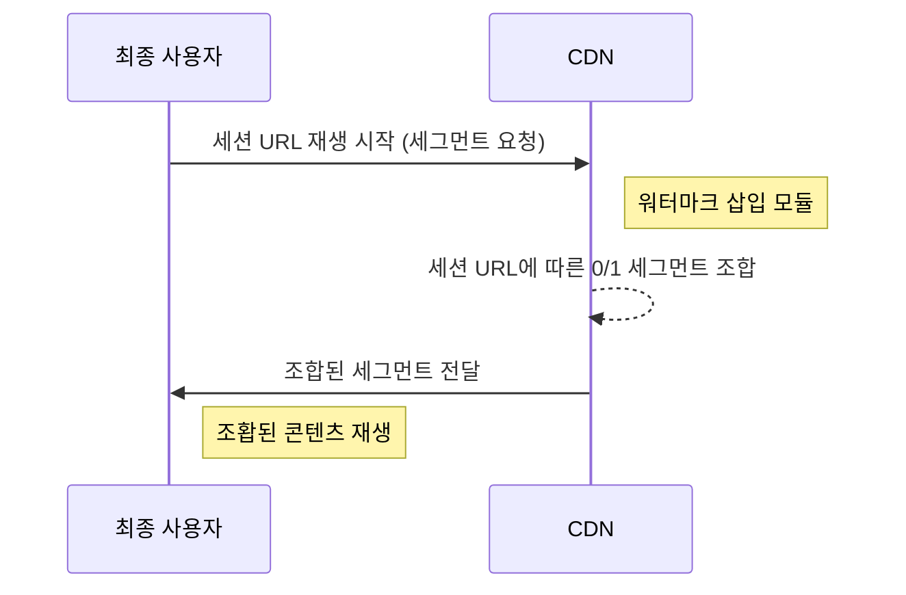

---
# Course title, summary, and position.
linktitle: CloudFront 워터마크 삽입
summary: 
weight: 20

# Page metadata.
title: CloudFront 워터마크 삽입 가이드
date: "2018-09-09T00:00:00Z"
lastmod: "2020-10-18T00:00:00Z"
draft: false  # Is this a draft? true/false
toc: true  # Show table of contents? true/false
type: book  # Do not modify.

# Add menu entry to sidebar.
# - name: Declare this menu item as a parent with ID `name`.
# - weight: Position of link in menu.
menu:
  watermarking:
    weight: 20
    parent: 워터마크 삽입
---

본 문서에서는 Amazon CloudFront CDN을 사용하는 서비스 사이트를 위해 CloudFront용 워터마크 삽입 모듈을 Lambda@Edge로 적용하는 방법에 대하여 설명합니다.



Lambda@Edge 설정에 필요한 소스 파일은 [샘플 다운로드 페이지](../../getting-started/fwm-downloads)에서 다운로드 받을 수 있습니다.

## Lambda@Edge 생성

- AWS console 에 접속하여 lambda 메뉴 선택 후 `create function` 버튼을 클릭합니다.
- Region을 `N. Virginia`로 선택합니다. (Lambda@Edge는 Virginia Region에 생성해야 사용 가능합니다.)

### 1. Runtime 설정

- `Node.js 6.10`을 선택합니다.

### 2. Role 설정

- `Create a custom role`을 선택하여 role을 생성합니다.

- [CloudFront 가이드](https://docs.aws.amazon.com/ko_kr/AmazonCloudFront/latest/DeveloperGuide/lambda-edge-permissions.html)
에 설명되어 있는대로 `lambda:GetFunction`, `lambda:EnableReplication*`, `iam:CreateServiceLinkedRole`, `cloudfront:UpdateDistribution`, `cloudfront:CreateDistribution` 권한을 추가하여 Role을 생성합니다.

- Lambda access log를 cloudwatch logs로 수집하기 위해 logs 관련 권한을 추가합니다.
    ```json
    {
        "Effect": "Allow",
        "Action": [
            "logs:CreateLogGroup",
            "logs:CreateLogStream",
            "logs:PutLogEvents"
        ],
        "Resource": "arn:aws:logs:*:*:*"
    }
    ```

- 생성한 role의 `Trust Relationship` 탭에 아래 역할을 추가합니다.
    ```json
    { 
        "Version": "2012-10-17",
        "Statement": [
            {
                "Effect": "Allow",
                "Principal": { 
                    "Service": [
                        "lambda.amazonaws.com", 
                        "edgelambda.amazonaws.com" 
                    ] 
                }, 
                "Action": "sts:AssumeRole" 
            } 
        ] 
    }
    ```

- 생성한 role을 lambda role에 적용 시킵니다.

### 3. Function 업로드

- `Create Function` 버튼을 클릭하여 lambda를 생성합니다.

- `Function Code` - `Code entry Type` 을 `Upload a .ZIP file`로 선택하고 콘솔 사이트에서 다운로드 받은 lambda 소스를 추가합니다.

- `Save` 버튼을 클릭하면 소스가 업로드되고, Cloud9을 통해 업로드 된 소스 수정이 가능합니다.

### 4. Function 소스 수정

> 아래 안내된 부분 이외의 소스를 수정할 경우, 오류가 발생할 수 있으니 주의하시기 바랍니다.

- 아래 테이블에 해당하는 변수의 값을 설정합니다.

    | Source Line | Name | Required | Description |
    | :--- | :-- | :-- | :------------ |
    | 3 | AVAILABLE_INTERVAL | True | 워터마크 적용을 위해 요청된 URL에는 timestamp 값이 포함되어 있습니다. 본 항목은 해당 timestamp의 유효 기간을 체크하기 위한 값입니다. <br/>0으로 설정할 경우 timestamp 유효 기간을 체크하지 않습니다.<br/> 단위: (분) |
    | 4 | AES_KEY | True | PallyCon 콘솔 사이트에서 제공하는 사이트 키 값을 입력합니다. |

- 저장한 후 `Action` 버튼의 `Publish new version`을 클릭하여 version을 생성합니다.

- 생성된 version이 포함된 ARN을 복사해 놓습니다. 우측 상단에 표시됩니다.
    - 예) arn:aws:lambda:us-east-1:{계정넘버}:function:{lambda이름}:{version}

## CloudFront 설정

CloudFront는 이미 생성되어 있다는 가정 하에 Lambda@Edge를 적용하는 방법을 가이드 합니다.

### Lambda@Edge 적용

AWS console 에 접속하여 `CloudFront` 메뉴 선택 후 lambda@Edge를 적용시킬 CloudFront를 선택합니다.

#### 1. Behaviors 설정

- `Behaviors` 탭을 선택 후 표시된 체크박스에 체크를 한 후에 Edit 버튼을 클릭합니다.

- `Lambda Function Associations` 항목을 세팅합니다.
	- EventType : `Viewer Request` 선택
	- Lambda Function ARN : Lambda@Edge 생성 과정에서 복사해 놓았던 ARN 입력

- `Yes, Edit` 버튼을 클릭합니다.

#### 2. 설정 완료

CloudFront의 Status가 `InProgress` 상태로 변경되며, Lambda@Edge가 적용이 완료되면 `Deployed`로 상태가 변경이 되고 모든 설정이 완료됩니다.

> 자세한 Lambda@Edge 관련 내용은 AWS 에서 제공하는 [CloudFront 가이드](https://docs.aws.amazon.com/ko_kr/AmazonCloudFront/latest/DeveloperGuide/lambda-at-the-edge.html)를 참조하시기 바랍니다.
