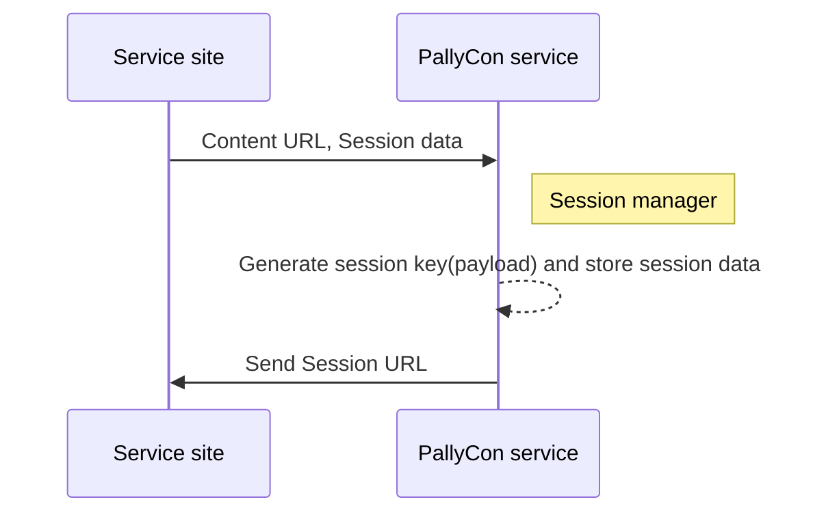

After pre-processing of watermark, the '0' and '1' versions of content (DASH or HLS) are mixed in real time and delivered to the client on the user's playback request. PallyCon Forensic Watermarking service provides the session manager which generates the mixed content URL with the information of the playback session.

The service site can stream the mixed content to the client according to the mixed URL through CDN integration such as Amazon CloudFront and Akamai CDN.  



The session manager API uses the following common specifications:

## PallyCon HTTP API Specification

The HTTP API requests used by the PallyCon service follow the specifications below.

> Please find the API request sample code in [Packager and Sample Download page]({}).

### Request

|Param key|Value|
|---|---|
|pallycon-apidata|base64 Encoding ( JSON string )|

#### Request Data JSON Format

```json
{
    "data":"{base64 encode(aes256 cbc encrypt(API data))}",
    "timestamp":"{yyyy-mm-ddThh:mm:ssZ}",
    "hash":"{base64 encode(sha256(message format))}"
}
```

**Request Data Specification**

| Name | Value | Required | Description |
| ---- | ----- | ---- | -------------- |
| `data` | String | Y | AES encryption on the JSON string generated by the specification for each API, and the result value is input as a base64 string. |
| `timestamp` | String | Y | Enter the time of the request at the GMT time zone in "yyyy-mm-ddThh: mm: ssZ" format. |
| `hash` | String | Y | Enter the hash value generated according to the following specification. |

**AES256 Encryption**

Aes256 encryption / decryption processing is performed as below using the site key value issued when joining PallyCon service. (Check PallyCon Console site)

- mode : CBC
- AES key : 32 byte (Site key issued from PallyCon Console site)
- AES IV : fixed 16 byte (0123456789abcdef)
- padding : pkcs7

**SHA256 message Format**

The input value of the SHA256 hash is a combination of the following strings.

```s
[site access key] + [site_id] + [json.data] + [json.timestamp]
```
  - site access key: It is the access key value that is issued when creating PallyConsole Cloud service site. It can be checked on the PallyCon Console page.
  - The resulting value of the sha256 hash function must be entered into the base64 function as a binary data, not as a string.

## CloudFront Session URL Request API {#cloudfront-session-url-api}

An API that receives the session URL to play on the client. The input values of the request are the URL of the watermark preprocessing result and the session information (forensic mark) to be inserted as a forensic watermark of the stream.

### Request

- Called by PallyCon HTTP API specification
- URL : `watermark.pallycon.com/api/v2/session/watermarkUrl/{site_id}`
- Method: GET

> You need to replace 'site_id' part with your siteID issued by PallyCon console.

### API Data JSON Format

```json
{
    "domain": {domain},
    "output_path": {output_path},
    "cid": {cid},
    "streaming_format": {streaming_format},
    "forensic_mark": {forensic_mark}
}
```

**API data specification**

| Name | Value | Required | Description |
| ---- | ----- | ---- | -------------- |
| `domain` | String | Y | Domain of content URL (e.g. cdn.yoursite.com) |
| `output_path` | String | Y | The output_path that was entered when requesting watermark packaging|
| `cid` | String | Y | Unique content ID |
| `streaming_format` | String | Y | Streaming protocol ("dash" or "hls")|
| `forensic_mark` | String | Y | Session data to be inserted as watermark (such as end user ID, device info, etc.), max 254 byte alphanumeric characters |

### Response

#### Response Data JSON Format

```json
{
    "error_code": {error_code},
    "error_message": {message},
    "data": {watermark_url}
}
```

**Response data specification**

| Name | Value | Required | Description |
| ---- | ---- | --- | -------------- |
| error_code | String | Y | "0000" if succeeded, alphanumeric error code if failed |
| error_message | String | Y | Error message |
| data | String | N | If succeeded, returns the Session URL<p>Please see below for detailed Session URL format |

- Session URL format: `<content CDN domain>/dldzkdpsxmdnjrtm/<encrypted payload>/<output_path>/<cid>/<stream format>/<manifest file>`

- Session URL specification

    | Item | Description |
    | ---- | ------ |
    | `content CDN domain` | Domain name of content's CDN. Set based on the domain in the request data |
    | `dldzkdpsxmdnjrtm` | Pre-defined keyword |
    | `encrypted payload` | Encrypted session key (payload) |
    | `output_path` | Path of the packaging output on the storage. |
    | `cid` | Unique ID of the content (ContentID) |
    | `stream format` | Streaming protocol of content. ('dash' or 'hls') |
    | `manifest file` | Manifest filename ('stream.mpd' or 'master.m3u8') |

## Akamai Session URL Request API {#akamai-session-url-api}

An API that receives the session URL to play on the client. The input values of the request are the URL of the watermark preprocessing result and the session information (forensic mark) to be inserted as a forensic watermark of the stream.

### Request

- Called by PallyCon HTTP API specification
- URL : `https://watermark.pallycon.com/api/v2/session/watermarkUrl/akamai/{site_id}`
- Method: GET

> You need to replace 'site_id' part with your siteID issued by PallyCon console.

### API Data JSON Format

```json
{
    "domain": {domain},
    "output_path": {output_path},
    "cid": {cid},
    "streaming_format": {streaming_format},
    "forensic_mark": {forensic_mark},
    "skipbit": {skipbit}
}
```

**API data specification**

| Name | Value | Required | Description |
| ---- | ----- | ---- | -------------- |
| `domain` | String | Y | Domain of content URL (e.g. cdn.yoursite.com) |
| `output_path` | String | Y | The output_path that was entered when requesting watermark ackaging |
| `cid` | String | Y | Unique content ID for DRM integration. If the content is non-DRM, input ny string such as 'content'. |
| `streaming_format` | String | Y | Streaming protocol ("dash" or "hls")|
| `forensic_mark` | String | Y | Session data to be inserted as watermark (such as end user ID, evice info, etc.), max 254 byte alphanumeric characters |
| `skipbit` | Long | N | The length of non-watermarked part at the start of the video (default: 4) |

### Response

#### Response Data JSON Format

```json
{
    "error_code": {error_code},
    "error_message": {message},
    "data": {watermark_url}
}
```

**Response data specification**

| Name | Value | Required | Description |
| ---- | ---- | --- | -------------- |
| error_code | String | Y | "0000" if succeeded, alphanumeric error code if failed |
| error_message | String | Y | Error message |
| data | String | N | If succeeded, returns the Session URL<p>Please see below for detailed Session URL format |

- Session URL format: `<content CDN domain>/<WMT>/<output_path>/<cid>/<stream_format>/<manifest_file>`

- Session URL specification

    | Item | Description |
    | ---- | ------ |
    | `content CDN domain` | Domain name of content's CDN. Set based on the domain in the request data |
    | `WMT` | Akamai JWT Token for the watermark integration |
    | `output_path` | Path of the packaging output on the storage. |
    | `cid` | Unique ID of the content for DRM integration |
    | `stream format` | Streaming protocol of content. ('dash' or 'hls') |
    | `manifest file` | Manifest filename ('stream.mpd' or 'master.m3u8') |

### Error code

| Code | Description |
| ---- | -------------- |
| 0000 | Succeeded |
| A1000 | Invalid input parameter |
| A1002 | Invalid timestamp format |
| A1003 | Can not find the site ID |
| A1006 | Failed to decrypt with the site key |
| A1007 | Failed to verify the hash |
| A4002 | Failed to store watermark data |
| A4003 | Failed to create watermark data |
| A5001 | Required to register Akamai certification keys |
| A5002 | Akamai watermark token error |
| A7008 | API data parsing error |
| A7009 | Invalid API version |
| A7010 | Invalid date format |
| A7011 | Failed to create mixed manifest |
| A7012 | Failed to get manifest |
| A7013 | Not supported streaming format |
| A7014 | Invalid properties file key value |
| A7015 | Empty value is not allowed |
| A7016 | forensic_mark must be under 254 bytes | 
| A7017 | Number of session URL API call exceeded trial limit (1,000) |

## Step-by-Step Guide with Example (CloudFront version)

The below guide shows how you can create the API request and get the response.

> Note: The examples shown in this guide are for your reference only. They don't actually work.

### Step 1 - Prepare API Request Data JSON

#### Example JSON for the API data

```json
{
    "domain": "cdn.service-site.com",
    "output_path": "output",
    "cid": "content1",
    "streaming_format": "dash",
    "forensic_mark": "testmark.1234567"
}
```

### Step 2 - AES256 encryption and base64 encoding of the API data

- Where to test : https://www.devglan.com/online-tools/aes-encryption-decryption
- Mode: CBC
- Key size: 256
- IV: 0123456789abcdef
- Secret key: cUk29dLagiJ0FGiK681tFIR75ETESe0S (site key of PallyCon account)

#### Result of step 2

```s
N5CNHHCgEPVDFBpgtHzraqNUzBZoy4pzx3fSDnzHDMek5AMlmWSlII67tNQ2MJP1NL+dSjQZlEnXp7+ATXOopJEdH1KIZ0jNjY19bRLl9aG0gJSsbS6krhNxuuDzLayT/CgPwQUge1hQj1U2xtXSbDFUfiXSFZtJLSlA/QdTwTC5NpxfLjBmtRspPh1AOuKNwgiS9HuJxV9f6NDK22unYvbh8/qnAWWtNTMcjgZMjkU=
```

### Step 3 - Generate hash

- site access key: A3DfypNw0bLgR3FAa5Q2TbS1iiUK4iIf
- site ID: EXPL
- api data: the result from step 2
- timestamp: 2020-05-27T02:15:00Z

#### Combined string before hash

```s
A3DfypNw0bLgR3FAa5Q2TbS1iiUK4iIfEXPLN5CNHHCgEPVDFBpgtHzraqNUzBZoy4pzx3fSDnzHDMek5AMlmWSlII67tNQ2MJP1NL+dSjQZlEnXp7+ATXOopJEdH1KIZ0jNjY19bRLl9aG0gJSsbS6krhNxuuDzLayT/CgPwQUge1hQj1U2xtXSbDFUfiXSFZtJLSlA/QdTwTC5NpxfLjBmtRspPh1AOuKNwgiS9HuJxV9f6NDK22unYvbh8/qnAWWtNTMcjgZMjkU=2020-05-27T02:15:00Z
```

#### Result of step 3

- sha256 + base64 output - where to test: https://hash.online-convert.com/sha256-generator

```s
xsQVqDW04FsO43Y64Gd6EFz0l5zIrebVr1yBWUY+Nuo=
```

***

### Step 4 - Build request data JSON and base64 encode

- 'data': the result of step 2
- 'timestamp': the same timestamp as in step 3
- 'hash': the result of step 3

#### JSON data

```json
{
    "data": "N5CNHHCgEPVDFBpgtHzraqNUzBZoy4pzx3fSDnzHDMek5AMlmWSlII67tNQ2MJP1NL+dSjQZlEnXp7+ATXOopJEdH1KIZ0jNjY19bRLl9aG0gJSsbS6krhNxuuDzLayT/CgPwQUge1hQj1U2xtXSbDFUfiXSFZtJLSlA/QdTwTC5NpxfLjBmtRspPh1AOuKNwgiS9HuJxV9f6NDK22unYvbh8/qnAWWtNTMcjgZMjkU=",
    "timestamp":"2020-05-27T02:15:00Z",
    "hash":"xsQVqDW04FsO43Y64Gd6EFz0l5zIrebVr1yBWUY+Nuo="
}
```

#### Result of step 4 (base64 encoded JSON)

```s
ewogICAgImRhdGEiOiAiTjVDTkhIQ2dFUFZERkJwZ3RIenJhcU5VekJab3k0cHp4M2ZTRG56SERNZWs1QU1sbVdTbElJNjd0TlEyTUpQMU5MK2RTalFabEVuWHA3K0FUWE9vcEpFZEgxS0laMGpOalkxOWJSTGw5YUcwZ0pTc2JTNmtyaE54dXVEekxheVQvQ2dQd1FVZ2UxaFFqMVUyeHRYU2JERlVmaVhTRlp0SkxTbEEvUWRUd1RDNU5weGZMakJtdFJzcFBoMUFPdUtOd2dpUzlIdUp4VjlmNk5ESzIydW5ZdmJoOC9xbkFXV3ROVE1jamdaTWprVT0iLAogICAgInRpbWVzdGFtcCI6IjIwMjAtMDUtMjdUMDI6MTU6MDBaIiwKICAgICJoYXNoIjoieHNRVnFEVzA0RnNPNDNZNjRHZDZFRnowbDV6SXJlYlZyMXlCV1VZK051bz0iCn0=
```

### Step 5 - Call PallyCon API URL with the data

- API URL: https://watermark.pallycon.com/api/v2/session/watermarkUrl/EXPL
- query param key: pallycon-apidata
- param value: the result of step 4

### Combined API URL

```s
https://watermark.pallycon.com/api/v2/session/watermarkUrl/akamai/EXPL?pallycon-apidata=ewogICAgImRhdGEiOiAiTjVDTkhIQ2dFUFZERkJwZ3RIenJhcU5VekJab3k0cHp4M2ZTRG56SERNZWs1QU1sbVdTbElJNjd0TlEyTUpQMU5MK2RTalFabEVuWHA3K0FUWE9vcEpFZEgxS0laMGpOalkxOWJSTGw5YUcwZ0pTc2JTNmtyaE54dXVEekxheVQvQ2dQd1FVZ2UxaFFqMVUyeHRYU2JERlVmaVhTRlp0SkxTbEEvUWRUd1RDNU5weGZMakJtdFJzcFBoMUFPdUtOd2dpUzlIdUp4VjlmNk5ESzIydW5ZdmJoOC9xbkFXV3ROVE1jamdaTWprVT0iLAogICAgInRpbWVzdGFtcCI6IjIwMjAtMDUtMjdUMDI6MTU6MDBaIiwKICAgICJoYXNoIjoieHNRVnFEVzA0RnNPNDNZNjRHZDZFRnowbDV6SXJlYlZyMXlCV1VZK051bz0iCn0=
```

### Response from API server (Final result)

```json
{
    "error_message":"Success",
    "error_code":"0000",
    "url":"https://cdn.service-site.com/dldzkdpsxmdnjrtm/OHVPUw4N4tUoc-wlcA72aX6Hj5a_v-HuXcLAbFwYSpwDDsiVdSLNbWnbjkVvTX20yiKw7U6nOmJzZaDep1_3YJYxfvHzof01IAVgAguBhGk=/output/ddb2b84b-c3ce-4f37-9182-c36f83fc3fce/dash/stream.mpd"
}
```

***
