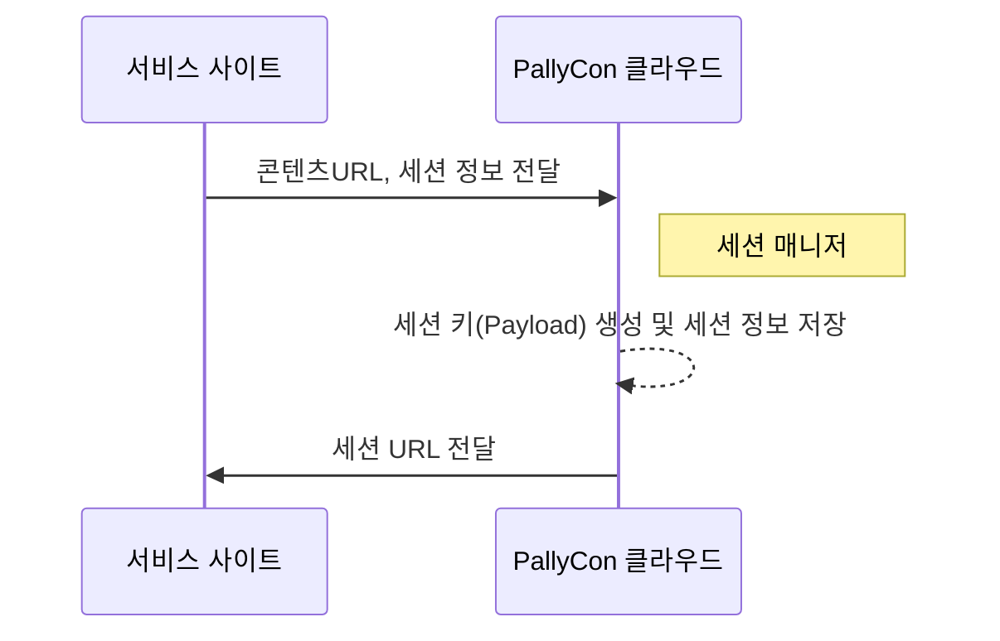

---
# Course title, summary, and position.
linktitle: 세션 매니저 API 가이드
summary: 세션 매니저는 해당 재생 세션의 정보와 조합할 콘텐츠 URL을 입력받아 최종 사용자에게 전달될 세션 URL을 생성합니다. 
weight: 10

# Page metadata.
title: 세션 매니저 API 가이드
date: "2018-09-09T00:00:00Z"
lastmod: "2020-10-18T00:00:00Z"
draft: false  # Is this a draft? true/false
toc: true  # Show table of contents? true/false
type: book  # Do not modify.

# Add menu entry to sidebar.
# - name: Declare this menu item as a parent with ID `name`.
# - weight: Position of link in menu.
menu:
  watermarking:
    weight: 10
    parent: 워터마크 삽입
---

워터마크 전처리를 마친 '0'과 '1' 두 버전의 콘텐츠(DASH 또는 HLS)는 사용자의 재생 요청 시에 실시간으로 조합되어 클라이언트에 전달됩니다. PallyCon 포렌식 워터마킹 서비스에서 제공하는 세션 매니저는 해당 재생 세션의 정보와 조합할 콘텐츠 URL을 입력받아, 최종 사용자에게 전달될 세션 URL을 생성합니다.

서비스 사이트는 아마존 CloudFront 또는 아카마이 CDN의 워터마크 연동을 통해 세션 URL에 따라 조합된 콘텐츠를 클라이언트에 스트리밍할 수 있습니다.



## PallyCon HTTP API 규격

PallyCon 서비스에서 사용하는 각종 HTTP API 요청시 아래 규격을 따릅니다.

> API 요청 규격에 대한 샘플 코드는 [샘플 다운로드 페이지](../../getting-started/fwm-downloads)에서 확인하시기 바랍니다.

### 요청 규격

|Param key|Value|
|---|---|
|pallycon-apidata|base64 Encoding ( JSON string )|

#### 요청 데이터 JSON 포맷

```json
{
    "data":"{base64 encode(aes256 cbc encrypt(API data))}",
    "timestamp":"{yyyy-mm-ddThh:mm:ssZ}",
    "hash":"{base64 encode(sha256(message format))}"
}
```

**요청 데이터 명세**

| <div style="width:80px">Name</div> | <div style="width:60px">Value</div> | <div style="width:60px">Required</div> | Description |
| ---- | ----- | ---- | -------------- |
| `data` | String | Y | 각 API마다 정의된 규격으로 생성한 JSON 문자열을 AES 암호화하고, 결과값을 base64 문자열로 입력 |
| `timestamp` | String | Y | GMT 시간대 기준으로 요청 시점의 시간을 "yyyy-mm-ddThh:mm:ssZ" 포맷으로 입력 |
| `hash` | String | Y | 아래 규격에 따라 생성한 해시값을 입력 |

**AES256 Encryption**

aes256 Encryption/Decryption 처리는 PallyCon Cloud 서비스 사이트 생성 시 발급 되는 Site 키 값을 이용하여 아래와 같이 처리 합니다. ( PallyCon 콘솔 사이트에서 확인 )

  - mode : CBC
  - AES key : 32 byte (PallyCon 콘솔 사이트에서 발급 되는 site key)
  - AES IV : fixed 16 byte (0123456789abcdef)
  - padding : pkcs7

**SHA256 message Format**

SHA256 해시의 입력값은 다음과 같은 문자열을 조합해 입력합니다.

  ```s
  [site access key] + [site_id] + [json.data] + [json.timestamp]
  ```

  - site access key: PallyCon Cloud 서비스 사이트 생성 시 발급 되는 access key 값이며 PallyCon 콘솔 사이트에서 확인 가능합니다.
  - sha256 해시 함수의 결과 값은 문자열로 변환하지 않고 바이너리 데이터 형태 그대로 base64 함수에 입력되어야 합니다.

## CloudFront용 세션 URL 요청 API {#cloudfront-session-url-api}

클라이언트에서 재생할 세션 URL을 받아오는 API입니다. 패키징 단계에서 A/B로 전처리된 결과물의 URL과 워터마크로 삽입될 세션 정보(forensic mark)를 입력값으로 전달합니다.

### 요청 규격

- PallyCon HTTP API 규격으로 호출
- URL : `https://watermark.pallycon.com/api/v2/session/watermarkUrl/{site_id}`
- Method: GET

> URL의 'site_id' 부분은 PallyCon 콘솔 사이트에서 발급된 실제 사이트 ID를 입력해야 합니다.

#### API 데이터 JSON 포맷

```json
{
    "domain": {domain},
    "output_path": {output_path},
    "cid": {cid},
    "streaming_format": {streaming_format},
    "forensic_mark": {forensicmark}
} 
```

**API 데이터 명세**

| <div style="width:120px">Name</div> | <div style="width:60px">Value</div> | <div style="width:60px">Required</div> | Description |
| ---- | ----- | ---- | -------------- |
| `domain` | String | Y | 재생할 콘텐츠 URL의 도메인 부분 (예: cdn.yoursite.com) |
| `output_path` | String | Y | 워터마크 패키징 요청 시 입력하였던 output_path |
| `cid` | String | Y | 콘텐츠의 고유 ID |
| `streaming_format` | String | Y | 콘텐츠의 스트리밍 유형 (dash 또는 hls)|
| `forensic_mark` | String | Y | 워터마크로 적용될 세션 데이터 (사용자 ID, 클라이언트 정보 등), 최대 254 byte, 영문 또는 숫자만 입력 가능|

### 응답 규격

#### 응답 데이터 JSON 포맷

```json
{
    "error_code": {error_code},
    "error_message": {message},
    "data": {watermark_url}
} 
```

**응답 데이터 명세**

| Name | Value | Required | Description |
| ---- | ---- | --- | -------------- |
| error_code | String | Y | "0000" : 성공, 에러인 경우 영문/숫자로 정의된 에러코드 |
| error_message | String | Y | 에러 메세지 내용|
| data | String | N | 성공한 경우, 변환된 세션 URL (워터마크 URL) 리턴<p>세션 URL 포맷: 아래 설명 참조 |

- 세션 URL 포맷: `<content CDN domain>/dldzkdpsxmdnjrtm/<encrypted payload>/<output_path>/<cid>/<stream format>/<manifest file>`

- 세션 URL 구성

    | 항목 | 설명 |
    | ---- | ------ |
    | `content CDN domain` | 콘텐츠를 서비스하는 CDN의 도메인명. 요청 데이터의 도메인 값을 기준으로 설정됨 |
    | `dldzkdpsxmdnjrtm` | 미리 정의된 고정 키워드 |
    | `encrypted payload` | 세션 매니저에서 생성된 세션 키(Payload)를 암호화한 데이터 |
    | `output_path` | 콘텐츠가 저장된 경로. 요청 데이터의 콘텐츠 URL을 기준으로 설정됨 |
    | `cid` | 콘텐츠의 고유 ID (ContentID) |
    | `stream foramt` | 콘텐츠의 스트리밍 유형에 따라 'dash' 또는 'hls' 입력됨 |
    | `manifest file` | 스트리밍 유형에 따라 'stream.mpd' 또는 'master.m3u8' 입력됨 |

## 아카마이 세션 URL 요청 API {#akamai-session-url-api}

클라이언트에서 재생할 세션 URL을 받아오는 API입니다. 패키징 단계에서 A/B로 전처리된 결과물의 URL과 워터마크로 삽입될 세션 정보(forensic mark)를 입력값으로 전달합니다.

### 요청 규격

- PallyCon HTTP API 규격으로 호출
- URL : `https://watermark.pallycon.com/api/v2/session/watermarkUrl/akamai/{site_id}`
- Method: GET

> URL의 'site_id' 부분은 PallyCon 콘솔 사이트에서 발급된 실제 사이트 ID를 입력해야 합니다.

#### API 데이터 JSON 포맷

```json
{
    "domain": {domain},
    "output_path": {output_path},
    "cid": {cid},
    "streaming_format": {streaming_format},
    "forensic_mark": {forensic_mark},
    "skipbit": {skipbit}
}
```

**API 데이터 명세**

| <div style="width:120px">Name</div> | <div style="width:60px">Value</div> | <div style="width:60px">Required</div> | Description |
| ---- | ----- | ---- | -------------- |
| `domain` | String | Y | 재생할 콘텐츠 URL의 도메인 부분 (예: cdn.yoursite.com) |
| `output_path` | String | Y | 워터마크 패키징 요청 시 입력하였던 output_path |
| `cid` | String | Y | 콘텐츠의 고유 ID |
| `streaming_format` | String | Y | 콘텐츠의 스트리밍 유형 (dash 또는 hls)|
| `forensic_mark` | String | Y | 워터마크로 적용될 세션 데이터 (사용자 ID, 클라이언트 정보 등), 최대 254 byte, 영문 또는 숫자만 입력 가능|
| `skipbit` | Long | N | 비디오 시작 시 워터마크되지 않는 부분의 길이 (기본값: 4) |

### 응답 규격

#### 응답 데이터 JSON 포맷

```json
{
    "error_code": {error_code},
    "error_message": {message},
    "data": {watermark_url}
} 
```

**응답 데이터 명세**

| Name | Value | Required | Description |
| ---- | ---- | --- | -------------- |
| error_code | String | Y | "0000" : 성공, 에러인 경우 영문/숫자로 정의된 에러코드 |
| error_message | String | Y | 에러 메세지 내용|
| data | String | N | 성공한 경우, 변환된 세션 URL (워터마크 URL) 리턴<p>세션 URL 포맷: 아래 설명 참조 |

- 세션 URL 포맷: `<content CDN domain>/<WMT>/<output_path>/<cid>/<stream_format>/<manifest_file>`

- 세션 URL 구성

    | 항목 | 설명 |
    | ---- | ------ |
    | `content CDN domain` | 콘텐츠를 서비스하는 CDN의 도메인명. 요청 데이터의 도메인 값을 기준으로 설정됨 |
    | `WMT` | 워터마크 연동을 위한 아카마이 JWT 토큰 |
    | `output_path` | 콘텐츠가 저장된 경로. 요청 데이터의 콘텐츠 URL을 기준으로 설정됨 |
    | `cid` | 콘텐츠의 고유 ID (ContentID) |
    | `stream foramt` | 콘텐츠의 스트리밍 유형에 따라 'dash' 또는 'hls' 입력됨 |
    | `manifest file` | 스트리밍 유형에 따라 'stream.mpd' 또는 'master.m3u8' 입력됨 |

### 에러 코드

| Code | Description |
| ---- | -------------- |
| 0000 | 성공 |
| A1000 | 잘못된 파라미터 값이 입력됨 |
| A1002 | Timestamp 형식이 잘못됨 |
| A1003 | Site ID를 찾을 수 없음 |
| A1006 | 해당 사이트 키로 복호화에 실패함 |
| A1007 | 해시 검증이 실패함 |
| A4002 | 워터마크 데이터의 저장이 실패함 |
| A4003 | 워터마크 데이터의 생성이 실패함 |
| A5001 | 아카마이 인증서 키 등록 필요 |
| A5002 | 아카마이 워터마크 토큰 오류 |
| A7008 | API 데이터 파싱 오류 |
| A7009 | API 버전이 맞지 않음 |
| A7010 | 날짜 형식이 맞지 않음 |
| A7011 | Mixed manifest 생성 실패 |
| A7012 | Manifest 획득 실패 |
| A7013 | 지원되지 않는 스트리밍 형식 |
| A7014 | Property 키 파일 값이 맞지 않음 |
| A7015 | 빈 입력값은 허용되지 않음 |
| A7016 | forensic_mark 길이 254 바이트 초과 | 
| A7017 | 트라이얼 계정의 세션 API 호출 제한 초과 (1,000회) |

## 단계 별 예제 (CloudFront 버전)

아래 가이드는 API 요청을 작성하고 응답을 얻는 방법을 단계 별로 보여줍니다.

> 참고: 이 안내서에 표시된 예는 참조 용이며 실제로는 작동하지 않습니다.

### 1단계 - 요청 데이터 JSON 생성

#### JSON 예제

```json
{
    "domain": "cdn.service-site.com",
    "output_path": "output",
    "cid": "content1",
    "streaming_format": "dash",
    "forensic_mark": "testmark.1234567"
}
```

### 2단계 - JSON 문자열의 AES256 암호화 및 Base64 인코딩

- 테스트 가능한 곳: https://www.devglan.com/online-tools/aes-encryption-decryption
- 모드: CBC
- 키 길이: 256
- IV: 0123456789abcdef (고정값)
- 비밀 키: cUk29dLagiJ0FGiK681tFIR75ETESe0S (PallyCon 콘솔 사이트에서 확인 가능한 '사이트 키' 값)

#### 2단계 결과물

```s
N5CNHHCgEPVDFBpgtHzraqNUzBZoy4pzx3fSDnzHDMek5AMlmWSlII67tNQ2MJP1NL+dSjQZlEnXp7+ATXOopJEdH1KIZ0jNjY19bRLl9aG0gJSsbS6krhNxuuDzLayT/CgPwQUge1hQj1U2xtXSbDFUfiXSFZtJLSlA/QdTwTC5NpxfLjBmtRspPh1AOuKNwgiS9HuJxV9f6NDK22unYvbh8/qnAWWtNTMcjgZMjkU=
```

### 3단계 - 해시 생성

- 액세스 키: A3DfypNw0bLgR3FAa5Q2TbS1iiUK4iIf (PallyCon 콘솔 사이트에서 확인 가능)
- 사이트 ID: EXPL (PallyCon 콘솔 사이트에서 확인 가능)
- api data: 2단계 결과물
- 타임스탬프: 2020-05-27T02:15:00Z

#### 해시 생성을 위해 조합된 문자열

```s
A3DfypNw0bLgR3FAa5Q2TbS1iiUK4iIfEXPLN5CNHHCgEPVDFBpgtHzraqNUzBZoy4pzx3fSDnzHDMek5AMlmWSlII67tNQ2MJP1NL+dSjQZlEnXp7+ATXOopJEdH1KIZ0jNjY19bRLl9aG0gJSsbS6krhNxuuDzLayT/CgPwQUge1hQj1U2xtXSbDFUfiXSFZtJLSlA/QdTwTC5NpxfLjBmtRspPh1AOuKNwgiS9HuJxV9f6NDK22unYvbh8/qnAWWtNTMcjgZMjkU=2020-05-27T02:15:00Z
```

#### 3단계 결과물

- sha256 + base64 결과 (테스트 가능한 곳: https://hash.online-convert.com/sha256-generator)

```s
xsQVqDW04FsO43Y64Gd6EFz0l5zIrebVr1yBWUY+Nuo=
```

### 4단계 - 요청 데이터 JSON 생성 및 Base64 인코딩

- 'data': 2단계 결과물
- 'timestamp': 3단계의 타임스탬프와 동일한 값
- 'hash': 3단계 결과물

#### JSON 문자열

```json
{
    "data": "N5CNHHCgEPVDFBpgtHzraqNUzBZoy4pzx3fSDnzHDMek5AMlmWSlII67tNQ2MJP1NL+dSjQZlEnXp7+ATXOopJEdH1KIZ0jNjY19bRLl9aG0gJSsbS6krhNxuuDzLayT/CgPwQUge1hQj1U2xtXSbDFUfiXSFZtJLSlA/QdTwTC5NpxfLjBmtRspPh1AOuKNwgiS9HuJxV9f6NDK22unYvbh8/qnAWWtNTMcjgZMjkU=",
    "timestamp":"2020-05-27T02:15:00Z",
    "hash":"xsQVqDW04FsO43Y64Gd6EFz0l5zIrebVr1yBWUY+Nuo="
}
```

#### 4단계 결과물 (base64 인코딩된 JSON)

```s
ewogICAgImRhdGEiOiAiTjVDTkhIQ2dFUFZERkJwZ3RIenJhcU5VekJab3k0cHp4M2ZTRG56SERNZWs1QU1sbVdTbElJNjd0TlEyTUpQMU5MK2RTalFabEVuWHA3K0FUWE9vcEpFZEgxS0laMGpOalkxOWJSTGw5YUcwZ0pTc2JTNmtyaE54dXVEekxheVQvQ2dQd1FVZ2UxaFFqMVUyeHRYU2JERlVmaVhTRlp0SkxTbEEvUWRUd1RDNU5weGZMakJtdFJzcFBoMUFPdUtOd2dpUzlIdUp4VjlmNk5ESzIydW5ZdmJoOC9xbkFXV3ROVE1jamdaTWprVT0iLAogICAgInRpbWVzdGFtcCI6IjIwMjAtMDUtMjdUMDI6MTU6MDBaIiwKICAgICJoYXNoIjoieHNRVnFEVzA0RnNPNDNZNjRHZDZFRnowbDV6SXJlYlZyMXlCV1VZK051bz0iCn0=
```

### 5단계 - 세션 매니저 API 호출

- API URL: https://watermark.pallycon.com/api/v2/session/watermarkUrl/EXPL
- 쿼리 파라미터 키: pallycon-apidata
- 파라미터 값: 4단계 결과물

### 파라미터 추가된 API URL

```s
https://watermark.pallycon.com/api/v2/session/watermarkUrl/EXPL?pallycon-apidata=ewogICAgImRhdGEiOiAiTjVDTkhIQ2dFUFZERkJwZ3RIenJhcU5VekJab3k0cHp4M2ZTRG56SERNZWs1QU1sbVdTbElJNjd0TlEyTUpQMU5MK2RTalFabEVuWHA3K0FUWE9vcEpFZEgxS0laMGpOalkxOWJSTGw5YUcwZ0pTc2JTNmtyaE54dXVEekxheVQvQ2dQd1FVZ2UxaFFqMVUyeHRYU2JERlVmaVhTRlp0SkxTbEEvUWRUd1RDNU5weGZMakJtdFJzcFBoMUFPdUtOd2dpUzlIdUp4VjlmNk5ESzIydW5ZdmJoOC9xbkFXV3ROVE1jamdaTWprVT0iLAogICAgInRpbWVzdGFtcCI6IjIwMjAtMDUtMjdUMDI6MTU6MDBaIiwKICAgICJoYXNoIjoieHNRVnFEVzA0RnNPNDNZNjRHZDZFRnowbDV6SXJlYlZyMXlCV1VZK051bz0iCn0=
```

### API 응답 (최종 결과)

```json
{
    "error_message":"Success",
    "error_code":"0000",
    "url":"https://cdn.service-site.com/dldzkdpsxmdnjrtm/OHVPUw4N4tUoc-wlcA72aX6Hj5a_v-HuXcLAbFwYSpwDDsiVdSLNbWnbjkVvTX20yiKw7U6nOmJzZaDep1_3YJYxfvHzof01IAVgAguBhGk=/output/ddb2b84b-c3ce-4f37-9182-c36f83fc3fce/dash/stream.mpd"
}
```
