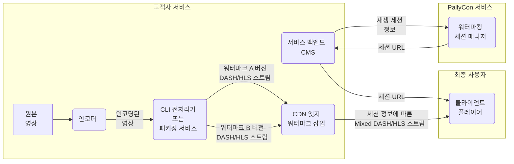

PallyCon 포렌식 워터마킹 서비스의 각종 개념과 용어에 대하여 설명합니다.

## 포렌식 워터마킹

동영상이나 이미지, 오디오 등 멀티미디어 콘텐츠의 불법 유출이 발생한 경우에 해당 유출자를 추적하기 위한 기술입니다. 사람의 눈으로는 감지할 수 없는 정보를 콘텐츠에 삽입하여, 유출된 콘텐츠로부터 사용자 정보를 추출할 수 있도록 합니다.

### 포렌식 워터마킹 기술 데모

아래 영상에서 포렌식 워터마킹 기술을 이용하여 영상에 워터마크를 삽입, 조합하고 검출하는 과정을 확인할 수 있습니다. 본 데모는 PallyCon 포렌식 워터마킹 솔루션에 대한 이해를 돕기 위한 것으로, 실제 상용 서비스에 적용되는 시나리오와는 차이가 있음을 알려드립니다.



> 최적의 재생을 위해 화면 품질을 '1080p'로 선택하고 자막(한글 또는 영문)을 선택하여 재생하시기 바랍니다.

## 워터마크 전처리

원본 영상에 워터마크를 삽입하기 위해서는 콘텐츠 인코딩 과정에서 전처리 작업이 필요합니다. 압축되지 않은 원본 비디오 프레임에 워터마크 값(0/1 또는 A/B 버전)을 적용하여 워터마크 처리된 프레임을 생성하고, 각각 두 벌의 인코딩된 영상으로 출력합니다.

삽입되는 워터마크 값은 각 콘텐츠 서비스 업체 별로 고유한 비밀 키를 이용해 암호화되어, 외부에서 임의로 추출할 수 없게 합니다.

워터마크 전처리 방식은 고객사의 환경에 따라 CLI 전처리기, 전처리 라이브러리 또는 워터마킹 패키징 서비스 중에서 선택할 수 있습니다.

<a href="../../preprocessing/" target="_self" class="btn btn-primary">워터마크 전처리 가이드 바로 가기</a>

### CLI 전처리기

인코딩된 MP4 결과물을 대상으로 전처리 과정을 수행하는 CLI(Command Line Interface) 기반 툴입니다. 서비스 사이트에서 자체적으로 구축한 패키징 서버에서 구동되며, 워터마크 전처리와 콘텐츠 패키징 과정을 통해 원본 영상을 A/B 타입 두 벌의 스트리밍 콘텐츠로 만들어냅니다.

- 지원 스트리밍 포맷: DASH, HLS
- 워터마킹과 멀티DRM 서비스를 모두 사용하는 경우 통합 패키징 가능
- 전처리 과정에서의 동영상 재인코딩을 위해 하드웨어 기반 인코딩 가속 필요

### 전처리 라이브러리

인코딩 솔루션에 포팅될 수 있도록 C++ 라이브러리 형태로 구현된 워터마크 전처리기입니다. 영상 인코딩 과정에서 직접 워터마크를 처리하는 방식으로, CLI 전처리기를 이용한 방식에 필요한 재인코딩 과정을 생략할 수 있습니다.

기본적으로 FFMPEG 기반의 인코더에 포팅을 지원하며 기타 상용 인코더에 적용을 위해서는 인코더 솔루션 업체의 작업이 필요합니다.

### 워터마킹 패키징 서비스

클라우드 SaaS 형태로 제공되는 워터마크 전처리 및 콘텐츠 패키징 서비스입니다. CLI 또는 라이브러리 방식의 전처리를 위한 별도의 서버를 구축할 필요 없이, 인코딩 결과물을 대상으로 PallyCon 클라우드 서비스를 이용하여 워터마크 전처리 및 패키징 작업을 수행할 수 있습니다.

### 패키징 작업 결과 콜백 URL

패키징 서비스가 포함된 워터마킹 서비스 고객을 대상으로 패키징 작업 결과를 알리기 위해 사용되는 URL입니다. 연동 규격에 따라 고객사에서 직접 구축한 웹 페이지 URL을 콘솔에 입력하면, PallyCon 서버가 해당 URL을 호출해 결과를 전송합니다. 상세한 내용은 [패키징 서비스 가이드](../../preprocessing/packaging-service)를 참고하시기 바랍니다.

## 워터마크 삽입

'0'과 '1'로 각각 마크된 A/B 버전의 영상을 재생 시점에 실시간으로 조합해 포렌식 워터마크 정보를 삽입합니다. 사용자 ID와 같은 세션 정보를 이진 형식으로 변환하고, 이에 따라 DASH 또는 HLS 스트림의 세그먼트를 조합하여 출력 스트림을 구성합니다.

결과적으로 재생 세션에 대한 고유 정보가 영상에 보이지 않게 삽입되어 클라이언트에 전송됩니다.

{}
세션 URL로 전달되는 DASH manifest(.mpd )또는 HLS playlist(.m3u8)의 세그먼트 목록은 세션 정보와 무관하게 모든 사용자에 동일한 경로 및 파일명이 적용됩니다. 따라서 동일 콘텐츠를 대상으로 여러 세션의 세그먼트 목록을 조합해 워터마킹을 무력화하는 **세그먼트 네이밍 공격으로부터 안전하게 보호**됩니다.
{}

<a href="../../embedding/" target="_self" class="btn btn-primary">워터마크 삽입 가이드 바로 가기</a>

### 세션 정보

사용자 ID, 콘텐츠 ID, 재생 시점의 시간 및 각종 클라이언트 정보 등 콘텐츠 유출의 추적에 필요한 정보를 의미합니다. 서비스 사이트의 필요에 따라 최대 254 바이트의 문자열로 세션 정보를 적용할 수 있습니다.

### 워터마크 페이로드(Payload)

0과 1의 워터마크 조합으로 최종 콘텐츠에 삽입되는 데이터는 최대 7바이트 길이의 페이로드 입니다. 사용자 ID 등의 정보를 포함한 실제 세션 정보는 PallyCon 서비스에서 별도 데이터베이스로 관리되며, 해당 세션 정보의 키로 페이로드가 사용됩니다.

### 워터마크 삽입 모듈

서비스 사이트의 CDN에 적용되는 모듈로, 클라이언트에서의 콘텐츠 재생 요청 시 '0'과 '1' 두 벌로 준비된 워터마크 영상(세그먼트)을 조합하여 스트리밍합니다. 세션 정보에 대한 워터마크 페이로드 값에 따라 고유한 순서로 조합된 세그먼트들을 전달합니다.

현재 Amazon CloudFront CDN에 적용 가능한 Lambda@Edge 모듈을 지원하며, Akamai CDN의 경우 유사한 방식으로 미리 연동 처리되어 옵션 설정 만으로 적용 가능합니다.

### 세션 URL

워터마크 콘텐츠의 재생 시 워터마크 삽입을 위해 사용되는 콘텐츠 URL입니다. 스트리밍 유형에 따라 DASH manifest(.mpd) 또는 HLS playlist(.m3u8) URL이 사용되며, 암호화된 워터마크 페이로드가 URL의 일부로 추가되어 각 세션마다 고유의 세션 URL이 적용됩니다.

### 세션 매니저

워터마크 삽입을 위해 세션 URL을 생성해주는 PallyCon 클라우드 서버의 기능으로, 서비스 사이트로부터 전달받은 세션 정보를 세션 데이터베이스에 저장하고 해당 항목의 키 값인 페이로드가 적용된 세션 URL을 응답합니다.

## 워터마크 검출

워터마킹된 영상이 유출되어 불법 배포되는 경우, 유출이 의심되는 영상을 PallyCon 서비스에 검출 의뢰할 수 있습니다. 워터마크 검출은 영상의 각 프레임을 분석하여 원본 워터마크 패턴을 감지하고, 삽입 시 사용한 비밀 키로 데이터를 해독합니다.

검출 과정을 통해 워터마크 페이로드를 찾아내면, 세션 데이터베이스에서 해당 페이로드를 키 값으로 하는 세션 정보를 찾아 검출 결과로 리포트합니다.

<a href="../../detecting/" target="_self" class="btn btn-primary">워터마크 검출 가이드 바로 가기</a>

## 지원 사양

PallyCon 포렌식 워터마킹 솔루션은 아래와 같은 사양을 지원합니다.

| 항목 | 내용 | 비고 |
| :--- | :-- | :--- |
| 콘텐츠 유형 | 비디오 콘텐츠 지원 | |
| 영상 포맷 및 코덱 | MP4 (CBR) VOD 영상, H.264/H.265 코덱 지원 | 라이브 영상 지원 추가 예정 |
| 지원 해상도 | 최대 4K/UHD 해상도 지원 | |
| Dynamic Range | SDR (Standard Dynamic Range), HDR (High Dynamic Range) 지원 |  |
| 스트리밍 프로토콜 | MPEG-DASH, HLS (Http Live Streaming) | |
| CDN 연동 | Amazon CloudFront, Akamai CDN 지원 | 타 CDN 연동은 별도 문의 |
| 워터마크 데이터 크기 | 매핑 테이블을 이용하여 최대 255 바이트 문자열 지원 | |
| DRM 연동 | 멀티 DRM (PlayReady, Widevine, FairPlay) 연동 지원 | |
