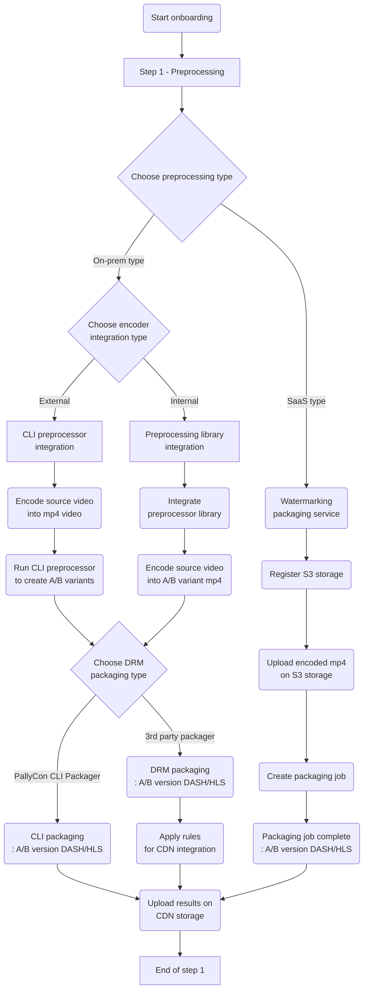
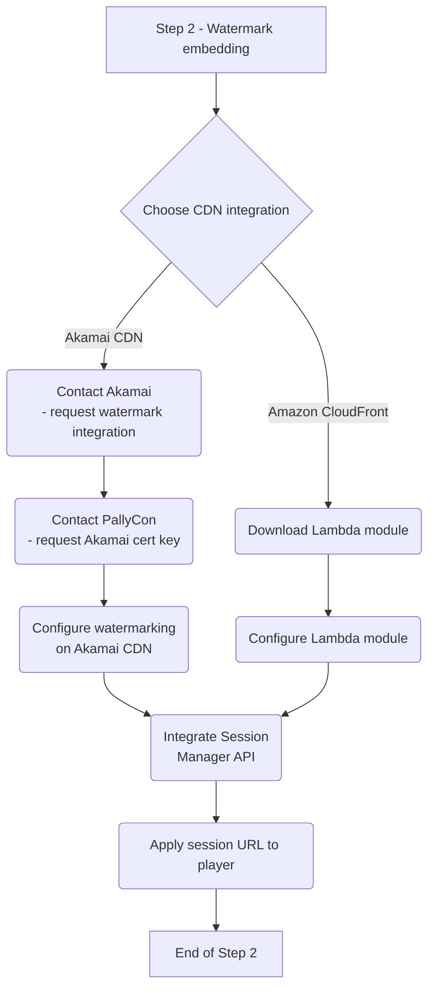
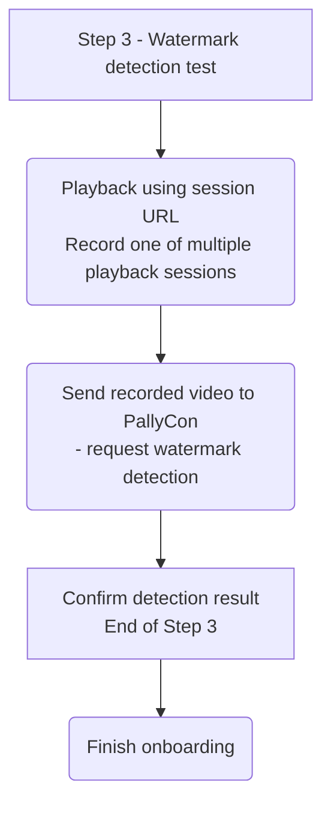

We provide onboarding guides for PallyCon Forensic Watermarking service, so that you can easily find guide documents that suit your various situations and requirements.

## Step 1 - Preprocessing

## Step 2 - Embedding

## Step 3 - Detection test

