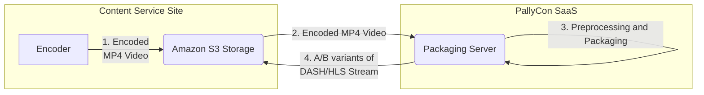
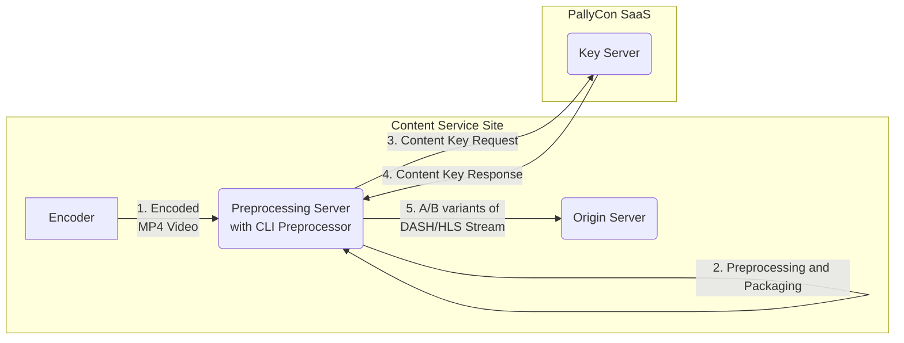
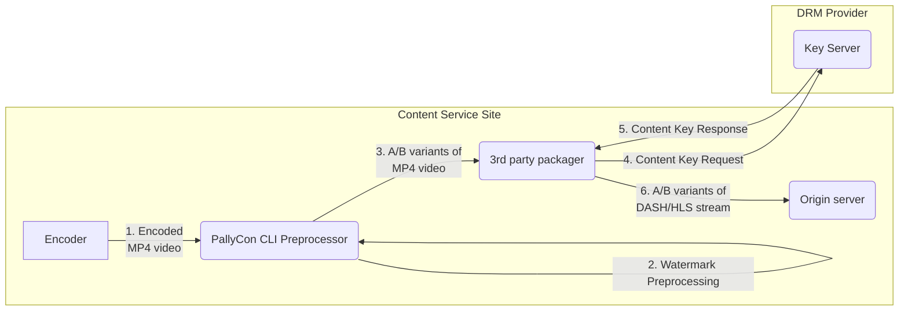
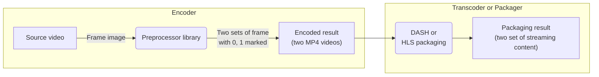
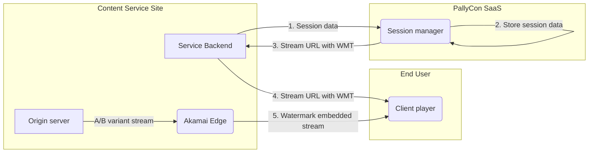
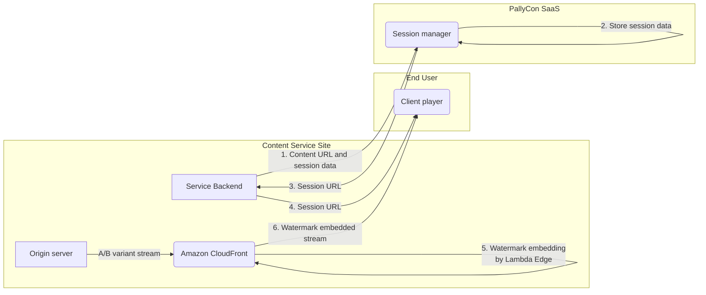

---
title: Forensic Watermarking Integration Workflow
linktitle: Integration Workflow
summary: This document describes the end-to-end workflows and options of `PallyCon Forensic Watermarking` integration.
toc: true
type: book
date: "2019-05-05T00:00:00+01:00"
lastmod: "2020-11-10T00:00:00Z"
draft: false
featured: true

menu:
  multidrm:
    parent: Getting Started
    weight: 40

# Prev/next pager order (if `docs_section_pager` enabled in `params.toml`)
weight: 40
---

This document describes the end-to-end workflows and options of `PallyCon Forensic Watermarking` integration.

## PallyCon Forensic Watermarking Service

`PallyCon Forensic Watermarking` is a cloud-based SaaS service that allows you to quickly and easily apply watermarking without building complex server environments.

There are three steps to apply PallyCon Forensic Watermarking to your content service. Each step has options you can choose.

## Step 1: Preparation of Watermarking Integration

To start the PallyCon Forensic Watermarking integration, you need to sign up for an account on [PallyCon Console](https://login.pallycon.com/join). 

The below options are available by your choice of packaging and CDN integration types.

### Option 1-A: PallyCon SaaS Packaging

PallyCon provides optional content packaging service that can process the `watermark pre-processing` and `content packaging` on AWS-based PallyCon cloud system. The below preparation is needed if you choose this option.

1. Set the AWS region to run the packaging service on `PallyCon Console`
 - This lets you choose the region where you upload the source mp4 video for packaging.
 - You can choose from five different regions as of now. (Oregon, Frankfurt, Seoul, Tokyo, Singapore)

2. Register the input/output storage for the packaging
 - You need to configure your S3 storage on PallyCon Console with the informations such as bucket name, access key and secret key.
 - You can set different storages for the packaging input and output.
 - Please refer to [this guide](../../preprocessing/packaging-service/) for more details.

> SaaS Packaging service charges `per input hour` based fee. Please check [our pricing page](https://pallycon.com/pricing/) for more details.

### Option 1-B: Akamai CDN Integration

If you use Akamai CDN for content delivery, you can utilize the pre-integrated `Akamai Adaptive Media Delivery` interface with PallyCon Forensic Watermarking.

1. Ask to your Akamai account representative to get the watermarking behavior added to your contract.

2. Contact PallyCon team to get the `token signing` and `pattern encryption` values required for the below configuration.

3. Add the watermarking behavior in your Akamai property configuration as described [here](https://learn.akamai.com/en-us/webhelp/adaptive-media-delivery/adaptive-media-delivery-implementation-guide/GUID-0BA201AE-8CB5-4A0C-AB11-39155F7CD96F.html).

### Option 1-C: Amazon CloudFront Integration

If you use CloudFront CDN, you need to setup PallyCon Watermark Embedder module on your CloudFront edge. Please check [this guide](../../embedding/cloudfront-embedder/) for more details.

## Step 2: Content Preprocessing

This step generates `A/B variants` of DASH/HLS streams from the source video. There are four options of preprocessing as described below:

### Option 2-A: PallyCon SaaS Packaging

1. Encode source video and upload the encoded mp4 to S3 storage
  - You need to encode the source video into mp4 file, and upload it on your Amazon S3 storage.
  - The storage should be registered on PallyCon Console in the previous step.
  - H.264 and H.265 codecs are supported up to 4K/UHD resolution.
 
2. Create a `watermark packaging job` on PallyCon Console
 - This will let PallyCon cloud system start the preprocessing and packaging process.
 - You can set multiple mp4 files for adaptive streaming as well as subtitles.
 - Please refer to [this guide](../../preprocessing/packaging-service/#packaging-job-registration) for more details.

3. Preprocessing and packaging on PallyCon SaaS
 - PallyCon SaaS copies the soure mp4 files (and optional subtitles) to its own system.
 - It creates A/B variants of mp4 and packages them into DASH/HLS streams, and copies the result on your output storage.
 - Please refer to [this guide](../../preprocessing/packaging-service/#packaging-job-registration) for more details.

4. Get the packaging results and copy them to your origin server
 - You will get an email notification when the packaging job is done.
 - If you use Amazon S3 as origin server, you can set it as the output storage of PallyCon SaaS packaging. (no need to copy the result)

> You may choose from the list of supported CDN integration when you create the packaging job. Currently Akamai and Amazon CloudFront are supported.

### Option 2-B: PallyCon CLI Preprocessor (with PallyCon Multi-DRM)

If you prefer to use your own system for this step instead of SaaS packaging, you can use `PallyCon CLI Preprocessor` as below.

1. Encode the source video into mp4

2. Run the CLI Preprocessor for watermark preprocessing and packaging
 - You need to setup an on-premise or cloud system that meets the hardware requirements of the CLI Preprocessor.
 - Please refer to [this guide](../../preprocessing/cli-preprocessor/) for more details.

3. Request content key for DRM encryption
 - CLI Preprocessor communicates with PallyCon DRM server to get the encryption key for DRM packaging.

4. Response content key
 - PallyCon DRM server generates and responds the content key.
 - You can also use your own content key if preferred.

5. Copy the A/B variants of DASH/HLS stream to an origin server
 - The structure of output stream varies by the target CDN of your choice.
 - You can choose from Amazon CloudFront and Akamai CDN as the input parameter of CLI preprocessor.

### Option 2-C: PallyCon CLI Preprocessor (with 3rd party packager integration) {#option2-c}

If you want to use PallyCon Forensic Watermarking with a 3rd party transcoder or packager(other than PallyCon SaaS packaging service or CLI packager), you need to follow the below workflow.

1. Encode the source video into mp4

2. Run the CLI Preprocessor for watermark preprocessing only
 - You need to setup an on-premise or cloud system that meets the hardware requirements of the CLI tool.
 - Please refer to [this guide](../../preprocessing/cli-preprocessor/) for more details.
 - You may set the CLI parameter to skip the packaging process and generate A/B variant mp4 files.

3. Run the 3rd party packager on both of A/B variant MP4 files
 - You can use a packaging tool or transcoder provided by a 3rd party vendor.
 - The packaging tool should follow the rules shown below to create the DASH/HLS output with a structure required for the watermark embedder integration.

4. Request content key for DRM encryption
 - The 3rd party packager may communicate with a DRM server (from PallyCon or other vendor) to get the encryption key for DRM packaging.

5. Response content key
 - The DRM server generates and responds the content key.

6. Copy the A/B variants of DASH/HLS stream to an origin server

#### Packaging rule for Akamai CDN integration

The 3rd party transcoder/packager should follow the below rule to integrate the A/B variant stream with Akamai CDN.

- A/B variant streams should be stored in origin server by following `Convert and store using the unlabeled A variant method` explained in [this guide](https://learn.akamai.com/en-us/webhelp/adaptive-media-delivery/adaptive-media-delivery-implementation-guide/GUID-027068FD-3386-4E7C-A46C-B1B3010B39EF.html) from Akamai.

- DASH/HLS segmentation should be done by 1 GOP(Group of Pictures) unit.

- HLS master playlist filename should be `master.m3u8`.

- DASH manifest filename should be `stream.mpd`.

- Video track directory structure should be `video/[codec]/[track number]/` format.

- Audio and subtitle track structure should be `[type]/[codec]/[track number]/` format.

-  `[track number]` directory should contain media files only. (no sub directory)

- DASH media segment tag should be `<SegmentTemplate>`. SegmentList tag is not supported.

- DASH media init filename should be in `xxx_init.xxx` format. (e.g. _init.mp4)

- DASH media segments filename should be in `xxx_$Number$.xxx` format. (e.g.  `seg_$Number$.m4s`)

- DASH media segments number should start from `0`.

- Both the filenames and manifest/playlist contents should be matched.

#### Packaging rule for Amazon CloudFront integration

The 3rd party transcoder/packager should follow the below rule to integrate the A/B variant stream with Amazon CloudFront.

- A/B variant streams should be stored in S3 origin in `/dldzkdpsxmdnjrtm/<output_path>/<cid>/<0/1>/<stream format>/<manifest file>` structure.
  -  `/dldzkdpsxmdnjrtm/`: Pre-defined keyword for CloudFront integration
  -  `<output_path>`: The directory name of the packaging output
  -  `<cid>`: Unique ID of the stream content
  -  `<0/1>`: `0` or `1` for A/B variants
  -  `<stream format>`: `dash` or `hls`
  -  `<manifest file>`: `stream.mpd` for DASH, `master.m3u8` for HLS

- DASH/HLS segmentation should be done by 1 GOP(Group of Pictures) unit.

### Option 2-D: Preprocessor Library Integrated with 3rd Party Encoder

You can do the watermark preprocessing as a part of encoding process. The integration should be done by the encoder vendor using `PallyCon Preprocessor library`.

1. Integrate PallyCon preprocessor library with your encoder
 - Please refer to [this guide](../../preprocessing/preprocessor-library/) for more details.

2. Encode source video into preprocessed(A/B variant) mp4 videos
 - The result will be two mp4 files for a single source video.

3. Package each mp4 files using a transcoder or packager
 - The result will be two sets of DASH/HLS streams with A/B variant segments.
 - If you use a 3rd party packager, you need to follow the rules of stream structure as mentioned in the option 2-C.

4. Copy the A/B variants of DASH/HLS stream to an origin server

## Step 3: Watermark Embedding

The A/B variant type watermark embedding is done by CDN edge with an embedder module or pre-integration. There are two options for the CDN integration as below.

### Option 3-A: Akamai Media Delivery

1. Send session data to PallyCon Session Manager
  - While configuring the player, the service backend (CMS) requests a `watermarked stream URL` to `PallyCon Session Manager` via `PallyCon Session Manager API`.
  - The request contains the stream info and the session data of the client such as user ID, IP address, and timestamp.

2. Store session data and generate watermark token
  - PallyCon Session Manager stores the session data and generate watermark token for response.

3. Response stream URL with watermark token (WMT)
  - The Session Manager creates the watermarked stream URL by including the WMT as a `virtual path component (VPC)` of the stream.
  - Please refer to [this guide](https://learn.akamai.com/en-us/webhelp/adaptive-media-delivery/adaptive-media-delivery-implementation-guide/GUID-1EE95B4A-2D97-47E3-BB97-3F3066C2F517.html) from Akamai for more details.

4. Set the stream URL with WMT to the client player
 - The stream URL (including WMT) is sent to the client player to start playback.

5. Watermark embedding and playback
 - Akamai edge mixes the A/B variant stream from origin server based on the watermarking pattern in the WMT.
 - The client player plays the `watermark embedded stream` the same way as non-watermarked stream.

### Option 3-B: Amazon CloudFront

1. Send content URL and session data to PallyCon Session Manager
  - While configuring the player, the service backend (CMS) requests a `Session URL` to `PallyCon Session Manager` via [Session Manager API](../../embedding/session-manager/).
  - The request contains the session data of the client such as user ID, IP address, and timestamp.

2. Store session data and generate session URL
  - PallyCon Session Manager stores the session data and generate a unique session URL from the stream URL and a session key.

3. Response Session URL
  - The service backend receives the session URL from PallyCon Session Manager.

4. Set the Session URL to the client player
 - The unique `Session URL` is sent to the client player to start playback.

5. Watermark embedding and playback
 - The Lambda@Edge module mixes the A/B variant stream from origin server based on the session key included in the session URL.
 - The client player plays the `watermark embedded stream` the same way as non-watermarked stream.

## Watermark Detection

If you find a leaked content after the watermark integration is done, you may request the watermark detection service to our team. Please check [this guide](../../detecting/) for more details.
