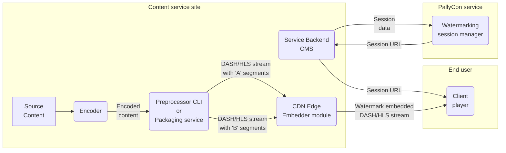

Describes various concepts and terms related to PallyCon Forensic Watermarking service.

## Forensic Watermarking

This technology is designed to track illegal distribution of multimedia content such as videos, images, and audio. By inserting information that can not be detected by the human eye into the content, the user information can be extracted from the leaked content.

### Forensic Watermarking Tech Demo

In the video below, you can see the process of embedding, mixing and detecting the watermark using forensic watermarking technology. This demo is intended to help you understand PallyCon Forensic Watermarking solution, and it is different from the scenarios that apply to actual commercial services.



> For optimal playback, select '1080p' as the video quality and select subtitle (Korean or English) for playback.

## Watermark Preprocessing

In order to embed a watermark in the original video, a preprocessing operation is required in the content encoding process. Different values (0/1 or A/B) are inserted in the original uncompressed video frames and output as two sets (A/B variants) of encoded video.

The inserted watermark value is encrypted using a secret key unique to each content service provider, and can not be extracted from the outside arbitrarily.

The watermark preprocessing can be done by CLI preprocessor, preprocessing library or SaaS packaging service depending on the customer's choice.

<a href="" target="_self" class="btn btn-default">Go to Watermark Preprocessing Guide</a>

### CLI Preprocessor

It is a Command Line Interface (CLI) based tool that generates the A/B variants of source video. It runs on a packaging server built by the content service, and processes the encoded mp4 video into two variants of DASH/HLS streaming contents.

- Supported Streaming Format: DASH, HLS
- Integrated packaging for both watermarking and multi-DRM services
- Requires hardware-based encoding acceleration to re-encode video during preprocessing

### Preprocessing Library

It is a watermark preprocessor implemented as a C ++ library so that it can be ported to an encoding solution. By applying the preprocessing directly in the video encoding process, you can omit the re-encoding process required for CLI preprocessor.

By default, porting to FFMPEG-based encoders is supported, and work with encoder solution vendors is required to apply them to other commercial encoders.

### Watermarking Packaging Service

A watermarking service provided in the form of cloud SaaS. You can preprocess and package your content using the PallyCon cloud service without having to build a separate server using the CLI preprocessor or library.

## Packaging Job Result Callback URL

A URL that is used to send the results of a packaging job to a watermarking service customer who signed up packaging service. You need to build this webpage on your server by following our specification and input its URL into the settings page of PallyCon Console site. PallyCon server calls the URL when a packaging job is finished. Please refer to the [Packaging Service Guide]({}) for details.

## Watermark Embedding

The A/B variants of video (marked with '0' or '1') are combined real-time on playback. It converts session information, such as user ID, to binary format, and thus composes the output stream by mixing A/B version segments in the DASH or HLS content.

As a result, unique information about the playback session is inserted invisibly in the video and sent to the client.

{}
The segment list of the DASH manifest (.mpd) or HLS playlist (.m3u8) passed as a Session URL applies the same path and filename to all users, regardless of session information. Therefore, it is **safe from segment naming attack** which is mixing the segment lists of multiple sessions for the same content.
{}

<a href="" target="_self" class="btn btn-default">Go to Watermark Embedding Guide</a>

### Session Data

Various client information such as user ID, content ID and time of playback. Depending on the needs of the service site, you can apply any session data as a string up to 254 bytes length.

### Watermark Payload

Up to 7 bytes of payload data can be embedded into the final content with a watermark combination of 0 and 1. Actual session data such as user ID is managed in a separate database in the PallyCon service, and the payload is used as the key of the session data.

### Watermark Embedder

This module is applied to the CDN of the service site. When the content is requested for playback on the client, the watermarked video is streamed by mixing A/B version segments. It delivers the segments in a unique order according to the watermark payload value for the session information.

By default, it supports the Lambda@Edge module of the Amazon CloudFront CDN. And Akamai CDN is also pre-integrated so you can configure it to enable the PallyCon integration.

### Session URL

It is a content URL which is used for playback of watermarked content stream. Depending on the type of streaming, a DASH manifest(.mpd) or HLS playlist(.m3u8) URL is used, and an encrypted watermark payload is added as part of the unique session-based URL.

### Session Manager

It is a function of PallyCon cloud server which generates Session URL for watermark embedding. It stores session information received from service site in session database and responds a Session URL which has encrypted payload.

## Watermark Detecting

If the watermarked video is leaked and distributed illegally, you can request the PallyCon service to detect the suspicious content. Watermark detection analyzes each frame of the video to detect the original watermark pattern and decrypts the data with the secret key used at the time of insertion.

If the watermark payload is found through the detection process, the session database finds the session information whose key value is the payload and reports it as the detection result.

<a href="" target="_self" class="btn btn-default">Go to Watermark Detecting Guide</a>

## Supported Specifications

PallyCon Forensic Watermarking supports the below specifications.

| Item | Specification | Remarks |
| :--- | :-- | :--- |
| Content Type | Supports video contents only | |
| Format and codec | MP4 (CBR) VOD video, H.264/H.265 codec supported | Live video will be supported later |
| Supported Resolution | Up to 4K/UHD resolution | |
| Dynamic Range | SDR (Standard Dynamic Range) supported | HDR will be supported later |
| Streaming Protocol | MPEG-DASH, HLS (Http Live Streaming) | |
| CDN Integration | Akamai and Amazon CloudFront CDN supported | Contact us for other CDN integration |
| Watermark Data Size | Up to 255 bytes string using mapping table | |
| DRM Integration | Multi DRM (PlayReady, Widevine, FairPlay) supported | |

---
