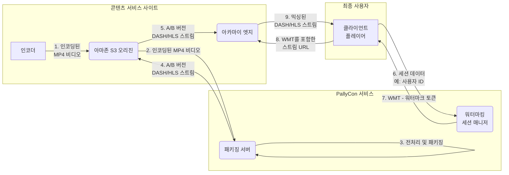
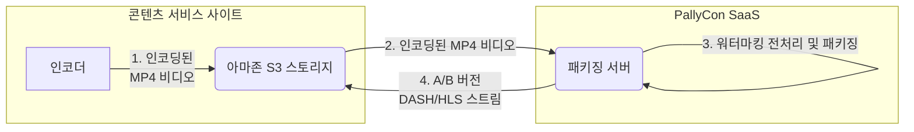
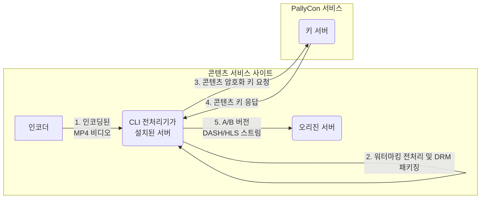
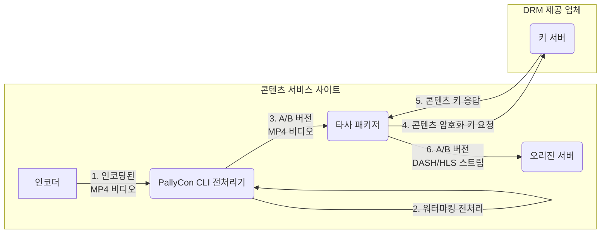
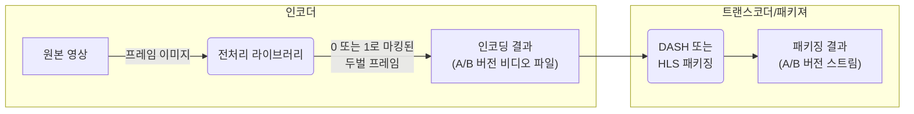
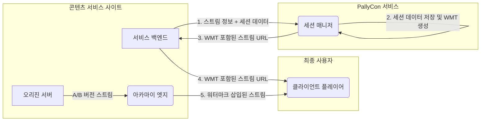
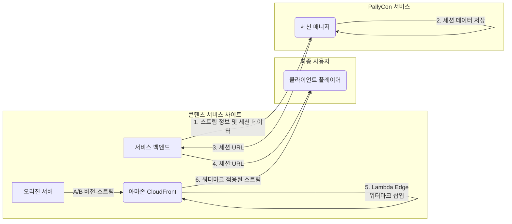

---
title: "포렌식 워터마킹 연동 워크플로우"
date: 2020-04-28T16:12:37+09:00
draft: false
weight: 7
---

이 문서는 `PallyCon 포렌식 워터마킹` 연동에 필요한 전체 워크플로우와 각종 옵션들을 설명합니다.

## PallyCon 포렌식 워터마킹 서비스

`PallyCon 포렌식 워터마킹`은 복잡한 서버 환경을 구축하지 않고도 포렌식 워터마킹을 쉽고 빠르게 적용할 수 있는 클라우드 기반 서비스입니다.

PallyCon 포렌식 워터마킹 서비스는 워터마크 전처리와 삽입을 위한 다양한 옵션을 제공합니다. 아래의 워크 플로우는 PallyCon SaaS 패키징 및 아카마이 CDN 연동을 사용하는 예시입니다.

콘텐츠 서비스에 PallyCon 포렌식 워터마킹을 적용하는 데는 세 가지 단계가 있으며, 각 단계에는 선택할 수 있는 옵션이 있습니다.

## 1단계: 워터마킹 연동 준비

PallyCon 포렌식 워터마킹 연동을 시작하려면 [PallyCon 콘솔](https://login.pallycon.com/join)에서 계정을 등록해야 합니다.

콘텐츠 패키징 및 CDN 연동 유형에 따라 아래와 같은 과정을 수행합니다.

### 옵션 1-A: PallyCon SaaS 패키징

PallyCon은 AWS 기반 클라우드 시스템에서 `워터마크 전처리`와 `콘텐츠 패키징`을 처리할 수 있는 SaaS 패키징 서비스를 제공합니다. 이 옵션을 선택하면 아래 준비가 필요합니다.

1. 패키징 서비스를 실행할 AWS 리전을 설정
 - PallyCon 콘솔 사이트에서 원본 mp4 비디오를 업로드할 지역을 선택할 수 있습니다.
 - 다음의 다섯 지역 중에서 선택할 수 있습니다. (오레곤, 프랑크푸르트, 서울, 도쿄, 싱가포르)

2. 패키징 작업을 위한 입/출력 스토리지 등록
 - PallyCon 콘솔 사이트에서 S3 버킷 이름, 액세스 키 및 비밀 키와 같은 정보를 입력하여 S3 스토리지를 등록합니다.
 - 패키징 입력과 출력에 대해 각각 다른 저장소를 설정할 수 있습니다.
 - 자세한 내용은 [이 안내서](https://pallycon.com/docs/ko/watermarking/preprocessing/packaging-service/)를 참조하시기 바랍니다.

> SaaS 패키징 서비스는 `입력 시간` 당 요금을 부과합니다. 자세한 내용은 [가격 정책 페이지](https://pallycon.com/ko/pricing/)를 확인하십시오.

### 옵션 1-B: 아카마이 CDN 연동

콘텐츠 전송에 아카마이 CDN을 사용하는 경우, 사전 통합된 `Akamai Adaptive Media Delivery` 인터페이스를 PallyCon 포렌식 워터마킹과 함께 사용할 수 있습니다.

1. 아카마이 계정 담당자에게 요청해 CDN 계약에 워터마킹 연동 기능을 추가합니다.

2. PallyCon 팀에 문의해 아래 구성에 필요한 토큰 서명 및 패턴 암호화 값을 전달받습니다.

3. [아카마이 가이드](https://learn.akamai.com/en-us/webhelp/adaptive-media-delivery/adaptive-media-delivery-implementation-guide/GUID-0BA201AE-8CB5-4A0C-AB11-39155F7CD96F.html)를 참고해 CDN 속성 구성에 워터마킹 동작을 추가합니다.

### 옵션 1-C: 아마존 CloudFront 연동

CloudFront CDN을 사용하는 경우, CloudFront 엣지에 PallyCon Watermark Embedder 모듈을 설정해야 합니다. 자세한 내용은 [이 안내서](https://pallycon.com/docs/ko/watermarking/embedding/cloudfront-embedder/)를 확인하십시오.

## 2단계: 워터마킹 전처리

이 단계에서는 하나의 원본 비디오에서 두 가지 버전(A/B variant)의 DASH/HLS 스트림을 생성합니다. 워터마킹 전처리 과정에는 아래와 같이 네 가지 옵션이 있습니다.

### 옵션 2-A: PallyCon SaaS 패키징

1. 비디오 인코딩 및 스토리지 업로드
  - 원본 비디오를 mp4 파일로 인코딩하여 아마존 S3 스토리지에 업로드합니다.
  - 스토리지는 이전 단계에서 PallyCon 콘솔에 등록되어 있어야 합니다.
  - H.264 및 H.265 코덱과 최대 4K/UHD 해상도를 지원합니다.
 
2. 워터마크 패키징 작업 생성
 - PallyCon 콘솔을 통해 PallyCon 클라우드 시스템이 전처리 및 패키징 프로세스를 수행하게 합니다.
 - 해상도 별 MP4 영상을 등록해 어댑티브 스트림을 생성하거나 자막을 추가할 수 있습니다.
 - 자세한 방법은 [해당 가이드](https://pallycon.com/docs/ko/watermarking/embedding/packaging-service/#packaging-job-registration)를 참고하시기 바랍니다..

3. PallyCon 클라우드 시스템에서의 전처리 및 패키징
 - PallyCon 클라우드의 패키징 서버는 원본 MP4 영상과 관련 파일들을 고객사 스토리지로부터 복사합니다.
 - 패키징 서버는 전처리 과정을 통해 원본 영상의 A/B 버전을 만들고, 각각 DASH/HLS 스트림으로 패키징된 결과를 출력 저장소에 저장합니다.
 - 자세한 방법은 [해당 가이드](https://pallycon.com/docs/ko/watermarking/embedding/packaging-service/#packaging-job-registration)를 참고하시기 바랍니다.

4. 패키징 결과를 CDN 오리진에 복사
 - 패키징 작업 완료 시 이메일 알림을 받거나 콘솔에서 확인 가능합니다.
 - 아마존 S3를 오리진 서버로 사용하는 경우, 이를 PallyCon SaaS 패키징의 출력 스토리지로 설정할 수 있습니다. (결과물 복사 불필요)

> 패키징 작업을 생성할 때, 연동 지원되는 CDN을 목록에서 선택할 수 있습니다. 현재 아카마이와 아마존 CloudFront CDN이 지원됩니다.

### 옵션 2-B: PallyCon CLI 전처리기 (PallyCon 멀티 DRM 이용 시)

SaaS 패키징 대신 직접 워터마킹 전처리를 수행하려면 `PallyCon CLI 전처리기`를 사용할 수 있습니다.

1. 원본 비디오를 MP4로 인코딩

2. CLI 전처리기를 통해 워터마크 전처리 및 DRM 패키징 수행
 - CLI 전처리기의 하드웨어 요구 사항을 충족시키는 온프레미스 또는 클라우드 시스템을 준비해야 합니다.
 - 자세한 사항은 [해당 가이드](https://pallycon.com/docs/ko/watermarking/preprocessing/cli-preprocessor/)를 참고하시기 바랍니다.

3. DRM 암호화를 위한 콘텐츠 키 요청
 - CLI 전처리기는 PallyCon DRM 서버와 통신하여 DRM 패키징을 위한 암호화 키를 얻습니다.

4. 콘텐츠 키 응답
 - PallyCon DRM 서버는 콘텐츠 키를 생성하고 응답합니다.
 - 고객사에서 직접 관리하는 키를 이용할 수도 있습니다.

5. A/B 버전 DASH, HLS 스트림을 오리진 서버로 복사
 - 출력 스트림의 구조는 선택한 대상 CDN에 따라 다릅니다.
 - CLI 전처리기의 입력 파라미터로 아마존 CloudFront 및 아카마이 CDN을 선택할 수 있습니다.

### 옵션 2-C: PallyCon CLI 전처리기 (타사 패키저 이용 시)

PallyCon SaaS 패키징 서비스 또는 CLI 패키저 이외의 타사 트랜스코더 또는 패키저를 PallyCon 포렌식 워터마킹과 함께 사용하려면 아래 워크플로우를 따라야합니다.

1. 원본 비디오를 MP4로 인코딩

2. CLI 전처리기를 이용해 워터마킹 전처리만 수행
- CLI 전처리기의 하드웨어 요구 사항을 충족시키는 온프레미스 또는 클라우드 시스템을 준비해야 합니다.
 - 자세한 사항은 [해당 가이드](https://pallycon.com/docs/ko/watermarking/preprocessing/cli-preprocessor/)를 참고하시기 바랍니다.
 - 패키징 프로세스를 건너 뛰고 A/B 버전 mp4 파일을 생성하도록 CLI 매개 변수를 설정할 수 있습니다.

3. 타사 패키져를 이용해 A/B 버전 MP4 비디오를 각각 패키징
 - DRM 패키징 기능을 제공하는 각종 트랜스코더 및 패키져 제품을 이용할 수 있습니다.
 - 워터마크 삽입 연동을 위해서는 패키징 결과물(DASH/HLS 스트림)을 아래 표시된 규칙에 따라 생성해야 합니다.

4. DRM 암호화 키 요청
 - 패키져는 DRM 패키징에 필요한 암호화 키를 얻기 위해 PallyCon 또는 다른 DRM 업체의 키 서버와 통신합니다.

5. 콘텐츠 키 응답
 - DRM 서버는 콘텐츠 키를 생성하고 응답합니다.

6. A/B 버전 DASH, HLS 스트림을 오리진 서버로 복사

#### 아카마이 CDN 연동을 위한 패키징 규칙

아카마이 CDN에서 워터마킹 삽입을 처리하려면, A/B 버전 DASH/HLS 스트림의 구조가 아래 규칙을 따라야합니다.

- 각각의 스트림은 [아카마이 가이드](https://learn.akamai.com/en-us/webhelp/adaptive-media-delivery/adaptive-media-delivery-implementation-guide/GUID-027068FD-3386-4E7C-A46C-B1B3010B39EF.html)의 `라벨이 없는 A 변형 방법을 사용하여 변환 및 저장` 항목에 따라 생성되어야 합니다.

- DASH/HLS 세그먼트는 1 GOP (Group of Pictures) 단위로 수행해야 합니다.

- HLS 마스터 플레이리스트 파일명은 `master.m3u8`이어야 합니다.

- DASH 매니페스트 파일 이름은 `stream.mpd`이어야 합니다.

- 비디오 트랙 디렉토리 구조는 `video/[codec]/[track number]/` 형식이어야 합니다.

- 오디오 및 자막 트랙 구조는 `[type]/[codec]/[track number]/` 형식이어야 합니다.

- `[트랙 번호]` 디렉토리에는 미디어 파일만 있어야 합니다. (하위 디렉토리 없음)

- DASH 미디어 세그먼트 태그는 `<SegmentTemplate>` 이어야 합니다. SegmentList 태그는 지원되지 않습니다.

- DASH media init filename은 `xxx_init.xxx` 형식이어야 합니다. (예: `_init.mp4`)

- DASH 미디어 세그먼트 파일 이름은 `xxx_$Number$.xxx` 형식이어야 합니다. (예: `seg_$Number$.m4s`)

- DASH 미디어 세그먼트 번호는 `0`부터 시작해야합니다.

- 파일 이름과 매니페스트/플레이리스트의 내용이 일치해야합니다.

#### 아마존 CloudFront 연동을 위한 패키징 규칙

아마존 CloudFront CDN에서 워터마킹 삽입을 처리하려면, A/B 버전 DASH/HLS 스트림의 구조가 아래 규칙을 따라야합니다.

- A/B 버전 스트림 콘텐츠는 S3 오리진에 `/dldzkdpsxmdnjrtm/<output_path>/<cid>/<0/1>/<stream format>/<manifest file>` 구조로 저장되어야 합니다.
  -  `/dldzkdpsxmdnjrtm/`: CloudFront 연동을 위해 정의된 키워드 문자열
  -  `<output_path>`: 패키징 결과물을 분류해 저장할 폴더명
  -  `<cid>`: 콘텐츠 서비스에서 관리하는 해당 콘텐츠의 고유 ID
  -  `<0/1>`: `0` or `1` A/B 버전을 구분
  -  `<stream format>`: `dash` 또는 `hls` 입력
  -  `<manifest file>`: DASH 콘텐츠는 `stream.mpd`, HLS 콘텐츠는 `master.m3u8` 

- DASH/HLS 세그먼트는 1 GOP (Group of Pictures) 단위로 수행해야 합니다.

### 옵션 2-D: 타사 인코더에 워터마킹 전처리 라이브러리 연동

워터마크 전처리는 인코딩 프로세스의 일부로 수행할 수 있습니다. 이를 위해서는 인코더 공급 업체가 `PallyCon 전처리 라이브러리`를 해당 제품에 적용해 지원해야 합니다.

1. 인코더에 PallyCon 전처리 라이브러리 적용
 - 자세한 사항은 [해당 가이드](https://pallycon.com/docs/ko/watermarking/preprocessing/preprocessor-library/)를 참고하시기 바랍니다.

2. 원본 영상을 A/B 버전 MP4 비디오로 인코딩
 - 하나의 원본 영상에 대해서 두 가지 버전의 MP4 파일이 생성됩니다.

3. 트랜스코더 또는 패키져를 통해 DASH/HLS 스트림 패키징
 - A/B 버전의 DASH 또는 HLS 스트림을 생성합니다.
 - 타사 솔루션을 이용할 경우, 패키징 결과물이 옵션 2-C에 설명된 규칙에 따라 생성되어야 합니다.

4. A/B 버전 DASH, HLS 스트림을 오리진 서버로 복사

## 3 단계: 워터마크 삽입

A/B 버전의 스트림 콘텐츠는 CDN 엣지와의 연동을 통해 재생 시점에 조합되어 고유한 워터마크 정보가 삽입됩니다. 아래와 같이 두 가지 CDN 연동이 가능합니다.

### Option 3-A: 아카마이 미디어 전송 솔루션

1. PallyCon 세션 매니저에 세션 데이터 전송
  - 콘텐츠 서비스 백엔드(CMS)는 `세션 매니저 API`를 통해 `PallyCon 세션 매니저`에 `워터마킹된 스트림 URL`을 요청합니다.
  - 요청에는 해당 스트림 정보와 사용자 ID, IP 주소 및 타임 스탬프와 같은 클라이언트의 세션 데이터가 포함됩니다.

2. 세션 데이터 저장 및 워터마크 토큰 생성
  - 세션 매니저는 세션 데이터를 저장하고 해당 세션의 워터마크 토큰을 생성합니다.

3. 워터마크 토큰(WMT)이 적용된 스트림 URL 전달
  - 세션 매니저는 API 응답으로 스트림 URL의 '가상 경로 구성 요소 (VPC)'에 워터마크 토큰을 포함시켜 API 응답으로 전송합니다.
  - 자세한 내용은 [아카마이 가이드](https://learn.akamai.com/en-us/webhelp/adaptive-media-delivery/adaptive-media-delivery-implementation-guide/GUID-1EE95B4A-2D97-47E3-BB97-3F3066C2F517.html)를 참고하시기 바랍니다.

4. 클라이언트 플레이어에 워터마크 버전 스트림 URL 전달
 - 콘텐츠 서비스는 클라이언트 플레이어에 워터마크 토큰이 포함된 URL을 전달합니다.

5. 콘텐츠 재생 및 워터마크 삽입
 - 재생이 시작되면 아카마이 엣지는 WMT에 포함된 워터마킹 패턴을 이용해 오리진 서버의 A/B 버전 스트림을 조합해 스트리밍합니다.
 - 클라이언트 플레이어는 워터마킹이 적용되지 않은 일반 스트림과 동일한 방법으로 해당 스트림을 재생할 수 있습니다.

### 옵션 3-B: 아마존 CloudFront CDN

1. 스트림 정보 및 세션 데이터를 PallyCon 세션 매니저로 전송
  - 콘텐츠 서비스 백엔드(CMS)는 [세션 매니저 API](https://pallycon.com/docs/ko/watermarking/embedding/session-manager/)를 통해 `PallyCon 세션 매니저`에 `워터마킹된 스트림 URL`을 요청합니다.
  - 요청에는 해당 스트림 정보와 사용자 ID, IP 주소 및 타임 스탬프와 같은 클라이언트의 세션 데이터가 포함됩니다.

2. 세션 데이터 저장 및 세션 URL 생성
  - 세션 매니저는 세션 데이터를 저장하고 해당 세션에 대한 고유한 세션 URL을 생성합니다.

3. 세션 URL 전달
  - 세션 매니저는 생성된 세션 URL을 API 응답으로 콘텐츠 서비스 백엔드에 전달합니다.

4. 세션 URL을 클라이언트에 전달
 - 서비스 사이트는 클라이언트 플레이어에 세션 URL을 전달합니다.

5. 콘텐츠 재생 시 워터마크 삽입 
 - CloudFront 엣지 서버는 해당 세션 URL에 포함된 세션 키를 이용해 Lambda@Edge 로직으로 A/B 버전 스트림을 조합해 클라이언트에 전달합니다.
 - 클라이언트 플레이어는 워터마킹이 적용되지 않은 일반 스트림과 동일한 방법으로 해당 스트림을 재생할 수 있습니다.

## 워터마크 검출

워터마크 연동이 완료된 후 유출된 콘텐츠를 발견하면, 워터 마크 감지를 PallyCon 서비스에 요청할 수 있습니다.
 보다 자세한 사항은 [해당 가이드](https://pallycon.com/docs/en/watermarking/detecting/)를 참고하시기 바랍니다.

***
