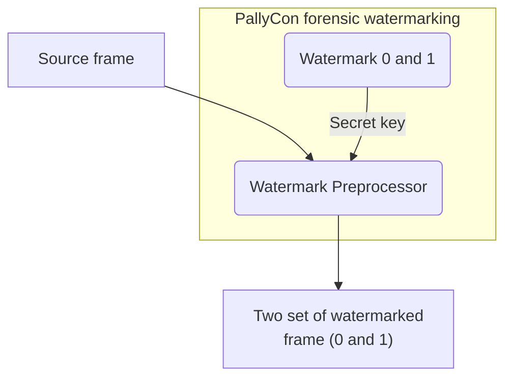

# Watermark Preprocessing

In order to apply watermark to a source video, a preprocessing operation is required in the content encoding process. A watermark value (0 and 1) is inserted in the original uncompressed video frame to generate output as two sets of encoded video. (A/B variants)

The inserted watermark value is encrypted using a secret key unique to each content service provider, and can not be extracted from the outside arbitrarily.

The watermark preprocessing can be done using CLI preprocessor, preprocessing library or SaaS packaging service depending on the customer's choice.

<article class="card">
    

        <h3>CLI Preprocessor Guide</h3>
        PallyCon CLI Preprocessor is a Command Line Interface (CLI) based tool that inserts a watermark to the source mp4 video. This document explains how to install and use the CLI Preprocessor.

        <a href="" target="_self" class="btn btn-default">Read More</a>
    

</article>
<article class="card">
    

        <h3>Preprocessor Library Guide</h3>
        PallyCon Preprocessor Library is a watermark preprocessor implemented as a C ++ library so that it can be ported to an encoding solution. This document explains how to use the Preprocessor Library.

        <a href="" target="_self" class="btn btn-default">Read More</a>
    

</article>
<article class="card">
    

        <h3>Packaging Service Guide</h3>
        PallyCon Forensic Watermarking Service provides cloud-based watermark preprocessing and packaging service. This document explains how to use the service.

        <a href="" target="_self" class="btn btn-default">Read More</a>
    

</article>
<article class="card">
    

        <h3>Packaging API Guide</h3>
        The preprocessing and packaging for forensic watermarking can also be done via HTTP-based APIs. This document describes storage management and packaging operations APIs for packaging processing.

        <a href="" target="_self" class="btn btn-default">Read More</a>
    

</article>

***
