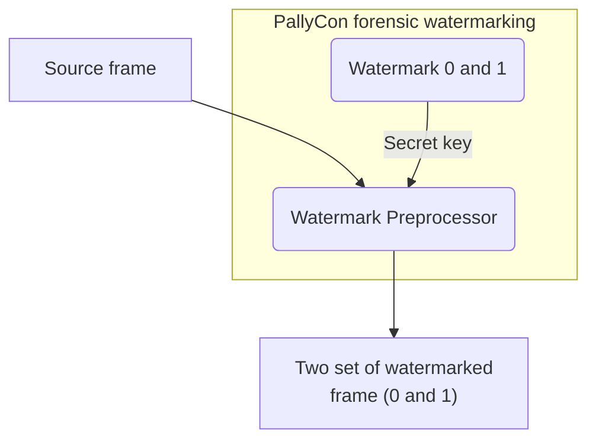

---
# Course title, summary, and position.
linktitle: 2. Watermark Preprocessing
summary: This document describes how to preprocess in a cloud-based packaging service or with an encoder integration.
weight: 20

# Page metadata.
title: Watermark Preprocessing
date: "2018-09-09T00:00:00Z"
lastmod: "2020-10-18T00:00:00Z"
draft: false  # Is this a draft? true/false
toc: false  # Show table of contents? true/false
type: book  # Do not modify.

# Add menu entry to sidebar.
# - name: Declare this menu item as a parent with ID `name`.
# - weight: Position of link in menu.
menu:
  watermarking:
    weight: 20
    parent: Forensic Watermarking
    name: Watermark Preprocessing
---

In order to apply watermark to a source video, a preprocessing operation is required in the content encoding process. A watermark value (0 and 1) is inserted in the original uncompressed video frame to generate output as two sets of encoded video. (A/B variants)

The inserted watermark value is encrypted using a secret key unique to each content service provider, and can not be extracted from the outside arbitrarily.

The watermark preprocessing can be done using CLI preprocessor, preprocessing library or SaaS packaging service depending on the customer's choice.

  

    

      

        <h3 class="card-title">CLI Preprocessor Guide</h3>
        
PallyCon CLI Preprocessor is a Command Line Interface (CLI) based tool that inserts a watermark to the source mp4 video. This document explains how to install and use the CLI Preprocessor.

        <a href="./cli-preprocessor/" class="btn btn-primary">Read More</a>
      

    

  

  

    

      

        <h3 class="card-title">Preprocessor Library Guide</h3>
        
PallyCon Preprocessor Library is a watermark preprocessor implemented as a C ++ library so that it can be ported to an encoding solution. This document explains how to use the Preprocessor Library.

        <a href="./preprocessor-library/" class="btn btn-primary">Read More</a>
      

    

  

  

    

      

        <h3 class="card-title">Packaging Service Guide</h3>
        
PallyCon Forensic Watermarking Service provides cloud-based watermark preprocessing and packaging service. This document explains how to use the service.

        <a href="./packaging-service/" class="btn btn-primary">Read More</a>
      

    

  

  

    

      

        <h3 class="card-title">Packaging API Guide</h3>
        
The preprocessing and packaging for forensic watermarking can also be done via HTTP-based APIs. This document describes storage management and packaging operations APIs for packaging processing.

        <a href="./packaging-api/" class="btn btn-primary">Read More</a>
      

    

  

