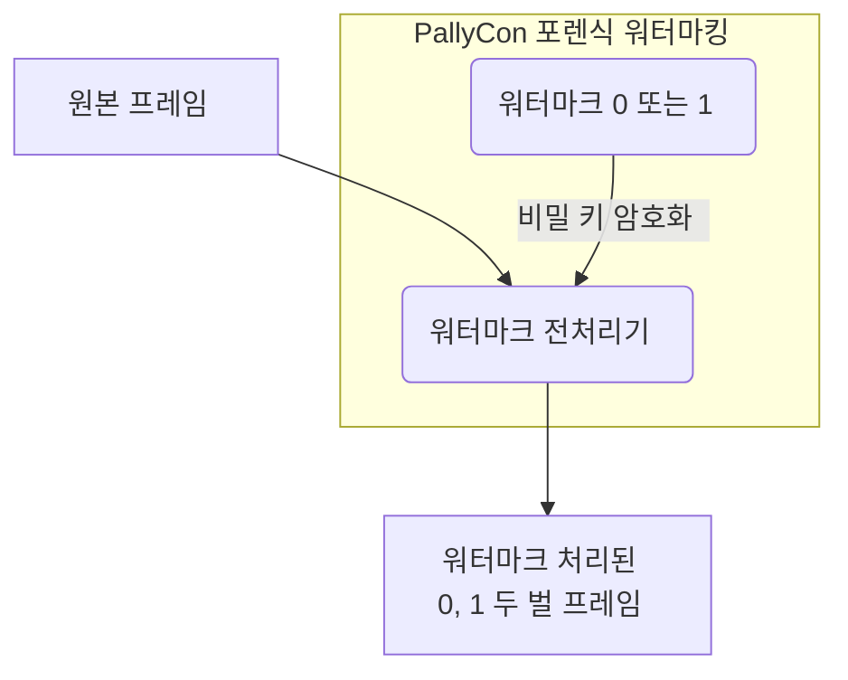

---
# Course title, summary, and position.
linktitle: 2. 워터마크 전처리
summary: 본 문서는 클라우드 방식의 패키징 서비스 또는 인코더 연동을 통한 워터마크 전처리 방법을 설명합니다.
weight: 20

# Page metadata.
title: 워터마크 전처리
date: "2018-09-09T00:00:00Z"
lastmod: "2020-10-18T00:00:00Z"
draft: false  # Is this a draft? true/false
toc: false  # Show table of contents? true/false
type: book  # Do not modify.

# Add menu entry to sidebar.
# - name: Declare this menu item as a parent with ID `name`.
# - weight: Position of link in menu.
menu:
  watermarking:
    weight: 20
    parent: 포렌식 워터마킹
    name: 워터마크 전처리
---

원본 영상에 워터마크를 적용하기 위해서는 콘텐츠 인코딩 과정에서 전처리 작업이 필요합니다. 압축되지 않은 원본 비디오 프레임에 워터마크 값(0 또는 1)을 삽입하여 워터마크 처리된 프레임을 생성하고, 각각 두 벌의 인코딩된 영상으로 출력합니다. (A/B Variants)

적용되는 워터마크 값은 각 콘텐츠 서비스 업체 별로 고유한 비밀 키를 이용해 암호화되어, 외부에서 임의로 추출할 수 없게 합니다.

워터마크 전처리 방식은 고객사의 환경에 따라 CLI 전처리기, 전처리 라이브러리 또는 워터마킹 패키징 서비스 중에서 선택할 수 있습니다.

  

    

      

        <h3 class="card-title">CLI 전처리기 가이드</h3>
        
PallyCon CLI 전처리기는 인코딩된 MP4 동영상을 대상으로 워터마크 전처리를 수행하는 CLI(Command Line Interface) 기반 툴입니다. 본 문서는 CLI 전처리기의 설치와 사용 방법을 설명합니다.

        <a href="./cli-preprocessor/" class="btn btn-primary">바로가기</a>
      

    

  

  

    

      

        <h3 class="card-title">전처리 라이브러리 가이드</h3>
        
PallyCon 워터마킹 전처리 라이브러리는 인코딩/트랜스코딩 솔루션에 포팅될 수 있도록 C++ 라이브러리 형태로 구현된 전처리기입니다. 본 문서는 해당 라이브러리의 사용법을 설명합니다.

        <a href="./preprocessor-library/" class="btn btn-primary">바로가기</a>
      

    

  

  

    

      

        <h3 class="card-title">패키징 서비스 가이드</h3>
        
PallyCon 워터마크 패키징 서비스는 클라우드 SaaS 형태로 제공되는 전처리 및 패키징 서비스입니다. 본 문서는 해당 서비스의 사용법을 설명합니다.

        <a href="./packaging-service/" class="btn btn-primary">바로가기</a>
      

    

  

  

    

      

        <h3 class="card-title">패키징 API 가이드</h3>
        
포렌식 워터마킹을 위한 전처리 및 패키징은 HTTP 기반 API를 통해 수행할 수도 있습니다. 이 문서에서는 패키징 처리를 위한 스토리지 관리 및 패키징 작업 API에 대해 설명합니다.

        <a href="./packaging-api/" class="btn btn-primary">바로가기</a>
      

    

  

