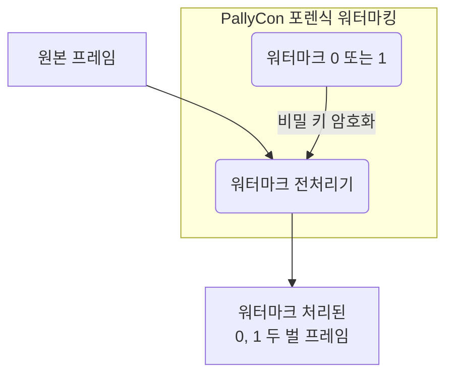

원본 영상에 워터마크를 적용하기 위해서는 콘텐츠 인코딩 과정에서 전처리 작업이 필요합니다. 압축되지 않은 원본 비디오 프레임에 워터마크 값(0 또는 1)을 삽입하여 워터마크 처리된 프레임을 생성하고, 각각 두 벌의 인코딩된 영상으로 출력합니다. (A/B Variants)

적용되는 워터마크 값은 각 콘텐츠 서비스 업체 별로 고유한 비밀 키를 이용해 암호화되어, 외부에서 임의로 추출할 수 없게 합니다.

워터마크 전처리 방식은 고객사의 환경에 따라 CLI 전처리기, 전처리 라이브러리 또는 워터마킹 패키징 서비스 중에서 선택할 수 있습니다.
