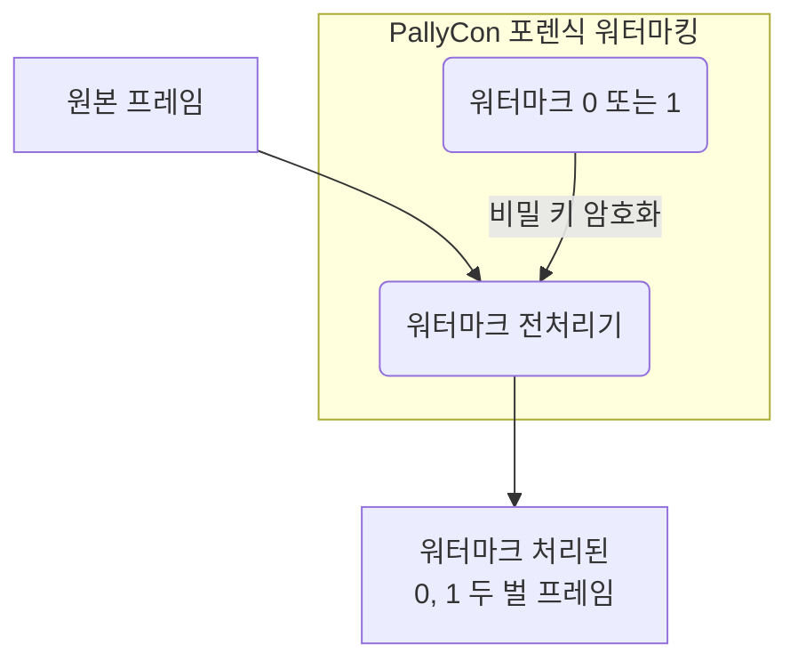

# 워터마크 전처리

원본 영상에 워터마크를 적용하기 위해서는 콘텐츠 인코딩 과정에서 전처리 작업이 필요합니다. 압축되지 않은 원본 비디오 프레임에 워터마크 값(0 또는 1)을 삽입하여 워터마크 처리된 프레임을 생성하고, 각각 두 벌의 인코딩된 영상으로 출력합니다. (A/B Variants)

적용되는 워터마크 값은 각 콘텐츠 서비스 업체 별로 고유한 비밀 키를 이용해 암호화되어, 외부에서 임의로 추출할 수 없게 합니다.

워터마크 전처리 방식은 고객사의 환경에 따라 CLI 전처리기, 전처리 라이브러리 또는 워터마킹 패키징 서비스 중에서 선택할 수 있습니다.

<article class="card">
    

        <h3>CLI 전처리기 가이드</h3>
        PallyCon CLI 전처리기는 인코딩된 결과물을 대상으로 전처리 과정을 수행하는 CLI(Command Line Interface) 기반 툴입니다. 본 문서는 CLI 전처리기의 설치와 사용 방법을 설명합니다.

        <a href="" target="_self" class="btn btn-default">바로 가기</a>
    

</article>
<article class="card">
    

        <h3>전처리 라이브러리 가이드</h3>
        PallyCon 전처리 라이브러리는 인코딩 솔루션에 포팅될 수 있도록 C++ 라이브러리 형태로 구현된 워터마크 전처리 모듈입니다. 본 문서는 전처리 라이브러리의 사용 방법을 설명합니다.

        <a href="" target="_self" class="btn btn-default">바로 가기</a>
    

</article>
<article class="card">
    

        <h3>패키징 서비스 가이드</h3>
        PallyCon 포렌식 워터마킹 서비스는 클라우드 기반의 워터마크 전처리 및 패키징 서비스를 제공합니다. 본 문서는 해당 서비스의 사용 방법을 설명합니다.

        <a href="" target="_self" class="btn btn-default">바로 가기</a>
    

</article>
<article class="card">
    

        <h3>패키징 API 가이드</h3>
        포렌식 워터마킹 적용을 위한 워터마크 전처리와 패키징 기능은 HTTP 기반의 API를 통해 수행할 수도 있습니다. 본 문서는 패키징 처리를 위한 스토리지 관리 및 패키징 작업 API를 설명합니다.

        <a href="" target="_self" class="btn btn-default">바로 가기</a>
    

</article>

***
