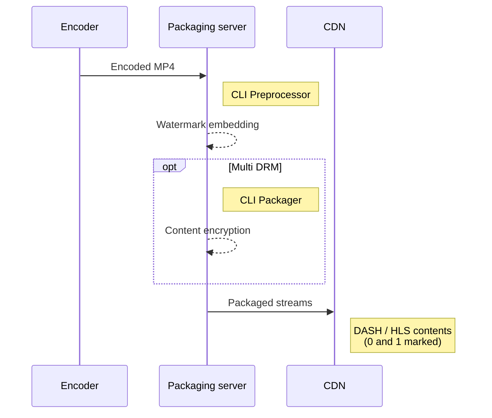

---
# Course title, summary, and position.
linktitle: CLI Preprocessor Guide
summary: PallyCon CLI Preprocessor is a command line interface (CLI) tool for watermark preprocessing on an encoded video file.
weight: 10

# Page metadata.
title: CLI Preprocessor Guide
date: "2018-09-09T00:00:00Z"
lastmod: "2020-10-18T00:00:00Z"
draft: false  # Is this a draft? true/false
toc: true  # Show table of contents? true/false
type: book  # Do not modify.

# Add menu entry to sidebar.
# - name: Declare this menu item as a parent with ID `name`.
# - weight: Position of link in menu.
menu:
  watermarking:
    weight: 10
    parent: Watermark Preprocessing
---

PallyCon CLI Preprocessor is a command line interface (CLI) tool for watermark preprocessing on an encoded video file.
It runs on a packaging server built by the content service, and processes the source mp4 video into two streaming contents with watermark (0/1 versions, also known as A/B variants).



## Modules

You may contact PallyCon team to get the PallyCon CLI Preprocessor after joining PallyCon watermarking service. It consists of the following two modules.

- FMembedder: Creates two content files, each marked '0' or '1'. For example, when the input content is 'A.mp4', it creates 'A_0.mp4' and 'A_1.mp4'. Each of the two generated content can be packaged as DASH / HLS streaming content using PallyCon CLI Packager.

- Sample Mixer: A test mixer that combines two mp4 files created by FMembedder into a single mp4 file. If you enter a payload string of up to 7 bytes, it will produce a combined result based on that payload. For actual service scenario, the watermark embedder module running on CDN is used to perform the combination of session information at playback time.

## Required environments

You need the following environment to run the CLI Preprocessor.

### Hardware

- CPU : Intel CPU
- RAM : 8GB or more
- GPU : NVIDIA graphics card that supports HW video encoding and decoding acceleration
  - [NVIDIA Video encoding and decoding GPU support matrix](https://developer.nvidia.com/video-encode-decode-gpu-support-matrix)

> AWS GPU instance performance

> - Geforce GTX1050 (Desktop, Pascal) << P2 (Tesla K80) << P3 (Tesla V100), G3 (Tesla M60)
> - When using an AWS EC2 instance as a watermark preprocessing server, we recommend an instance of type P3 or G3 for GPU acceleration.

### Software

- Ubuntu server 16.04 LTS
- Intel IPP (Integrated Performance Primitives) 2018
- NVIDIA CUDA Toolkit 9.1 (NVIDIA hardware acceleration)
- Dependency libraries

## Installation guide

### Intel IPP 2018 installation

Follow these steps to install the Intel IPP 2018 library:

> If you have existing Intel IPP library installed, it is recommended to re-install it.

1. Install the GPG key for the repository
  ```sh
  sudo apt update
  sudo apt install apt-transport-https
  wget https://apt.repos.intel.com/intel-gpg-keys/GPG-PUB-KEY-INTEL-SW-PRODUCTS-2019.PUB
  sudo apt-key add GPG-PUB-KEY-INTEL-SW-PRODUCTS-2019.PUB
  ```

2. Add the Intel® IPP repository
  ```sh
  sudo sh -c 'echo deb https://apt.repos.intel.com/ipp all main > /etc/apt/sources.list.d/intel-ipp.list'
  ```

3. Update the list of the packages
  ```sh
  sudo apt update
  ```

4. Install IPP library
  ```sh
  sudo apt install intel-ipp-64bit-2018.3-051
  ```

5. Uninstall IPP library (if needed)
 ```sh
 sudo apt autoremove intel-ipp-64bit-2018.3-051
 ```

- References

 - [Installing Intel® Performance Libraries and Intel® Distribution](https://software.intel.com/en-us/articles/installing-intel-free-libs-and-python-apt-repo)
 - [Free access to Intel® Compilers, Performance libraries, Analysis tools and more...](https://software.intel.com/en-us/articles/free-ipsxe-tools-and-libraries)

### NVIDIA CUDA Toolkit 9.1 installation

Run the following script to install the NVIDIA CUDA toolkit.
  ```sh
  wget http://developer.download.nvidia.com/compute/cuda/repos/ubuntu1604/x86_64/cuda-repo-ubuntu1604_9.1.85-1_amd64.deb
  
  sudo dpkg -i cuda-repo-ubuntu1604_9.1.85-1_amd64.deb
  
  sudo apt-key adv --fetch-keys http://developer.download.nvidia.com/compute/cuda/repos/ubuntu1604/x86_64/7fa2af80.pub
  
  sudo apt-get update
  
  sudo apt-get install -y \
      linux-headers-$(uname -r) \
      cuda
  ```

- References

  - [NVIDIA CUDA Installation guide for Linux](http://developer.download.nvidia.com/compute/cuda/7.5/Prod/docs/sidebar/CUDA_Installation_Guide_Linux.pdf)
  - [CUDA Toolkit 9.1 Download](https://developer.nvidia.com/cuda-91-download-archive?target_os=Linux&target_arch=x86_64&target_distro=Ubuntu&target_version=1604&target_type=debnetwork)
  - [AWS, Installing the NVIDIA Driver on Linux Instances](https://docs.aws.amazon.com/AWSEC2/latest/UserGuide/install-nvidia-driver.html).

### Dependency libraries installation

Install the dependency libraries required for CLI Preprocessor to run as follows:
  ```sh
  sudo apt update
  sudo apt install -y \
    libbz2-dev \
    zlib1g-dev \
    libass-dev \
    libva-dev \
    libvdpau-dev \
    libssl-dev
  ```

## CLI Preprocessor guide

### FMembedder

Execute the FMembedder executable file in the 'bin' folder in the downloaded archive with the following command.

- Required parameters

| Parameter | Description | Example   | Remarks   |
|:------ |:----------|:------|:------|
| `-i` | Input media filename | `-i ~/demo/input.mp4` | |
| `-o` | Output media filename | `-o ~/demo/output.mp4` | The resulting output will be two files with '0' and '1' marked. (~/demo/output_0.mp4 and ~/demo/output_1.mp4) |
| `--access_key` | Access Key for service authorization | `--access_key QSTO2zE7` | - Trial customer: Enter `FOR_INKA_FORENSIC_WATERMARK_TEST` <br> - commercial customer of watermarking service: Enter the access key value shown in the PallyCon Console site |

{}
The `access key` value is used in pairs with the `seed key` file(fmdat.key) stored in the CLI Preprocessor's 'bin' folder. For watermark trials using the CLI Preprocessor, you must use the access key for the trial ('FOR_INKA_FORENSIC_WATERMARK_TEST'), not the access key issued at the PallyCon Console site. The seed key file for the trial is included in the deployed CLI Preprocessor. To use the CLI Preprocessor commercially, you need to replace the file with the commercial seed key that is delivered after a separate contract. And you need to enter the value of the access key issued at PallyCon Console site for the `--access_key` parameter.
{}

- Descriptions of all parameters can be checked with '-h' option. `FMembedder -h`

#### Example of FMembedder usage

- Example 1: to apply NVIDIA HW acceleration encoder(nvenc), use '-n' option
  ```sh
  FMembedder -i ~/demo/input.mp4 -o ~/demo/output.mp4 -n --access_key FOR_INKA_FORENSIC_WATERMARK_TEST
  ```

- Example 2: to apply NVIDIA HW acceleration encoder(nvenc) and decoder(cuvid), use both '-n' and '-c' options
  ```sh
  FMembedder -i ~/demo/input.mp4 -o ~/demo/output.mp4 -n -c --access_key FOR_INKA_FORENSIC_WATERMARK_TEST
  ```

{}
If an error occurs that is related to the common library path, you must set LD_LIBRARY_PATH in the PATH environment variable. For details, refer to the FMembedder.sh file included in the CLI embedder archive file.
{}

#### DRM packaging (optional)

For content that applies both forensic watermarking and DRM, you can package the '0' and '1' version mp4 files generated by FMembedder using PallyCon Packager. Depending on the service's target platform, the two versions of watermark content are packaged in DASH or HLS format, and delivered to the user in real time through the embedder module of the CDN.

For details on DRM packaging and watermark mixing, please refer to the following guide documents.

- [DRM Packaging Guide](../../../multidrm/packaging)

- [Watermark Embedding Guide](../../embedding)

### Sample mixer

Execute the sampleMixer executable file in the 'bin' folder of the CLI Preprocessor archive with the following command.

- Required parameters: (input in the following order)

1. Filename of output video with '0' marked (e.g. ~/demo/output_0.mp4)
2. Filename of output video with '1' marked (e.g. ~/demo/output_1.mp4)
3. Filename of mixed output (e.g. ~/demo/output_mix.mp4)
4. Watermark payload for mixing (e.g. testmsg or 746573746d7367)
  - Up to 7 ASCII characters or 14 hexadecimal digits
  - On actual service scenario with session manager integration, watermark data can insert up to 255 bytes of character string with payload value as its key.

- Explanation of all parameters can be confirmed by executing without parameter input as follows. `sampleMixer`

#### Example of sample mixer usage

You can create a sample mixed video(output_mix.mp4) with a payload data 'testmsg' from the FMembedder output by running the following script.

  ```sh
  sampleMixer ~/demo/output_0.mp4 ~/demo/output_1.mp4 ~/demo/output_mix.mp4 testmsg
  ```
