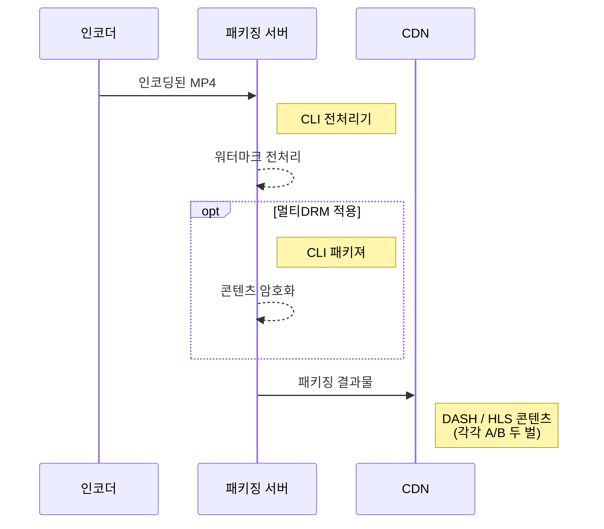

PallyCon CLI 전처리기는 인코딩된 MP4 동영상을 대상으로 워터마크 전처리를 수행하는 CLI(Command Line Interface) 기반 툴입니다.
서비스 사이트에서 자체적으로 구축한 패키징 서버에서 구동되며, 워터마크 전처리와 패키징 과정을 통해 mp4 원본 영상을 워터마크(0 또는 1)가 적용된 두 벌의 스트리밍 콘텐츠로 만들어냅니다. (A/B Variants)



## 모듈 구성

PallyCon CLI 워터마크 전처리기는 워터마킹 서비스 가입 후 별도 요청을 통해 받을 수 있으며, 다음과 같은 두 가지 모듈로 구성됩니다.

- FMembedder:  각각 '0' 또는 '1'로 마크된 두 개의 콘텐츠 파일을 만듭니다. 예를 들어, 입력 콘텐츠가 'A.mp4'일 때 'A_0.mp4'와 'A_1.mp4'를 생성합니다. 생성된 두 벌의 콘텐츠는 각각 PallyCon 패키져를 이용해 DASH/HLS 스트리밍 콘텐츠로 패키징할 수 있습니다.

- 샘플 믹서: FMembedder가 생성한 두 개의 mp4 파일을 단일 mp4 파일로 조합하는 테스트용 믹서입니다. 최대 7바이트의 페이로드 문자열을 입력하면 해당 페이로드에 따라 조합된 결과물을 생성합니다. 실제 서비스 시에는 CDN에 연동되는 워터마크 믹서 모듈을 통해 재생 시점의 세션 정보로 조합을 수행합니다.

## 실행 환경

CLI 전처리기를 실행하려면 다음과 같은 환경이 필요합니다.

### 하드웨어

- CPU : 인텔 CPU
- RAM : 8GB 이상
- GPU : 비디오 인코딩 및 디코딩 하드웨어 가속을 지원하는 NVIDIA 그래픽 카드
  - [NVIDIA 비디오 인코딩 및 디코딩 GPU 지원 매트릭스](https://developer.nvidia.com/video-encode-decode-gpu-support-matrix)

> AWS GPU 인스턴스 성능

> - Geforce GTX1050 (데스크탑, 파스칼) << P2 (테슬라 K80) << P3 (테슬라 V100), G3 (테슬라 M60)
> - AWS EC2 인스턴스를 워터마크 전처리용 서버로 사용시, GPU 가속 기능을 위해 P3 또는 G3 유형의 인스턴스를 권장합니다.

### 소프트웨어

- 우분투 서버 16.04 LTS
- Intel IPP (Integrated Performance Primitives) 2018
- NVIDIA CUDA Toolkit 9.1 (NVIDIA 하드웨어 가속 사용)
- 기타 라이브러리 설치

## 설치 가이드

### Intel IPP 2018 설치

다음과 같은 과정을 통하여 Intel IPP 2018 라이브러리를 설치합니다.

> 기존에 설치되어 있는 Intel IPP 라이브러리가 있다면 삭제 후 재설치를 권장합니다.

1. 저장소 GPG 키 설치
  ```sh
  sudo apt update
  sudo apt install apt-transport-https
  wget https://apt.repos.intel.com/intel-gpg-keys/GPG-PUB-KEY-INTEL-SW-PRODUCTS-2019.PUB
  sudo apt-key add GPG-PUB-KEY-INTEL-SW-PRODUCTS-2019.PUB
  ```

2. Intel® IPP 저장소 추가
  ```sh
  sudo sh -c 'echo deb https://apt.repos.intel.com/ipp all main > /etc/apt/sources.list.d/intel-ipp.list'
  ```

3. 패키지 리스트 업데이트
  ```sh
  sudo apt update
  ```

4. IPP 라이브러리 설치
  ```sh
  sudo apt install intel-ipp-64bit-2018.3-051
  ```

5. IPP 라이브러리 삭제 (필요 시)
 ```sh
 sudo apt autoremove intel-ipp-64bit-2018.3-051
 ```

- 참고 자료

 - [Installing Intel® Performance Libraries and Intel® Distribution](https://software.intel.com/en-us/articles/installing-intel-free-libs-and-python-apt-repo)
 - [Free access to Intel® Compilers, Performance libraries, Analysis tools and more...](https://software.intel.com/en-us/articles/free-ipsxe-tools-and-libraries)

### NVIDIA CUDA 툴킷 9.1 설치

다음과 같은 스크립트를 실행하여 NVIDIA CUDA 툴킷을 설치합니다.
  ```sh
  wget http://developer.download.nvidia.com/compute/cuda/repos/ubuntu1604/x86_64/cuda-repo-ubuntu1604_9.1.85-1_amd64.deb
  
  sudo dpkg -i cuda-repo-ubuntu1604_9.1.85-1_amd64.deb
  
  sudo apt-key adv --fetch-keys http://developer.download.nvidia.com/compute/cuda/repos/ubuntu1604/x86_64/7fa2af80.pub
  
  sudo apt-get update
  
  sudo apt-get install -y \
      linux-headers-$(uname -r) \
      cuda
  ```

- 참고 자료

  - [NVIDIA CUDA Installation guide for Linux](http://developer.download.nvidia.com/compute/cuda/7.5/Prod/docs/sidebar/CUDA_Installation_Guide_Linux.pdf)
  - [CUDA Toolkit 9.1 Download](https://developer.nvidia.com/cuda-91-download-archive?target_os=Linux&target_arch=x86_64&target_distro=Ubuntu&target_version=1604&target_type=debnetwork)
  - [AWS, Installing the NVIDIA Driver on Linux Instances](https://docs.aws.amazon.com/AWSEC2/latest/UserGuide/install-nvidia-driver.html).

### 의존성 라이브러리 설치

다음과 같이 CLI 전처리기 실행에 필요한 의존성 라이브러리를 설치합니다.
  ```sh
  sudo apt update
  sudo apt install -y \
    libbz2-dev \
    zlib1g-dev \
    libass-dev \
    libva-dev \
    libvdpau-dev \
    libssl-dev
  ```

## CLI 전처리기 사용 방법

### FMembedder

압축 파일의 'bin' 폴더 내 FMembedder 실행 파일을 아래 명령으로 실행합니다.

- 필수 파라미터

| 파라미터 | 설명       | 예시   | 비고   |
|:------ |:----------|:------|:------|
| `-i` | 입력 미디어 파일 명 | `-i ~/demo/input.mp4` | |
| `-o` | 출력 미디어파일 명 | `-o ~/demo/output.mp4` | 출력되는 결과물은 ~/demo/output_0.mp4 와 ~/demo/output_1.mp4 두 파일이 생성됩니다. |
| `--access_key` | 서비스 인증 액세스 키 | `--access_key QSTO2zE7` | - 트라이얼 고객: `FOR_INKA_FORENSIC_WATERMARK_TEST` 입력 <br> - 워터마킹 서비스 상용 고객:  PallyCon 콘솔 사이트의 연동 설정에 표시된 액세스 키 값 입력 |

{}
`액세스 키` 값은 CLI 전처리기의 'bin' 폴더에 저장되어 있는 `시드 키` 파일(fmdat.key)과 쌍을 이루어 사용됩니다. CLI 전처리기를 이용한 워터마크 트라이얼의 경우 콘솔 사이트에서 발급되는 액세스 키가 아닌 트라이얼용 액세스 키('FOR_INKA_FORENSIC_WATERMARK_TEST')를 사용해야 하며, 트라이얼용 시드 키 파일은 배포되는 CLI 전처리기에 포함되어 있습니다. 상용으로 CLI 전처리기를 사용하려면 별도 계약 후 전달되는 상용 시드 키로 해당 파일을 교체하고 `--access_key` 파라미터에 콘솔 사이트에서 발급된 액세스 키 값을 입력해야 합니다.
{}

- 전체 파라미터에 대한 설명은 '-h' 옵션으로 확인할 수 있습니다. `FMembedder -h`

#### FMembedder 실행 예제

- 예제 1: NVIDIA 하드웨어 가속 인코더(nvenc) 적용 시, '-n' 옵션 사용
  ```sh
  FMembedder -i ~/demo/input.mp4 -o ~/demo/output.mp4 -n --access_key FOR_INKA_FORENSIC_WATERMARK_TEST
  ```

- 예제 2: NVIDIA 하드웨어 가속 인코더(nvenc) 및 디코더(cuvid) 적용 시, '-n' 과 '-c' 옵션 사용
  ```sh
  FMembedder -i ~/demo/input.mp4 -o ~/demo/output.mp4 -n -c --access_key FOR_INKA_FORENSIC_WATERMARK_TEST
  ```

{}
공용 라이브러리 경로와 관련된 에러 발생 시, PATH 환경 변수에 LD_LIBRARY_PATH 를 설정해야 합니다. 상세 내용은 압축파일에 포함된 FMembedder.sh 파일을 참고하시기 바랍니다.
{}

#### DRM 패키징 (옵션)

포렌식 워터마킹과 DRM을 동시에 적용하는 콘텐츠의 경우, FMembedder로 생성된 '0'과 '1' 버전 mp4 파일을 각각 PallyCon 패키져를 이용해 DRM 패키징 합니다. 서비스 대상 플랫폼에 따라 DASH 또는 HLS 형태로 패키징된 두 벌의 콘텐츠는 CDN의 워터마크 삽입 모듈을 통해 실시간으로 조합되어 사용자에게 전달됩니다.

DRM 패키징과 워터마크 믹싱에 대한 상세 사항은 다음의 가이드 문서들을 참고하시기 바랍니다.

- [DRM 패키징 가이드]({})

- [워터마크 삽입 가이드]({})

### 샘플 믹서

CLI 전처리기 압축 파일의 'bin' 폴더 내 sampleMixer 실행 파일을 아래 명령으로 실행합니다.

- 필수 파라미터: (아래 순서로 입력 필요)

1. '0'이 삽입된 전처리 결과 파일 명 (예: ~/demo/output_0.mp4)
2. '1'이 삽입된 전처리 결과 파일 명 (예: ~/demo/output_1.mp4)
3. 믹스된 출력 파일 명 (예: ~/demo/output_mix.mp4)
4. 삽입할 워터마크 페이로드 (예: testmsg 또는 746573746d7367)
  - 최대 7자리 아스키 문자열 또는 16진수 14자리
  - 세션 매니저와 연동한 실제 서비스 시나리오에서는 페이로드 값을 키로 하는 최대 255바이트 문자열을 워터마크로 삽입 가능

- 전체 파라미터에 대한 설명은 다음과 같이 파라미터 입력 없이 실행하여 확인할 수 있습니다. `sampleMixer`

#### 샘플 믹서 사용 예제

아래와 같은 스크립트를 실행하여 FMembedder의 결과물로부터 'testmsg'라는 페이로드로 조합된 샘플 영상(output_mix.mp4)을 생성할 수 있습니다.

  ```sh
  sampleMixer ~/demo/output_0.mp4 ~/demo/output_1.mp4 ~/demo/output_mix.mp4 testmsg
  ```

***
