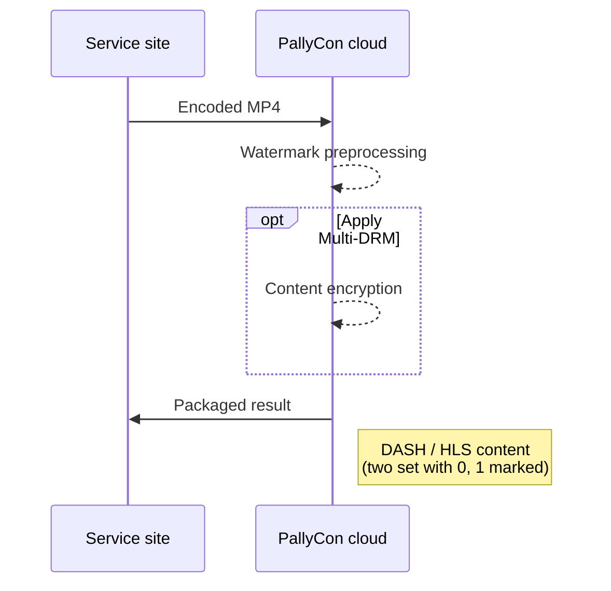

---
# Course title, summary, and position.
linktitle: Packaging API Guide
summary: You can preprocess and package your content using our HTTP-based APIs instead of building a separate server using the CLI Preprocessor or library.
weight: 40

# Page metadata.
title: Packaging API Guide
date: "2018-09-09T00:00:00Z"
lastmod: "2020-10-18T00:00:00Z"
draft: false  # Is this a draft? true/false
toc: true  # Show table of contents? true/false
type: book  # Do not modify.

# Add menu entry to sidebar.
# - name: Declare this menu item as a parent with ID `name`.
# - weight: Position of link in menu.
menu:
  watermarking:
    weight: 40
    parent: Watermark Preprocessing
---

You can preprocess and package your content using our HTTP-based APIs instead of building a separate server using the CLI Preprocessor or library.



The packaging storage and job management APIs use the following common specifications:

## PallyCon HTTP API Specification

The HTTP API requests used by the PallyCon service follow the specifications below.

> Please find the API request sample code in [Sample Download page](../../getting-started/fwm-downloads).

### Request

|Name|Value|
|---|---|
|pallycon-apidata|base64 Encoding ( JSON string )|

#### Request Data JSON Format

```json
{
    "data":"{base64 encode(aes256 cbc encrypt(API data))}",
    "timestamp":"{yyyy-mm-ddThh:mm:ssZ}",
    "hash":"{base64 encode(sha256(message format))}"
}
```

**Request Data Specification**

| Name | Value | Required | Description |
| ---- | ----- | ---- | -------------- |
| `data` | String | Y | AES encryption on the JSON string generated by the specification for each API, and the result value is input as a base64 string. |
| `timestamp` | String | Y | Enter the time of the request at the GMT time zone in "yyyy-mm-ddThh: mm: ssZ" format. |
| `hash` | String | Y | Enter the hash value generated according to the following specification. |

**AES256 Encryption**

Aes256 encryption / decryption processing is performed as below using the site key value issued when joining PallyCon service. (Check PallyCon Console site)

- mode : CBC
- AES key : 32 byte (Site key issued from PallyCon Console site)
- AES IV : fixed 16 byte (0123456789abcdef)
- padding : pkcs7

**SHA256 message Format**

The input value of the SHA256 hash is a combination of the following strings.

```s
[site access key] + [site_id] + [json.data] + [json.timestamp]
```
  - site access key: It is the access key value that is issued when creating PallyConsole Cloud service site. It can be checked on the PallyCon Console page.
  - The resulting value of the sha256 hash function must be entered Numbero the base64 function as a binary data, not as a string.

## Storage Registration API {#storage-register}

An API that registers storage used for watermark preprocessing and packaging job. Before you can register a packaging job, you must register the storage that will be used for the job through this API.

### Request

- Use PallyCon Cloud HTTP API specification
- URL : `https://api.pallycon.com/api/v2/storage/[SITE_ID]`
- Method: POST
- Content type: application/json;charset=UTF-8

> The 'SITE_ID' part of the URL should be your site ID issued from PallyCon Console site.

#### Request Data JSON Format

```json
{
	"storage_name" : "{storage name}",
	"type" : "{storage type}",
	"id": "{access id}",
	"password": "{access password}",
	"aws_bucket": "{bucket name}",
	"description" : "{description}",
	"region": "{region}"
}
```

#### Request Data Specification

| **Key**      | **type** | **required** | **description**                            |
|--------------|----------|--------------|--------------------------------------------|
| storage_name | String   | Y            | Name of the storage                     |
| type         | String   | Y            | Storage type : S3                         |
| id           | String   | Y            | AWS access key id for the storage      |
| password     | String   | Y            | AWS secret access key |
| aws_bucket   | String   | Y            | Name of S3 bucket                       |
| description  | String   | N            | Description of the storage              |
| region       | String   | Y            | Storage's region code           |

### Response

#### Response Data JSON Format

```json
{
	"storage_id": "{storage id}",
	"error_code": "{error code}",
	"error_message": "{error message}"
}
```

#### Response Data Specification

| **Key**       | **type** | **description**                                        |
|---------------|----------|--------------------------------------------------------|
| error_code    | String   | "0000" : Success, Otherwise it will be alphanumeric error code |
| error_message | String   | Detailed error message if failed     |
| storage_id    | String   | ID of the storage    |

## Storage Update API {#storage-update}

An API that modifies storage information used for watermark preprocessing and packaging operations.

### Request

- Use PallyCon Cloud HTTP API specification
- Url: `https://api.pallycon.com/api/v2/storage/[SITE_ID]`
- Method: PUT
- Content type: application/json;charset=UTF-8

#### Request Data JSON Format

```json
{
	"storage_id" : "{storage id}",
	"storage_name" : "{storage name}",
	"description": "{description}"
}
```

#### Request Data Specification

| **Key**      | **type** | **required** | **description** |
|--------------|----------|--------------|-----------------|
| storage_id   | String   | Y            | Storage ID     |
| storage_name | String   | N            | Name of the storage     |
| description  | String   | N            | Description of the storage   |

### Response

#### Response Data JSON Format

```json
{
	"storage_id": "{storage id}",
	"error_code": "{error code}",
	"error_message": "{error message}"
}
```

#### Response Data Specification

| **Key**       | **type** | **description**                                        |
|---------------|----------|--------------------------------------------------------|
| error_code    | String   | "0000" : Success, Otherwise it will be alphanumeric error code |
| error_message | String   | Detailed error message if failed                             |
| storage_id    | String   | ID of the storage             |

## Storage List API {#storage-list}

An API to get a list of registered storage.

### Request

- Use PallyCon Cloud HTTP API specification
- Url : `https://api.pallycon.com/api/v2/storage/[SITE_ID]`
- Method : GET
- Content type : application/json;charset=UTF-8

#### Request Data JSON Format

```json
{
	"search_keyword": "{search keyword}",
	"search_keyword_type": "{storageId / storageName}",
	"storage_type": "S3",
	"region": "{region}",
	"from": "{YYYY-MM-DD'T'hh:mm:ss'Z'}",
	"to": "{YYYY-MM-DD'T'hh:mm:ss'Z'}",
	"page_unit": "{Number value}",
	"page_index": "{Number value}",
	"time_zone": "{hh:mm}"
}
```

#### Request Data Specification

| **Key**             | **type** | **required** | **description**                   |
|---------------------|----------|--------------|-----------------------------------|
| search_keyword      | String   | N            | keyword of the search          |
| search_keyword_type | String   | N            | Type of search (storageId or storageName) |
| storage_type        | String   | Y            | Type of storage (S3)                |
| from                | String   | N            | Search parameter for storage registration time  |
| to                  | String   | N            | Search parameter for storage registration time  |
| page_unit           | Number      | N            | Number of max result per page. default : 25           |
| page_index          | Number      | N            | Index of result page. default : 1          |
| region              | String   | Y            | AWS region code                   |
| time_zone           | String   | N            | Timezone for the search           |

### Response

#### Response Data JSON Format

```json
{
	"error_code": "{error code}",
	"error_message": "{error message}",
	"total_count": "total count",
	"time_zone": "{hh:mm}",
	"data": [{
		"storage_id" : "{storage id}",
		"storage_name" : "{storage name}",
		"type" : "{storage type}",
		"id": "{access id}",
		"password": "{access password}",
		"aws_bucket": "{bucket name}",
		"description" : "{description}",
		"region": "{region}",
		"reg_date": "{YYYY-MM-DD'T'hh:mm:ss'Z'}"
	}]
}
```

#### Response Data Specification

| **Key**       | **type** | **description**                                        |
|---------------|----------|--------------------------------------------------------|
| error_code    | String   | "0000" : Success, Otherwise it will be alphanumeric error code |
| error_message | String   | Detailed error message if failed                             |
| storage_id    | String   | ID of the storage                                            |

***

## Packaging Job Registration API {#packaging-job-register}

This API registers new watermark packaging job. Before you can register a packaging job, you must first register a storage and upload the original MP4 file to that storage.

### Request

- Url: `https://api.pallycon.com/api/v2/pack/[SITE_ID]`
- Method: POST
- Content type: application/json;charset=UTF-8

**Limitations for trial account**

1. Trial does not support adaptive streaming content packaging.
2. The original video to be packaged is only supported in the mp4 format.
3. A trial account can perform only one packaging job.

#### Request Data JSON Format

```json
{
	"job_name": "{job name}",
	"storage":{
		"input":{
			"storage_id": "{storage id}",
			"contents_path":[ input contents path ]
		},
		"output":{
			"storage_id": "{storage id}",
			"path": "{output path}"
		}
	},
	"content_id": "{content id}",
	"streaming_format": [dash, hls],
	"protect_type": [ drm, watermark ],
	"subtitles":[
		{
		"path": "{subtitle path}",
		"language": "{language}"
		}
	],
    "dash_option":{
        "min_buffer_time": {Number value},
        "enable_average_bandwidth_mpd": {true|false}
    },
    "drm_option": {
        "multi_key": {true|false},
        "skip_audio_encryption": {true|false},
        "max_sd_height": {Number value},
        "max_hd_height": {Number value},
        "max_uhd1_height": {Number value},
        "clear_lead": {Number value},
        "generate_tracktype_manifests": {true|false}
    }	
}
```

#### Request Data Specification

| **Key**              | **type**   | **required** | **description**                                          |
|----------------------|------------|--------------|----------------------------------------------------------|
| job_name             | String     | Y            | Name of packaging job                               |
| storage              | JSON       | Y            | Storage and file information for the source video   |
| content_id           | String     | Y            | Unique ID of the content (CID, max 200byte) |
| streaming_format     | Array      | Y            | Type of streaming format                               |
| protection_type      | Array      | Y            | Options to apply DRM and watermark. 'watermark' is mandatory while 'DRM' is optional. |
| subtitles            | JSON Array | N            | Subtitle data, if any.      |
| dash_option          | JSON       | N            | Options about DASH packaging |
| drm_option           | JSON       | N            | Options about DRM encryption |

**storage.input**

| **Key**       | **type** | **required** | **description**                                                                 |
|---------------|----------|--------------|---------------------------------------------------------------------------------|
| storage_id    | String   | Y         | ID of the storage assigned by PallyCon.                   |
| contents_path | Array    | Y         | The folder / file path where the original file is located. If more than one is specified, they are packaged as an adaptive stream |

**storage.output**

| **Key**    | **type** | **required** | **description**                 |
|------------|----------|--------------|---------------------------------|
| storage_id | String   | Y            | ID of the storage assigned by PallyCon. |
| path       | Array    | Y            | The path where the packaging results will be stored   |

**subtitles**

| **Key**  | **type** | **required** | **description** |
|----------|----------|--------------|-----------------|
| path     | String   | N            | Path of the subtitle file |
| language | String   | N            | Language of the subtitle file  |

**dash_option**

| **Key**  | **type** | **required** | **description** |
|----------|----------|--------------|-----------------|
| min_buffer_time | Number | N      | Specifies, in seconds, a common duration used in the definition of the MPD Representation data rate. Minimum: 2 |
| enable_average_bandwidth_mpd | Boolean | N | Use average bandwidth for each track in MPD. default: false |

**drm_option**

| **Key**  | **type** | **required** | **description** |
|----------|----------|--------------|-----------------|
| multi_key | Boolean | N | Enables multi-key packaging. default: false |
| skip_audio_encryption | Boolean | N | Disable audio track encryption. default: false(encrypt audio) |
| max_sd_height | Number | N | Max resolution to be packaged as SD track. default: 480 | 
| max_hd_height | Number | N | Max resolution to be packaged as HD track. default: 1080 |
| max_uhd1_height | Number | N | Max resolution to be packaged as UHD track. default: 2160 |
| clear_lead | Number | N | Unencrypted section at the beginning (by second). default: 0 |
| generate_tracktype_manifests | Boolean | N | Create multiple manifest (playlist) files for multi-key packaging. For adaptive streams containing SD to UHD tracks, three manifests are created: ‘SD_ONLY’, ‘SD_HD’, and ‘SD_UHD’. default: false | 

### Response

#### Response Data JSON Format

```json
{
	"error_code": {error code},
	"error_message": {error message},
	"job_id": {job id}
}
```

#### Response Data Specification

| **Key**       | **type** | **description**                                        |
|---------------|----------|--------------------------------------------------------|
| error_code    | String   | "0000" : Success, Otherwise it will be alphanumeric error code |
| error_message | String   | Detailed error message if failed    |
| job_id        | Number     | Returned only on successful job creation  |

## Packaging Job List API {#packaging-job-list}

An API used to retrieve a list of packaging jobs from PallyCon packaging server.

### Request

- Url : `https://api.pallycon.com/api/v2/pack/{siteId}`
- Method : GET
- Content type : application/json;charset=UTF-8

#### Request Data JSON Format

```json
{
	"search_keyword": "{search keyword}",
	"search_keyword_type": "{cid, jobId, jobname}",
	"search_type": "{watermark, drm}",
	"search_status": "{ready, success, failed, complete, working, process}",
	"search_condition": "{dash, hls}",
	"from": "{YYYY-MM-DD'T'hh:mm:ss'Z'}",
	"to": "{YYYY-MM-DD'T'hh:mm:ss'Z'}",
	"page_unit": "{Number value}",
	"page_index": "{Number value}",
	"time_zone": "{hh:mm}"
}
```

#### Request Data Specification

| **Key**      | **type** | **required** | **description**                                   |
|---------------------|----------|--------------|--------------------------------------------|
| from                | String   | N            | Search parameter for job registration time    |
| to                  | String   | N            | Search parameter for job registration time    |
| page_unit           | Number      | N            | Number of max result per page. default : 25  |
| page_index          | Number      | N            | Index of result page. default : 1      |
| search_type         | String   | N            | Search for security option (drm, watermark)  |
| search_status       | String   | N            | Search for job status (ready, success, failed, complete(success + failure), working(pending + processing), job progress, stop) |
| search_condition    | String   | N            | Streaming format (dash, hls)                   |
| search_keyword_type | String   | N            | Type of search keyword (cid, jobId, jobName)  |
| search_keyword      | String   | N            | Search keyword string             |
| region              | String   | Y            | AWS region code    |
| time_zone           | String   | N            | Time zone for the search   |

### Response

#### Response Data JSON Format

```json
{
	"error_code": "{error code}",
	"error_message": "{error message}",
	"total_count": "{count}",
	"time_zone": "{hh:mm}",
	"data": [ {
		"job_id": "{job id}",
		"job_name": "{job name}",
		"start_date": "{start date({YYYY-MM-DD'T'hh:mm:ss'Z')}",
		"update_date": "{update date({YYYY-MM-DD'T'hh:mm:ss'Z')}",
		"reg_date": "{registered date({YYYY-MM-DD'T'hh:mm:ss'Z')}",
		"watermark": "{watermark use}",
		"drm": "{true/false}",
		"dash": "{true/false}",
		"hls": "{true/false}",
		"content_id": "{content id}",
		"status": "{status}",
		"storage":{
			"input":{
				"storage_id": "{storage id}",
				"contents_path":[ input contents path ]
			},
			"output":{
				"storage_id": "{storage id}",
				"path": "{output path}"
			}
		},
		"subtitles":[ {
			"path": "{subtitle path}",
			"language": "{language}"
		} ]
	} ]
}
```

## Packaging Result Callback Numberegration

If you set a callback URL for packaging job result on PallyCon Console site, the web page will receive the below request when a job is finished or if there is an error.

### Request data JSON

The below JSON data will be sent to the callback URL in POST method without any encryption.

```json
{
    "job_id": <job_id>,
    "error_code": <error_code>,
    "error_message": <error_message>,
    "input_contents_path": [<input_contents_path>...],
    "output_path": <output_path>
}
```

## Error Code and Status Code

### API error code

| Code | Description |
| ---- | -------------- |
| 0000 | Succeeded |
| A1000 | Invalid input parameter |
| A1002 | Invalid timestamp format |
| A1003 | Cannot find the site ID |
| A1006 | Failed to decrypt with the site key |
| A1007 | Failed to verify the hash |
| A4002 | Failed to store watermark data |
| A4003 | Failed to create watermark data |
| A7008 | API data parsing error |
| A7009 | Invalid API version |

### Status code for packaging process

| Status code | Status |
| ---- | ---- |
|WM000| Ready|
|WM010| Get Job LIst|
|WM020| Send Agent|
|WM021100| File downloading|
|WM021200| File download complete|
|WM022100| Watermark packaging|
|WM022200| Watermark packaging complete|
|WM023100| DRM packaging|
|WM023200| DRM packaging complete|
|WM023300| AKAMAI Convert|
|WM024100| File uploading|
|WM024200| File uploading complete|
|WM030| Packaging complete|
|WM100| Request packaging stop|
|WM200| Packaging stop complete|
|WM999| Packaging error|

### Error code for packaging process

| Error code | Status |
| ---- | ---- |
|WM900101| Failed to get Job List.|
|WM900102| This Mode does not exist.|
|WM900103| This Mode does not exist.|
|WM900104| Failed to get site information.|
|WM900105| An invalid value from the StoreServer was passed.|
|WM900106| Failed to get CID.|
|WM900107| Failed to get MetaData Information.|
|WM900108| No bucket information or file path.|
|WM900109| Failed to update DB status to SEND_AGENT.|
|WM900110| Failed to update DB status to END.|
|WM900111| Failed to select storage data.|
|WM900112| Failed to get mail form.|
|WM900113| Failed to set Storage information.|
|WM900114| Numberernal cluster error.|
|WM900115| ClusterEvent.UnreachableMember.|
|WM900116| Failed to get pack list.|
|WM900117| Failed to parse Pack Information.|
|WM900118| Failed to update DB status to get pack information.|
|WM900119| Failed to update DB status to cancel job|
|WM900120| Failed to update DB status.|
|WM900121| Job list separate fail.|
|WM900122| Failed to call lambda to stop the instance.|
|WM900123| Failed to make api data.|
|WM900124| Failed to call api.|
|WM900125| Failed to parse api response data.|
|WM900126| Response API error code is not success.|
|WM900127| Watermark status Update Fail to WM010|
|WM900128| Watermark status Update Fail to WM030|
|WM900129| Watermark status Update Fail to WM02X|
|WM900130| Watermark status Update Fail to WM200|
|WM900131| Failed to get stop request list.|
|WM900132| Failed to parse api response data by WM100.|
|WM900133| Watermark status Update Fail to error.|
|WM900134| Job information is null.|
|WM900135| Failed to decrypt pki key.|
|WM900136| Failed to mapping api data to decrypt pki key.|
|WM900137| Failed to create job data.|
|WM900001|Common site key decrypt fail.|
|WM900002|Watermark Job Call API Parameter make fail.|
|WM900003|Watermark Job list API call fail.|
|WM900004|API Return parser fail.|
|WM900005|API error.|
|WM900006|Job Executor error.|
|WM900007|S3 Bucket Access key and id is invalid.|
|WM900008|S3 Bucket connect fail.(key or region is invalid)|
|WM900009|S3 Bucket info is invalid.|
|WM900010|Contents download failed.|
|WM900011|Subtitles download failed.|
|WM900012|S3 get Object failed.|
|WM900013|Download failed.(File does not exist or size is 0kb.)|
|WM900014|The size of the content file is too large. Please switch to commercial.|
|WM900015|Codec is invalid.|
|WM900016|Contents playback time is too short.(At least 12 minutes)|
|WM900017|Video size is invalid.(minimum width 640px)|
|WM900018|Temp file delete failed.|
|WM900019|Upload process failed.|
|WM900020|S3 put object process failed.|
|WM900021|Upload file empty.|
|WM900022|Media info get failed.|
