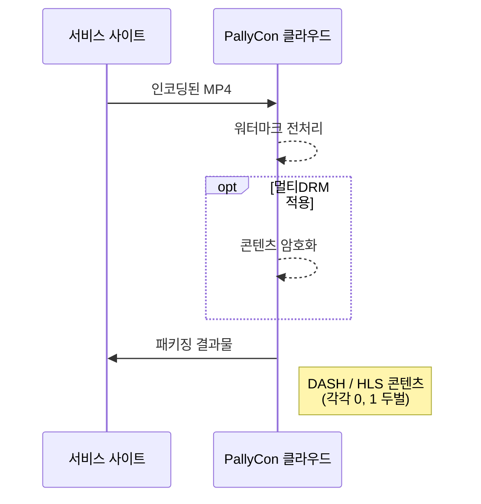

PallyCon 워터마크 패키징 서비스는 클라우드 SaaS 형태로 제공되는 워터마크 삽입 서비스입니다. CLI 전처리기 또는 전처리 라이브러리를 이용한 별도의 서버를 구축할 필요 없이, 인코딩 결과물을 대상으로 PallyCon 클라우드 서비스를 이용하여 API 기반 워터마크 전처리 및 패키징 작업을 수행할 수 있습니다.



패키징을 위한 스토리지와 작업 관리 API에는 아래와 같은 공통 규격이 사용됩니다.

## PallyCon HTTP API 규격

PallyCon 서비스에서 사용하는 각종 HTTP API 요청시 아래 규격을 따릅니다.

> API 요청 규격에 대한 샘플 코드는 [패키져/샘플 다운로드 페이지]({})에서 확인하시기 바랍니다.

### 요청 규격

|Name|Value|
|---|---|
|pallycon-apidata|base64 Encoding ( JSON string )|

### 요청 데이터 JSON 포맷

```json
{
    "data":"{base64 encode(aes256 cbc encrypt(API data))}",
    "timestamp":"{yyyy-mm-ddThh:mm:ssZ}",
    "hash":"{base64 encode(sha256(message format))}"
}
```

**요청 데이터 명세**

| Name | Value | Required | Description |
| ---- | ----- | ---- | -------------- |
| `data` | String | Y | 각 API마다 정의된 규격으로 생성한 JSON 문자열을 AES 암호화하고, 결과값을 base64 문자열로 입력 |
| `timestamp` | String | Y | GMT 시간대 기준으로 요청 시점의 시간을 "yyyy-mm-ddThh:mm:ssZ" 포맷으로 입력 |
| `hash` | String | Y | 아래 규격에 따라 생성한 해시값을 입력 |

**AES256 암호화**

AES256 암호화는 PallyCon Cloud 서비스 사이트 생성 시 발급 되는 Site 키 값을 이용하여 아래와 같이 처리 합니다. ( PallyCon 콘솔 사이트에서 확인 )

  - Mode : CBC
  - AES key : 32 byte (PallyCon 콘솔 사이트에서 발급 되는 site key)
  - AES IV : fixed 16 byte (0123456789abcdef)
  - Padding : pkcs7

**SHA256 입력 포맷**

SHA256 해시의 입력값은 다음과 같은 문자열을 조합해 입력합니다.

  ```s
  [site access key] + [site_id] + [json.data] + [json.timestamp]
  ```

  - site access key: PallyCon Cloud 서비스 사이트 생성 시 발급 되는 access key 값이며 PallyCon 콘솔 사이트에서 확인 가능합니다.
  - sha256 해시 함수의 결과 값은 문자열로 변환하지 않고 바이너리 데이터 형태 그대로 base64 함수에 입력되어야 합니다.

## 스토리지 등록 API {#storage-register}

워터마크 전처리와 패키징 작업에 사용되는 스토리지를 등록하는 API입니다. 패키징 작업을 등록하기 전에 먼저 이 API를 통해 작업에 사용될 스토리지를 등록해야 합니다.

### 요청 규격

- PallyCon HTTP API 규격으로 호출
- URL : `https://api.pallycon.com/api/v2/storage/[SITE_ID]`
- Method: POST
- Content type: application/json;charset=UTF-8

> URL의 'SITE_ID' 부분은 PallyCon 콘솔 사이트에서 발급된 실제 사이트 ID를 입력해야 합니다.

#### 요청 데이터 JSON 포맷

```json
{
	"storage_name" : "{storage name}",
	"type" : "{storage type}",
	"id": "{access id}",
	"password": "{access password}",
	"aws_bucket": "{bucket name}",
	"description" : "{description}",
	"region": "{region}"
}
```

#### 요청 데이터 명세

| **Key**      | **type** | **required** | **description**                            |
|--------------|----------|--------------|--------------------------------------------|
| storage_name | String   | Y            | 스토리지 명                                |
| type         | String   | Y            | 스토리지 타입 : 현재 AWS S3만 지원 ('S3' 입력)  |
| id           | String   | Y            | 스토리지 접근 ID : aws access key id       |
| password     | String   | Y            | 스토리지 접근 암호 : aws secret access key |
| aws_bucket   | String   | Y            | 버켓 명                                    |
| description  | String   | N            | 스토리지 설명                              |
| region       | String   | Y            | 스토리지의 AWS 리전 코드           |

### 응답 규격

#### 응답 데이터 JSON 포맷

```json
{
	"storage_id": "{storage id}",
	"error_code": "{error code}",
	"error_message": "{error message}"
}
```

#### 응답 데이터 명세

| **Key**       | **type** | **description**                                        |
|---------------|----------|--------------------------------------------------------|
| error_code    | String   | "0000" : 성공, 에러인 경우 영문/숫자로 정의된 에러코드 |
| error_message | String   | 에러인 경우 에러 메시지                                |
| storage_id    | String   | 스토리지 ID    |

## 스토리지 수정 API {#storage-update}

워터마크 전처리와 패키징 작업에 사용되는 스토리지 정보를 수정하는 API입니다.

### 요청 규격

- PallyCon Cloud HTTP API 규격으로 호출
- Url: `https://api.pallycon.com/api/v2/storage/[SITE_ID]`
- Method: PUT
- Content type: application/json;charset=UTF-8

#### 요청 데이터 JSON 포맷

```json
{
	"storage_id" : "{storage id}",
	"storage_name" : "{storage name}",
	"description": "{description}"
}
```

#### 요청 데이터 명세

| **Key**      | **type** | **required** | **description** |
|--------------|----------|--------------|-----------------|
| storage_id   | String   | Y            | 스토리지 ID     |
| storage_name | String   | N            | 스토리지 명     |
| description  | String   | N            | 스토리지 설명   |

### 응답 규격

#### 응답 데이터 JSON 포맷

```json
{
	"storage_id": "{storage id}",
	"error_code": "{error code}",
	"error_message": "{error message}"
}
```

#### 응답 데이터 명세

| **Key**       | **type** | **description**                                        |
|---------------|----------|--------------------------------------------------------|
| error_code    | String   | "0000" : 성공, 에러인 경우 영문/숫자로 정의된 에러코드 |
| error_message | String   | 에러인 경우 에러 메시지                                |
| storage_id    | String   | 스토리지 ID                                            |

## 스토리지 목록 API {#storage-list}

등록된 스토리지의 목록를 가져오는 API입니다.

### 요청 규격

- PallyCon Cloud HTTP API 규격으로 호출
- Url : `https://api.pallycon.com/api/v2/storage/[SITE_ID]`
- Method : GET
- Content type : application/json;charset=UTF-8

#### 요청 데이터 JSON 포맷

```json
{
	"search_keyword": "{search keyword}",
	"search_keyword_type": "{storageId/ storageName}",
	"storage_type": "S3",
	"region": "{region}",
	"from": "{YYYY-MM-DD'T'hh:mm:ss'Z'}",
	"to": "{YYYY-MM-DD'T'hh:mm:ss'Z'}",
	"page_unit": {Number value},
	"page_index": {Number value},
	"time_zone": "{hh:mm}"
}
```

#### 요청 데이터 명세

| **Key**             | **type** | **required** | **description**                   |
|---------------------|----------|--------------|-----------------------------------|
| search_keyword      | String   | N            | 검색어                            |
| search_keyword_type | String   | N            | 검색 타입(storageId, storageName) |
| storage_type        | String   | Y            | 스토리지 타입 (S3)                |
| from                | String   | N            | 스토리지의 등록 시간 검색 조건      |
| to                  | String   | N            | 스토리지의 등록 시간 검색 조건      |
| page_unit           | Number      | N            | 검색 갯수. default : 25           |
| page_index          | Number      | N            | 검색 페이지. default : 1          |
| region              | String   | Y            | 스토리지의 AWS Region 코드        |
| time_zone           | String   | N            | 검색 시간대                       |

### 응답 규격

#### 응답 데이터 JSON 포맷

```json
{
	"error_code": "{error code}",
	"error_message": "{error message}",
	"total_count": "total count",
	"time_zone": "{hh:mm}",
	"data": [{
		"storage_id" : "{storage id}",
		"storage_name" : "{storage name}",
		"type" : "{storage type}",
		"id": "{access id}",
		"password": "{access password}",
		"aws_bucket": "{bucket name}",
		"description" : "{description}",
		"region": "{region}",
		"reg_date": "{YYYY-MM-DD'T'hh:mm:ss'Z'}"
	}]
}
```

#### 응답 데이터 규격

| **Key**       | **type** | **description**                                        |
|---------------|----------|--------------------------------------------------------|
| error_code    | String   | "0000" : 성공, 에러인 경우 영문/숫자로 정의된 에러코드 |
| error_message | String   | 에러인 경우 에러 메시지                                |
| storage_id    | String   | 스토리지 ID                                            |

***

## 패키징 작업 등록 API {#packaging-job-register}

이 API는 새로운 워터마킹 패키징 작업을 등록합니다. 패키징 작업을 등록하기 전에 먼저 작업용 스토리지를 등록하고, 해당 스토리지에 원본 MP4 파일을 업로드해야 합니다.

### 요청 규격

- Url: `https://api.pallycon.com/api/v2/pack/[SITE_ID]`
- Method: POST
- Content type: application/json;charset=UTF-8

**트라이얼 시 제약 사항**

1. 트라이얼 계정에서는 Adaptive Streaming 콘텐츠 패키징을 지원하지 않습니다.
2. 패키징할 원본 영상은 mp4 포맷만 지원됩니다.
3. 트라이얼 계정은 한 번의 패키징 작업만 제공됩니다.

#### 요청 데이터 JSON 포맷

```json
{
	"job_name": "{job name}",
	"storage":{
		"input":{
			"storage_id": "{storage id}",
			"contents_path":[ input contents path ]
		},
		"output":{
			"storage_id": "{storage id}",
			"path": "{output path}"
		}
	},
	"content_id": "{content id}",
	"streaming_format": [dash, hls],
	"protect_type": [ drm, watermark ],
	"subtitles":[
		{
		"path": "{subtitle path}",
		"language": "{language}"
		}
	],
    "dash_option":{
        "min_buffer_time": {Number value},
        "enable_average_bandwidth_mpd": {true|false}
    },
    "drm_option": {
        "multi_key": {true|false},
        "skip_audio_encryption": {true|false},
        "max_sd_height": {Number value},
        "max_hd_height": {Number value},
        "max_uhd1_height": {Number value},
        "clear_lead": {Number value},
        "generate_tracktype_manifests": {true|false}
    }	
}
```

#### 요청 데이터 명세

| **Key**              | **type**   | **required** | **description**                                          |
|----------------------|------------|--------------|----------------------------------------------------------|
| job_name             | String     | Y            | Job 이름                                                 |
| storage              | JSON       | Y            | 콘텐츠가 저장된 스토리지 및 원본 파일 정보                |
| content_id           | String     | Y            | 고객사에서 관리하는 고유한 콘텐츠 ID(CID, 최대 200byte) |
| streaming_format     | Array      | Y            | 스트리밍 콘텐츠 타입                                     |
| protection_type      | Array      | Y            | drm, watermark 적용 사항. watermark 는 필수 옵션         |
| subtitles            | JSON Array | N            | 자막 정보                                                |
| dash_option          | JSON       | N            | DASH 패키징 관련 옵션 |
| drm_option           | JSON       | N            | DRM 암호화 관련 옵션 |

**storage.input**

| **Key**       | **type** | **required** | **description**                                                                 |
|---------------|----------|--------------|---------------------------------------------------------------------------------|
| storage_id    | String   | Y            | PallyCon에서 발급한 스토리지 고유 ID    |
| contents_path | Array    | Y            | 원본 파일이 업로드된 폴더/파일 경로. 여러 개가 지정될 경우 Adaptive Streaming 형태로 패키징됨 |

**storage.output**

| **Key**    | **type** | **required** | **description**                 |
|------------|----------|--------------|---------------------------------|
| storage_id | String   | Y            | PallyCon에서 발급한 스토리지 고유 ID |
| path       | Array    | Y            | 패키징 결과물이 저장될 경로     |

**subtitles**

| **Key**  | **type** | **required** | **description** |
|----------|----------|--------------|-----------------|
| path     | String   | N            | 자막 파일 경로 |
| language | String   | N            | 자막 파일 언어 |

**dash_option**

| **Key**  | **type** | **required** | **description** |
|----------|----------|--------------|-----------------|
| min_buffer_time | Number | N      | 원활한 재생을 보장하는 데 필요한 초기 버퍼링 된 미디어의 최소 시간입니다. 최소값: 2 |
| enable_average_bandwidth_mpd | Boolean | N | 최대 대역폭이 아닌 평균을 mpd 단위로 적용합니다. 기본값: false |

**drm_option**

| **Key**  | **type** | **required** | **description** |
|----------|----------|--------------|-----------------|
| multi_key | Boolean | N | 멀티키 패키징 여부. 기본값: false |
| skip_audio_encryption | Boolean | N | 오디오 트랙 DRM 암호화 여부. 기본값: false (암호화 적용) |
| max_sd_height | Number | N | SD 트랙으로 패키징될 최대 해상도 설정. 기본값: 480 | 
| max_hd_height | Number | N | HD 트랙으로 패키징될 최대 해상도 설정. 기본값: 1080 |
| max_uhd1_height | Number | N | UHD 트랙으로 패키징될 최대 해상도 설정. 기본값: 2160 |
| clear_lead | Number | N | 영상 초반 암호화 비활성화 구간 (초 단위). 기본값: 0 |
| generate_tracktype_manifests | Boolean | N | 트랙별 매니페스트(플레이리스트) 파일 생성. SD부터 UHD 트랙까지 포함된 어댑티브 스트림의 경우, ‘SD_ONLY’, ‘SD_HD’, ‘SD_UHD’ 세 가지 매니페스트가 생성됨. 기본값: false | 

### 응답 규격

#### 응답 데이터 JSON 포맷

```json
{
	"error_code": {error code},
	"error_message": {error message},
	"job_id": {job id}
}
```

#### 응답 데이터 명세

| **Key**       | **type** | **description**                                        |
|---------------|----------|--------------------------------------------------------|
| error_code    | String   | "0000" : 성공, 에러인 경우 영문/숫자로 정의된 에러코드 |
| error_message | String   | 에러인 경우 에러 메시지                                |
| job_id        | Number      | Job 등록이 성공한 경우만 발급                          |

## 패키징 목록 조회 API {#packaging-job-list}

PallyCon 패키징 서버에서 패키징 작업 목록를 가져오기 위해서 사용되는 API 입니다.

### 요청 규격

- Url : `https://api.pallycon.com/api/v2/pack/{siteId}`
- Method : GET
- Content type : application/json;charset=UTF-8

#### 요청 데이터 JSON 포맷

```json
{
	"search_keyword": "{search keyword}",
	"search_keyword_type": "{cid, jobId, jobname}",
	"search_type": "{watermark, drm}",
	"search_status": "{ready, success, failed, complete, working, process}",
	"search_condition": "{dash, hls}",
	"from": "{YYYY-MM-DD'T'hh:mm:ss'Z'}",
	"to": "{YYYY-MM-DD'T'hh:mm:ss'Z'}",
	"page_unit": "{Number value}",
	"page_index": "{Number value}",
	"time_zone": "{hh:mm}"
}
```

#### 요청 데이터 명세

| **Key**      | **type** | **required** | **description**                                   |
|---------------------|----------|--------------|--------------------------------------------|
| from                | String   | N            | 패키징 작업 등록 시간 검색 조건                         |
| to                  | String   | N            | 패키징 작업 등록 시간 검색 조건                         |
| page_unit           | Number      | N            | 검색 갯수. default : 25                    |
| page_index          | Number      | N            | 검색 페이지. default : 1                   |
| search_type         | String   | N            | 보안 타입 검색(drm, watermark)             |
| search_status       | String   | N            | 진행 상태 검색(ready, success, failed, complete(성공+실패), working(대기+진행), process(진행), stop) |
| search_condition    | String   | N            | 스트리밍 포멧(dash, hls)                   |
| search_keyword_type | String   | N            | 검색 타입(cid, jobId, jobName)             |
| search_keyword      | String   | N            | 검색어                                    |
| region              | String   | Y            | AWS 리전 코드로 검색                     |
| time_zone           | String   | N            | 검색 시간대                               |

### 응답 규격

#### 응답 데이터 JSON 포맷

```json
{
	"error_code": "{error code}",
	"error_message": "{error message}",
	"total_count": "{count}",
	"time_zone": "{hh:mm}",
	"data": [ {
		"job_id": "{job id}",
		"job_name": "{job name}",
		"start_date": "{start date({YYYY-MM-DD'T'hh:mm:ss'Z')}",
		"update_date": "{update date({YYYY-MM-DD'T'hh:mm:ss'Z')}",
		"reg_date": "{registered date({YYYY-MM-DD'T'hh:mm:ss'Z')}",
		"watermark": "{watermark use}",
		"drm": "{true/false}",
		"dash": "{true/false}",
		"hls": "{true/false}",
		"content_id": "{content id}",
		"status": "{status}",
		"storage":{
			"input":{
				"storage_id": "{storage id}",
				"contents_path":[ input contents path ]
			},
			"output":{
				"storage_id": "{storage id}",
				"path": "{output path}"
			}
		},
		"subtitles":[ {
			"path": "{subtitle path}",
			"language": "{language}"
		} ]
	} ]
}
```

## 패키징 결과 콜백 연동

PallyCon 콘솔 사이트에 패키징 결과에 대한 콜백 URL을 등록하면, 패키징 작업이 완료되거나 에러 발생 시 아래와 같은 정보를 해당 페이지를 통해 수신할 수 있습니다.

### JSON 요청 데이터

다음과 같은 JSON 데이터가 POST 방식으로 콜백 URL에 전송됩니다. (암호화되지 않은 평문)

```json
{
    "job_id": <job_id>,
    "error_code": <error_code>,
    "error_message": <error_message>,
    "input_contents_path": [<input_contents_path>...],
    "output_path": <output_path>
}
```

## 에러 및 상태 코드

### API 에러 코드

| Code | Description |
| ---- | -------------- |
| 0000 | 성공 |
| A1000 | 잘못된 파라미터 값이 입력됨 |
| A1002 | Timestamp 형식이 잘못됨 |
| A1003 | Site ID를 찾을 수 없음 |
| A1006 | 해당 사이트 키로 복호화에 실패함 |
| A1007 | 해시 검증이 실패함 |
| A4002 | 워터마크 데이터의 저장이 실패함 |
| A4003 | 워터마크 데이터의 생성이 실패함 |
| A7008 | API 데이터 파싱 오류 |
| A7009 | API 버전이 맞지 않음 |

### 패키징 작업 상태 코드

| Status code | Status |
| ---- | ---- |
|WM000| 준비 |
|WM010| 작업 목록 설정|
|WM020| 에이전트에 전송|
|WM021100| 원본 파일 다운로드 중|
|WM021200| 원본 파일 다운로드 완료|
|WM022100| 워터마크 패키징 중|
|WM022200| 워터마크 패키징 완료|
|WM023100| DRM 패키징 중|
|WM023200| DRM 패키징 완료|
|WM023300| 아카마이 지원 처리 중|
|WM024100| 결과 파일 업로드 중|
|WM024200| 결과 파일 업로드 완료|
|WM030| 패키징 작업 완료|
|WM100| 패키징 작업 중단 요청|
|WM200| 패키징 작업 중단 완료|
|WM999| 패키징 에러 발생|

### 패키징 작업 에러 코드

| Error code | Status |
| ---- | ---- |
|WM900101| 작업 목록 설정 실패|
|WM900102| 지원되지 않는 모드입니다.|
|WM900103| 지원되지 않는 모드입니다.|
|WM900104| 사이트 정보가 없습니다.|
|WM900105| DRM 패키징 콜백 연동 오류|
|WM900106| CID 설정 실패|
|WM900107| 메타데이터 설정 실패|
|WM900108| 스토리지 또는 파일이 존재하지 않습니다.|
|WM900109| SEND_AGENT 상태 저장 실패|
|WM900110| 완료 상태 저장 실패|
|WM900111| 스토리지 데이터 선택 실패|
|WM900112| 메일 폼 설정 실패|
|WM900113| 스토리지 정보 설정 실패|
|WM900114| 내부 클러스터 오류|
|WM900115| ClusterEvent.UnreachableMember.|
|WM900116| 패키징 목록 설정 실패|
|WM900117| 패키징 정보 파싱 오류|
|WM900118| 패키징 정보 관련 DB 업데이트 실패|
|WM900119| 작업 취소 관련 상태 업데이트 실패|
|WM900120| DB 상태 업데이트 실패|
|WM900121| 작업 목록 분리 실패|
|WM900122| 인스턴스 중지를 위한 람다 호출 실패|
|WM900123| API 요청 데이터 생성 실패|
|WM900124| API 호출 실패|
|WM900125| API 응답 데이터 파싱 오류|
|WM900126| 실패한 API 응답 수신 |
|WM900127| WM010 상태 업데이트 실패|
|WM900128| WM030 상태 업데이트 실패|
|WM900129| WM02X 상태 업데이트 실패|
|WM900130| WM200 상태 업데이트 실패|
|WM900131| 중단 요청 목록 설정 실패|
|WM900132| WM100 관련 응답 데이터 파싱 오류|
|WM900133| 오류 상태 업데이트 실패|
|WM900134| 작업 데이터 없음|
|WM900135| PKI 키 복호화 실패|
|WM900136| PKI 키 복호화를 위한 매핑 오류|
|WM900137| 작업 데이터 생성 실패|
|WM900001| 사이트키 복호화 실패|
|WM900002| 워터마킹 작업 API 생성 실패|
|WM900003| 워터마킹 작업 목록 API 호출 오류|
|WM900004| API 응답 파서 오류|
|WM900005| API 오류|
|WM900006| 작업 실행 에러|
|WM900007| S3 버킷 액세스키/ID 오류|
|WM900008| S3 버킷 접속 오류 (잘못된 키 또는 리전)|
|WM900009| S3 버킷 정보 오류|
|WM900010| 원본 콘텐츠 다운로드 실패|
|WM900011| 자막 파일 다운로드 실패|
|WM900012| S3 GET Object 오류|
|WM900013| 파일 다운로드 오류|
|WM900014| 트라이얼 계정의 원본 파일 크기 제한 초과|
|WM900015| 지원하지 않는 코덱|
|WM900016| 원본 영상 길이가 너무 짧음 (최소 12분 이상)|
|WM900017| 원본 영상 해상도가 너무 낮음 (최소 640p 이상)|
|WM900018| 임시 파일 삭제 실패|
|WM900019| 업로드 프로세스 오류|
|WM900020| S3 PUT Object 실패|
|WM900021| 업로드할 결과 파일이 없음|
|WM900022| 미디어 정보 오류|

***
