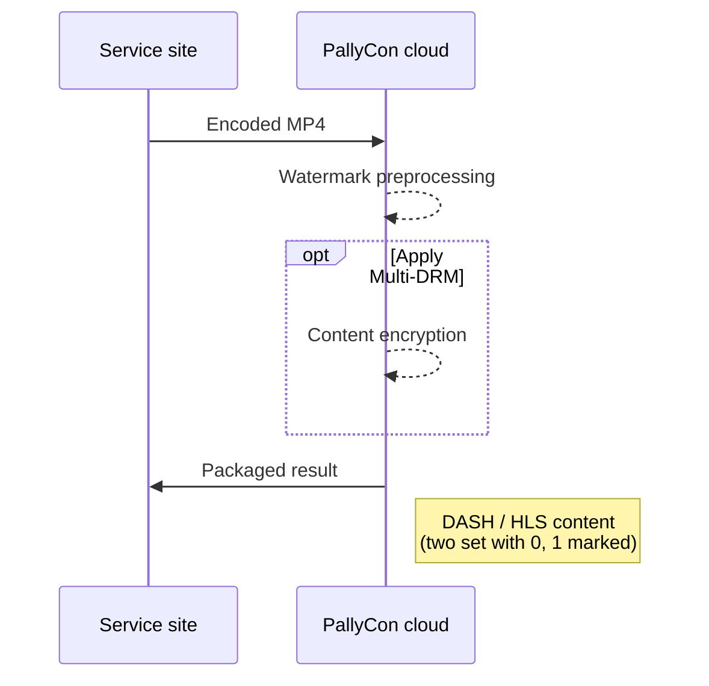

---
# Course title, summary, and position.
linktitle: Packaging Service Guide
summary: You can preprocess and package your content using the PallyCon cloud service without having to build a separate server with the CLI preprocessor or library.
weight: 30

# Page metadata.
title: Preprocessor Library Guide
date: "2018-09-09T00:00:00Z"
lastmod: "2020-10-18T00:00:00Z"
draft: false  # Is this a draft? true/false
toc: true  # Show table of contents? true/false
type: book  # Do not modify.

# Add menu entry to sidebar.
# - name: Declare this menu item as a parent with ID `name`.
# - weight: Position of link in menu.
menu:
  watermarking:
    weight: 30
    parent: Watermark Preprocessing
---

A watermarking service provided in the form of cloud SaaS. You can preprocess and package your content using the PallyCon cloud service without having to build a separate server with the CLI preprocessor or library.

The packaging service can be used via the web UI of the PallyCon console site or the following HTTP APIs.

## Packaging guide through the web console

You can can perform content packaging for watermark preprocessing process on [PallyCon Console site](https://console.pallycon.com) using Web UI. The following procedure will package the original MP4 video into two 0/1 watermarked DASH or HLS content. (A/B variants)

### AWS region and S3 storage settings

To use the watermark packaging service, you must first select the AWS region to perform the service.

After login to the console site, go to the `Site Settings` > `Integration Settings` screen and set the region to be used on `Packaging Service Region` in the `Forensic Watermarking Settings` section.



> The `Packaging Service Region` list displays only the regions for which the instance type is currently supported for packaging. Storage of regions not listed can not be used for the packaging operations.

Next, set the AWS S3 storage information where the original content and packaging results will be stored.

From the `Forensic Watermarking` menu on the left side of the screen, go to the `Packaging Service` > `Storage Setting` screen and click the `Register` button.



Enter each item on the `Storage Registration` screen as below.



- `Type`: Select the type of storage to be registered. Currently, only S3 is supported.
- `Storage Name`: Enter an arbitrary name to identify the storage. (Special characters can not be used, max 50 bytes)
- `Bucket Name`: Enter the name of the bucket to be used for input or output of the packaging operation from among the buckets inside the S3 storage.
- `Access Key`: Enter the ID value of `Access Key` required for S3 access.
- `Secret Key`: Enter the `Secret Access Key` value of the Access Key.
- `Description`: Enter a detailed description of the storage to be registered. (optional)

> You can register multiple storages according to usage. At least two (input and output) storages must be registered for packaging.

### Packaging Job Registration

When the storage registration is complete, go to the `Packaging` screen for job registration. Click the `Create` button on the right side of the screen to register a new job.



> You must upload the original video file (mp4) to be packaged into the input bucket before you register the packaging job.

Enter each item on the `Registration of packaging operation` screen as follows.



- `Job Name`: Enter an arbitrary name to distinguish the job. (Special characters can not be used, maximum 50 bytes)
- `Content ID`: Enter the unique ID (Content ID) of the content to be packaged. (Special characters can not be used, maximum 200 bytes)
- `Input Storage`: Select the input storage from the list that you registered in the previous step.
- `Input Content Path`: Enter the path of the source video file (mp4) in the storage, excluding the bucket name. (For example, source/test1.mp4)
- `Output Storage`: Select the output storage you registered in the previous step from the list.
- `Output Content Path`: Enter the path to the output to be created in the output bucket.
- `Security setting`: If you package by applying watermarking and DRM simultaneously, click the `DRM` option to select it.
- `Streaming format`: Select the streaming format to be packaged.
- `Caption file path`: If you are packaging with subtitles, upload the subtitle file for each language to the same input storage as the source video, then input the corresponding path.

Enter each item and click the `Create` button to register the packaging job for the content. A list of pending or running packaging jobs can be viewed on the corresponding screen.

> If multiple source videos are registered for different resolutions, it can be packaged into adaptive bitrate (ABR) content.

### Packaging History

When packaging is successful, 0/1 version watermarking content packaged in DASH/HLS format is created in the content path of the output storage set when registering the job.

The history of the completed packaging jobs can be viewed on the `Packaging history` screen as shown below.



Packaged DASH/HLS content must be connected to the CDN supported by the watermark embedding module for real-time mixing. Please refer to [Watermark Embedding Guide](../../embedding) for details of this integration.
