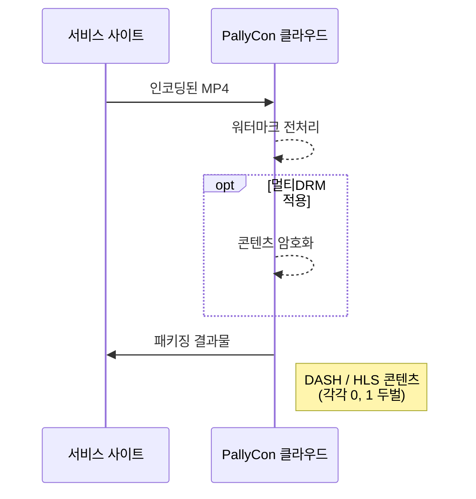

---
# Course title, summary, and position.
linktitle: 패키징 서비스 가이드
summary: PallyCon 워터마크 패키징 서비스는 클라우드 SaaS 형태로 제공되는 전처리 및 패키징 서비스입니다.
weight: 30

# Page metadata.
title: 패키징 서비스 가이드
date: "2018-09-09T00:00:00Z"
lastmod: "2020-10-18T00:00:00Z"
draft: false  # Is this a draft? true/false
toc: true  # Show table of contents? true/false
type: book  # Do not modify.

# Add menu entry to sidebar.
# - name: Declare this menu item as a parent with ID `name`.
# - weight: Position of link in menu.
menu:
  watermarking:
    weight: 30
    parent: 워터마크 전처리
---

PallyCon 워터마크 패키징 서비스는 클라우드 SaaS 형태로 제공되는 전처리 및 패키징 서비스입니다. CLI 전처리기 또는 전처리 라이브러리를 이용한 별도의 서버를 구축할 필요 없이, 인코딩 결과물을 대상으로 PallyCon 클라우드 서비스를 이용하여 워터마크 전처리 및 패키징 작업을 수행할 수 있습니다.

패키징 서비스는 PallyCon 콘솔 사이트의 웹 UI 또는 별도의 HTTP API를 통해 사용할 수 있습니다.

## 웹 콘솔을 통한 패키징 가이드

[PallyCon 콘솔 사이트](https://console.pallycon.com)에서 웹 UI를 이용해 워터마크 전처리 과정을 포함한 콘텐츠 패키징을 수행할 수 있습니다. 아래와 같은 과정을 통하여 원본 MP4 파일을 워터마크 적용된 0/1 두 벌의 DASH 또는 HLS 콘텐츠로 패키징합니다.

### AWS 리전 및 S3 스토리지 설정

워터마크 패키징 서비스를 이용하기 위해서는 우선 해당 서비스를 수행할 AWS 리전을 선택해야 합니다. 

콘솔 사이트에 로그인 후 `사이트 설정` > `연동 설정` 화면으로 이동해 `포렌식 워터마킹 설정` 항목의 `패키징 서비스 리전`에서 사용할 리전을 설정합니다.



> 패키징 서비스 리전 목록에는 현재 시점에 패키징 작업에 필요한 인스턴스 타입이 지원되는 리전만 표시됩니다. 목록에 표시되지 않은 리전의 스토리지는 패키징 작업에 사용할 수 없습니다.

다음으로 원본 콘텐츠와 패키징 결과물이 저장될 AWS S3 스토리지 정보를 설정합니다.

화면 좌측의 `포렌식 워터마킹` 메뉴에서 `패키징 서비스` > `스토리지 설정` 화면으로 이동해 `등록` 버튼을 클릭합니다.



`스토리지 등록` 화면의 각 항목들을 아래와 같이 입력합니다.



- `타입`: 등록할 스토리지의 타입을 선택합니다. 현재는 S3만 지원합니다.
- `스토리지 명`: 해당 스토리지를 구별할 수 있는 임의의 이름을 입력합니다. (특수 문자 사용 불가, 50바이트 이하)
- `버킷 명`: 해당 S3 내부의 버킷 중에서 패키징 작업의 입력 또는 출력 용도로 사용할 버킷의 이름을 입력합니다.
- `Access Key`: S3 접근을 위해 필요한 `Access Key`의 ID 값을 입력합니다.
- `Secret Key`: 해당 Access Key의 `Secret Access Key` 값을 입력합니다.
- `설명`: 등록할 스토리지에 대한 자세한 설명을 입력합니다. (선택 사항)

> 용도에 따라 여러 개의 스토리지를 등록할 수 있으며, 패키징 작업을 위해서는 최소 두 개(입력용, 출력용) 이상의 스토리지가 등록되어야 합니다.

### 패키징 작업 등록

스토리지 등록이 완료되면 작업 등록을 위해 `패키징 작업` 화면으로 이동합니다. 화면 우측의 `등록` 버튼을 눌러 신규 작업을 등록합니다.



> 패키징 작업 등록 전에 패키징할 원본 비디오 파일(mp4)을 입력용 버킷에 업로드해야 합니다.

`패키징 작업 등록` 화면의 각 항목들을 아래와 같이 입력합니다.



- `Job 명`: 해당 작업을 구분할 임의의 이름을 입력합니다. (특수 문자 사용 불가, 최대 50바이트)
- `콘텐츠 ID`: 패키징할 콘텐츠의 고유 ID(Content ID)를 입력합니다. (특수 문자 사용 불가, 최대 200바이트)
- `입력 스토리지`: 이전 단계에서 등록한 입력용 스토리지를 목록에서 선택합니다.
- `입력 콘텐츠 경로`: 입력용 스토리지 내 원본 영상 파일(mp4)의 경로를 버킷명을 제외하고 입력합니다. (예: source/test1.mp4)
- `출력 스토리지`: 이전 단계에서 등록한 출력용 스토리지를 목록에서 선택합니다.
- `출력 콘텐츠 경로`: 출력용 버킷에 생성될 결과물의 경로를 입력합니다.
- `보안 설정`: 워터마킹과 DRM을 동시 적용해 패키징하는 경우, `DRM` 옵션을 클릭해 선택합니다.
- `스트리밍 포맷`: 패키징될 스트리밍 포맷을 선택합니다.
- `자막 파일 경로`: 자막을 포함하여 패키징하는 경우, 각 언어 별로 자막 파일을 원본 영상과 동일한 입력 스토리지에 업로드한 후 해당 경로를 입력합니다.

각 항목을 입력하고 `등록` 버튼을 누르면 해당 콘텐츠에 대한 패키징 작업이 등록됩니다. 대기 중 또는 진행 중인 패키징 작업의 목록은 해당 화면에서 확인할 수 있습니다.

> 동일 영상에 대해서 각 해상도 별로 여러 입력 파일을 등록하면 어댑티브 스트리밍(Adaptive bitrate, ABR) 콘텐츠로 패키징할 수 있습니다.

### 패키징 이력 확인

패키징이 성공적으로 완료되면, 작업 등록 시 설정한 출력 스토리지의 콘텐츠 경로에 DASH/HLS 포맷으로 패키징된 A/B 버전 워터마킹 콘텐츠가 생성됩니다.

완료된 패키징 작업의 이력은 아래와 같이 `패키징 완료 이력` 화면에서 조회할 수 있습니다.



패키징 완료된 DASH/HLS 콘텐츠는 실시간 조합을 위해 워터마크 삽입 연동을 지원하는 CDN과 연결되어야 합니다. 해당 연동 처리에 대한 상세 내용은 [워터마크 삽입 가이드](../../embedding)를 참고하시기 바랍니다.
