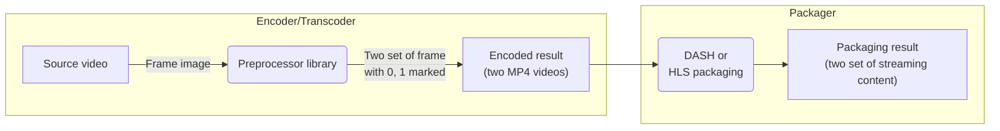

---
# Course title, summary, and position.
linktitle: Preprocessor Library Guide
summary: PallyCon Watermark Preprocessor Library is a C ++ library that can be ported to an encoding solution.
weight: 20

# Page metadata.
title: Preprocessor Library Guide
date: "2018-09-09T00:00:00Z"
lastmod: "2020-10-18T00:00:00Z"
draft: false  # Is this a draft? true/false
toc: true  # Show table of contents? true/false
type: book  # Do not modify.

# Add menu entry to sidebar.
# - name: Declare this menu item as a parent with ID `name`.
# - weight: Position of link in menu.
menu:
  watermarking:
    weight: 20
    parent: Watermark Preprocessing
---

PallyCon Watermark Preprocessor Library is a C ++ library that can be ported to an encoding solution. By preprocessing watermark directly in the video encoding process, you can omit the re-encoding process required for CLI Preprocessor.



By default, porting to FFMPEG-based encoder/transcoder is supported. To apply Preprocessor library to other commercial solutions, it is required to port the library by the solution vendor. Please contact us if you need more information or want to apply the library.

<a href="https://www.pallycon.com/contact/" target="_blank" class="btn btn-primary">Contact Us</a>

## Prerequisites

- Ubuntu 16.04 or 18.04 
- FFMPEG 3.4.2 ~ 4.1.1 version
- Set 'YOUR_FFMPEG_PATH' in Makefile
- Install dependencies as below

```s
sudo apt-get update
sudo apt-get install -y \
		build-essential \
		libva-dev \
		libvdpau-dev \
		libssl-dev
```

## Detailed flow

1. Initialize encoder / transcoder 

2. Initialize the Preprocessor library
    - Execute `CreateEmbedderImplement()` and `init()` functions for '0' and '1' versions respectively for the Preprocessor library initialization.

3. Load the frame to work from the source video
    - Progressively encodes and preprocesses watermarks from the first frame.

4. Decode source frame to image

5. Preprocess watermark into decoded image
    - Perform the following steps to produce two sets('0' and '1') of the video. (A/B variants)

6. Insert watermark
    - Sets the '0' and '1' marks by calling `embed()` function of the Preprocessor library.

7. Encode the watermarked image as a video frame

8. Write the encoded frame to the output video

9. Finalize the Preprocessor library
    - Call `DestroyEmbedderImplement()` function of the Preprocessor library for the '0' and '1' versions.

10. Finalize encoder / transcoder

> Repeat step 3 to 8 of the above procedure until the last frame of the source video to create two output videos with '0' and '1' marks inserted. (For example, output_0.mp4 and output_1.mp4)

## API List

```s
- IEmbedder* CreateEmbedderImplement(EmbedMarkSymbol sym)
  : @return embedder instance
  
- void DestroyEmbedderImplement(IEmbedder* embedder)
  : destroy embedder instance
    
- IEmbedder::init(const char* fmkeyfile, const char* accesskey)
  : initialize embedder with Keyfile and Access-Key [1]
  : @return FMError
    
- IEmbedder::embed(EmbedFrame* frame)
  : embed watermark
  : @return bool
```

### API Usage

```s
   embed_0 = CreateEmbedderImplement(EmbedMarkSymbol_0) [1]
   embed_1 = CreateEmbedderImplement(EmbedMarkSymbol_1)
    |
    v
   embed_0->init("./fmkeyDemo.dat", "FOR_INKA_FORENSIC_WATERMARK_TEST") [2]
   embed_1->init("./fmkeyDemo.dat", "FOR_INKA_FORENSIC_WATERMARK_TEST")
    |
    v
 +------------------------------------+
 | EmbedFrame ef0 [3]                 |
 | EmbedFrame ef1                     |
 |  |                                 |
 |  v                                 |
 | embed_0->embed(&ef0) [4]           |loop
 | embed_1->embed(&ef1)               |
 |  |                                 |
 |  v                                 |
 | adjust_packet_size(...) [5]        |
 +------------------------------------+
    |
    v
   DestroyEmbedderImplement(embed_0)
   DestroyEmbedderImplement(embed_1)
    |
    v
   XXXX_0.mp4, XXXX_1.mp4
   
   
   [1] Server Side A/B Variant Watermark method combines 0/1 files to generate unique user information. Create two instances for the 0/1 output files.
       - embedsample.cpp::fm_init_embedder()

   [2] Keyfile and Access-Key
       - Keyfile path and Access-Key must be entered to use the library.
       - The sample project includes a keyfile for demonstration. If you use the demo key, the 'Pallycon Demo' text will appear at the top left of the result video, and there are no other functional restrictions.
       - Please contact us to get the commercial version Keyfile and Access-Key.
       - embedsample.cpp::fm_init_embedder()

   [3] Set the EmbedFrame field as shown in the sample code.
       - embedsample.cpp::fm_embed(), IEmbedder.h

   [4] Call IEmbedder::embed() to embed watermark.
       - embedsample.cpp::fm_embed()

   [5] Match the size of embedded 0/1 version AVPacket.
       - embedsample.cpp::fm_adjust_packet_size(), fm_check_filler_data_rbsp()
```

### Restrictions

The encoder should follow the below rules to integrate PallyCon Forensic Watermarking.
Configure your encoder by referring to the below example about libx264.

1. The size of AVPacket should be the same after IEmbedder::embed()
   embedsample.cpp::fm_adjust_packet_size(), fm_check_filler_data_rbsp()

2. B-Frame should not be used
   embedsample.h::DONT_USE_BFRAME

3. GOP size should be 60
   - embedsample.cpp::openOutputFile()::enc_ctx->gop_size
   - embedsample.cpp::checkAndUpdateParam()::pCtx->x264_param
