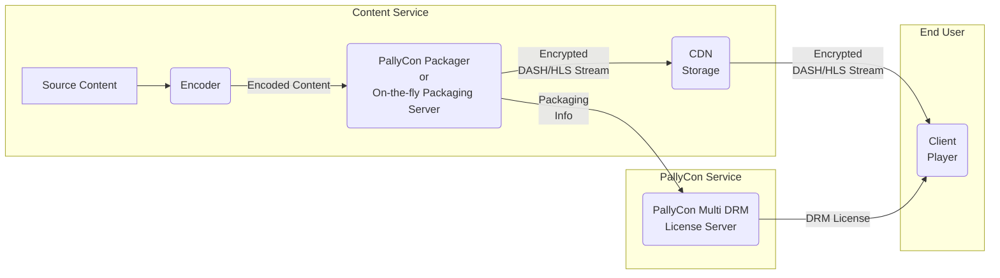
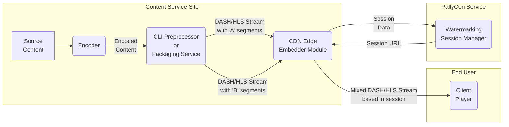

Describes various common concepts and terms related to PallyCon service.

## PallyCon Service

It is a cloud-based content security service operated by INKA Entworks. It consists of PallyCon Multi DRM service to prevent unauthorized use of content, and PallyCon forensic watermarking service to track the source of illegal distribution of the content.

## Service Site

It means the content service site of PallyCon's customer. Multi-DRM and/or forensic watermarking services provided by PallyCon are applied to the service sites.

## Site ID

A unique ID for the customer service site (content service) to which the PallyCon service is applied. It is created automatically when you signup to PallyCon service or add site, and it is used to identify the target in all integration processes such as content packaging, DRM licensing, and watermarking service.

## Site Key

It is an AES256 key used to encrypt data in various processes of PallyCon service integration. When a site ID is created, a unique key for the site is automatically generated.

## Access Key

This key is used for additional security and control in the process of using content packagers or generating license tokens. Similar to site key, access key is created together with site ID.

## Timezone

All date / time information processed by the PallyCon service (for example, the date of DRM license issue or packaging operation) is based on GMT (Greenwich Mean Time). In PallyCon console site, date / time information can be converted into customer's time zone by using 'Timezone' setting when displaying various data. Even if the setting is changed, the actual date / time data recorded in the database will not be changed, and the time data input of various integration APIs must be based on GMT regardless of the time zone setting of the console.

## PallyCon Multi-DRM Service

PallyCon Multi DRM service is a cloud-based SaaS (Solution as a Service) which consists of packaging solutions that apply DRM to contents, DRM license issuance service, and client solutions for DRM contents playback.

Please refer to [the guide]({{ %ref "/multidrm"%}}) for more details about PallyCon Multi DRM service.

## PallyCon Forensic Watermarking Service

PallyCon Forensic Watermarking is a cloud-based SaaS service that allows you to quickly and easily apply watermarking without building complex server environments.

Please refer to [the guide]({{ %ref "/watermarking"%}}) for more details about PallyCon Forensic Watermarking service.
