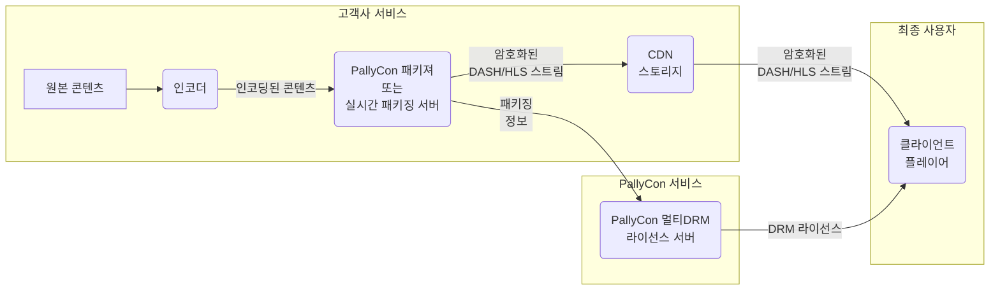
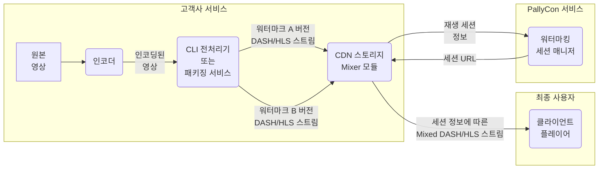

PallyCon 서비스와 관련된 각종 공통 개념과 용어에 대하여 설명합니다.

## PallyCon 서비스

잉카 엔트웍스에서 운영하는 클라우드 기반 콘텐츠 보안 서비스입니다. 콘텐츠의 불법 사용을 방지하는 PallyCon 멀티DRM 서비스와 불법 유출 발생 시 유출자를 추적하는 PallyCon 포렌식 워터마킹 서비스로 구성되어 있습니다.

## 서비스 사이트

PallyCon 고객사의 콘텐츠 서비스 사이트를 의미합니다. PallyCon에서 제공하는 멀티DRM과 포렌식 워터마킹 서비스는 고객사의 해당 서비스 사이트를 대상으로 적용됩니다.

## 사이트 ID

PallyCon 서비스가 적용될 고객사의 서비스 사이트(콘텐츠 서비스)에 대한 고유 아이디입니다. PallyCon 서비스 가입 또는 추가 사이트 등록 시 자동 생성되며 콘텐츠 패키징, DRM 라이센싱, 워터마킹 서비스 등 모든 연동 과정에서 대상을 구분하기 위해 사용됩니다.

## 사이트 키

PallyCon 서비스의 각종 연동 과정에서 연동 데이터를 암호화하는데 사용되는 AES256 키입니다. 사이트 ID가 생성될 때 해당 사이트의 고유한 사이트 키가 자동 생성됩니다.

## 액세스 키

콘텐츠 패키져 연동 또는 라이선스 토큰 생성 등의 과정에서 추가적인 보안 및 제어 처리를 위해 사용되는 키입니다. 사이트 키와 마찬가지로 사이트 ID가 생성될 때 함께 생성됩니다.

## 타임존

PallyCon 서비스에서 처리되는 모든 날짜/시간 정보(예: DRM 라이선스 발급일 또는 패키징 작업일 등)는 GMT(그리니치 표준시)를 기준으로 합니다. PallyCon 콘솔 사이트에서는 각종 데이터 조회 시 타임존 설정을 이용하여 날짜/시간 정보를 해당 시간대로 변환해 표시할 수 있습니다. 해당 설정을 변경하여도 데이터베이스에 기록된 실제 날짜/시간 데이터는 변경되지 않으며, 각종 연동 API에서 입력하는 시간 데이터는 콘솔의 타임존 설정과 무관하게 GMT 기준으로 입력되어야 합니다.

## PallyCon 멀티 DRM 서비스

PallyCon 멀티 DRM 서비스는 클라우드 기반의 SaaS (Solution as a Service)로, 콘텐츠에 DRM을 적용하는 패키징 솔루션과 DRM 라이선스 발급 서버, 그리고 DRM 콘텐츠의 재생에 필요한 클라이언트 연동 솔루션으로 이루어져 있습니다

PallyCon 멀티 DRM 서비스에 대한 자세한 사항은 [해당 가이드]({{ %ref "/multidrm"%}})를 참고하시기 바랍니다.

## PallyCon 포렌식 워터마킹 서비스

PallyCon 포렌식 워터마킹 서비스는 클라우드 기반의 SaaS 서비스로, 복잡한 서버 환경을 구축하지 않고도 워터마킹을 쉽고 빠르게 적용할 수 있게 도와줍니다.

PallyCon 포렌식 워터마킹 서비스에 대한 자세한 사항은 [해당 가이드]({{ %ref "/watermarking"%}})를 참고하시기 바랍니다.

***
