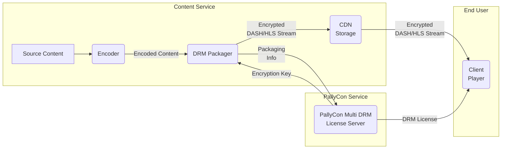

PallyCon Multi DRM service is a cloud-based SaaS (Solution as a Service) which consists of packaging solutions that apply DRM to contents, DRM license issuance service, and client solutions for DRM contents playback.

This document describes various concepts and terminology related to PallyCon Multi DRM service.

## PallyCon Service

It is a cloud-based content security service operated by INKA Entworks. It consists of PallyCon Multi DRM service to prevent unauthorized use of content, and PallyCon forensic watermarking service to track the source of illegal distribution of the content.

## Service Site

It means the content service site of PallyCon's customer. Multi-DRM and/or forensic watermarking services provided by PallyCon are applied to the service sites.

## Site ID

A unique ID for the customer service site (content service) to which the PallyCon service is applied. It is created automatically when you signup to PallyCon service or add site, and it is used to identify the target in all integration processes such as content packaging, DRM licensing, and watermarking service.

## Site Key

It is an AES256 key used to encrypt data in various processes of PallyCon service integration. When a site ID is created, a unique key for the site is automatically generated.

## Access Key

This key is used for additional security and control in the process of using content packagers or generating license tokens. Similar to site key, access key is created together with site ID.

## Timezone

All date / time information processed by the PallyCon service (for example, the date of DRM license issue or packaging operation) is based on GMT (Greenwich Mean Time). In PallyCon console site, date / time information can be converted into customer's time zone by using 'Timezone' setting when displaying various data. Even if the setting is changed, the actual date / time data recorded in the database will not be changed, and the time data input of various integration APIs must be based on GMT regardless of the time zone setting of the console.

## DRM (Digital Rights Management)

It is a technology that restricts the illegal use of various digital contents and controls the use of the contents of the authorized users according to the intention of the copyright owner. It consists of encryption technology for content protection and license management technology for usage rights control.

## Multi-DRM

It means application of multiple DRM technologies for each client platform to support DRM in various PC, mobile and OTT client environments. Please refer to [Supported Environments page]({}) for DRM and streaming protocol support information according to client environment.

## Packaging

The process of applying DRM by encrypting the original contents. There are pre-packaging method that serves pre-packaged contents to users and real-time packaging method which processes packaging at the time of contents playback.

For a detailed description of DRM packaging, see the [Content Packaging Guide]({}).

## Packaging Callback URL

A URL that is used to enter a unique ID for each content when packaging content through PallyCon Packager or Wowza integration module. You need to build this webpage on your server by following our specification and input its URL into the settings page of PallyCon Console site. During content packaging process, PallyCon server calls the URL to communicate with your server. This callback is not used if you enter the content ID directly to PallyCon Packager. 

> The callback type integration method is not recommended because delays or errors may occur depending on the situation of the customer's system. (Especially in the case of real-time packaging) Please contact us if you want the callback method for a specific reason.

## DRM License

In order for the client to play DRM-applied content, a license must be obtained from the DRM server. A DRM license consists of a cryptographic key used to decrypt content and usage control information (such as duration and supported environment). PallyCon supports callback method and token method according to the way of checking user's rights during license issuance process.

## License Callback

When a client requests a DRM license to play the content, the PallyCon cloud server calls the callback URL of the service site, checks the usage rights, and issues a license.

> The callback type integration method is not recommended because delays or errors may occur depending on the situation of the customer's system. Please use the token method instead, and contact us if you want the callback method for a specific reason.

## License Token

When a client plays content, the service site generates a license token according to the specification and delivers it to the client. The client sends the token to the PallyCon cloud server to receive the DRM license.

For more information about license token, please refer to the [Guide]({}).

## License Callback URL

A URL that is used when issuing DRM license by callback method. You need to build this webpage on your server by following our specification and input its URL into the settings page of PallyCon Console site. During license issuance process, PallyCon server calls the URL to communicate with your server. This callback URL is not used if you request DRM license by token method. 

## KMS Token

An authentication token used for content packaging key integration via CPIX API. A unique token is generated for each service site, and this token should be added to the API-specific key request URL such as PallyCon CPIX API or SPEKE API. Please refer to the [Developer Guide]({}) for details.
