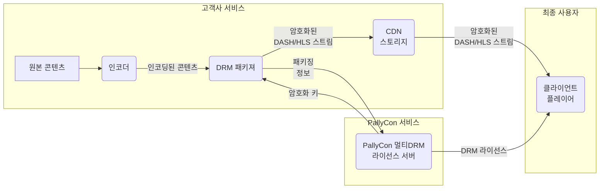

PallyCon Multi DRM 서비스는 클라우드 기반의 SaaS (Solution as a Service)로 DRM을 콘텐츠에 적용하는 패키징 솔루션, DRM 라이센스 발급 서비스 및 DRM 콘텐츠 재생을위한 클라이언트 솔루션으로 구성됩니다.

본 문서에서는 PallyCon 멀티DRM 서비스와 관련된 각종 개념과 용어에 대하여 설명합니다.

## PallyCon 서비스

잉카 엔트웍스에서 운영하는 클라우드 기반 콘텐츠 보안 서비스입니다. 콘텐츠의 불법 사용을 방지하는 PallyCon 멀티DRM 서비스와 불법 유출 발생 시 유출자를 추적하는 PallyCon 포렌식 워터마킹 서비스로 구성되어 있습니다.

## 서비스 사이트

PallyCon 고객사의 콘텐츠 서비스 사이트를 의미합니다. PallyCon에서 제공하는 멀티DRM과 포렌식 워터마킹 서비스는 고객사의 해당 서비스 사이트를 대상으로 적용됩니다.

## 사이트 ID

PallyCon 서비스가 적용될 고객사의 서비스 사이트(콘텐츠 서비스)에 대한 고유 아이디입니다. PallyCon 서비스 가입 또는 추가 사이트 등록 시 자동 생성되며 콘텐츠 패키징, DRM 라이센싱, 워터마킹 서비스 등 모든 연동 과정에서 대상을 구분하기 위해 사용됩니다.

## 사이트 키

PallyCon 서비스의 각종 연동 과정에서 연동 데이터를 암호화하는데 사용되는 AES256 키입니다. 사이트 ID가 생성될 때 해당 사이트의 고유한 사이트 키가 자동 생성됩니다.

## 액세스 키

콘텐츠 패키져 연동 또는 라이선스 토큰 생성 등의 과정에서 추가적인 보안 및 제어 처리를 위해 사용되는 키입니다. 사이트 키와 마찬가지로 사이트 ID가 생성될 때 함께 생성됩니다.

## 타임존

PallyCon 서비스에서 처리되는 모든 날짜/시간 정보(예: DRM 라이선스 발급일 또는 패키징 작업일 등)는 GMT(그리니치 표준시)를 기준으로 합니다. PallyCon 콘솔 사이트에서는 각종 데이터 조회 시 타임존 설정을 이용하여 날짜/시간 정보를 해당 시간대로 변환해 표시할 수 있습니다. 해당 설정을 변경하여도 데이터베이스에 기록된 실제 날짜/시간 데이터는 변경되지 않으며, 각종 연동 API에서 입력하는 시간 데이터는 콘솔의 타임존 설정과 무관하게 GMT 기준으로 입력되어야 합니다.

## DRM (Digital Rights Management)

각종 디지털 콘텐츠의 불법적인 사용을 제한하고, 승인된 사용자의 콘텐츠 사용을 저작권 소유자의 의도에 따라 제어하는 기술입니다. 콘텐츠의 보호를 위한 암호화 기술과 사용 권한 제어를 위한 라이선스 관리 기술로 구성됩니다.

## 멀티 DRM

다양한 PC, 모바일 및 OTT 클라이언트 환경에서 DRM을 지원하기 위해 각 클라이언트 플랫폼 별로 여러 DRM 기술을 적용하는 것을 말합니다. 클라이언트 환경에 따른 DRM과 스트리밍 프로토콜 지원 정보는 [지원 환경 페이지]({})를 참고하시기 바랍니다.

## 패키징

원본 콘텐츠를 암호화하여 DRM을 적용하는 과정으로, 사전에 패키징된 콘텐츠를 사용자에게 서비스하는 프리 패키징 방식과 콘텐츠 재생 시점에 패키징을 처리하며 전달하는 실시간 패키징 방식이 있습니다.

DRM 패키징에 대한 상세한 설명은 [콘텐츠 패키징 가이드]({})를 참고하시기 바랍니다.

## 패키징 콜백 URL

PallyCon 패키져 또는 Wowza 연동 모듈을 통한 콘텐츠 패키징 시 각 콘텐츠마다 고유한 아이디를 입력하기 위해 사용되는 URL입니다. 연동 규격에 따라 고객사에서 직접 구축한 웹 페이지 URL을 콘솔에 입력하면, PallyCon 서버가 해당 URL을 호출해 통신이 이루어집니다. 패키져에서 직접 콘텐츠 ID를 입력하는 경우에는 이 콜백이 사용되지 않으며, 상세한 내용은 별도 가이드를 참고하시기 바랍니다.

> 콜백 방식의 패키징 연동은 고객사 시스템의 상황에 따라 지연 현상이나 오류가 발생할 수 있어 권장되지 않습니다. (특히 실시간 패키징의 경우) 특별한 이유로 콜백 방식 연동을 원하는 고객사는 별도로 문의해 주시기 바랍니다.

## DRM 라이선스

클라이언트에서 DRM이 적용된 콘텐츠를 사용하기 위해서는 DRM 서버로부터 라이선스를 획득해야 합니다. DRM 라이선스는 콘텐츠 복호화에 사용되는 암호키와 사용 권한 제어 정보(사용 가능 기간, 환경 등)로 구성됩니다. 라이선스 발급 과정에서 사용자 권한을 확인하는 방식에 따라 콜백 방식과 토큰 방식의 연동을 지원합니다.

## 라이선스 콜백

클라이언트에서 콘텐츠 재생을 위하여 DRM 라이선스를 요청하면, PallyCon 클라우드 서버가 서비스 사이트의 콜백 URL을 호출하여 사용 권한을 확인 후 라이선스를 발급하는 방식입니다.

> 콜백 방식 라이선스 연동은 고객사 시스템의 상황에 따라 재생 시점에 지연 현상이나 오류가 발생할 수 있어 권장되지 않습니다. 대신 아래 라이선스 토큰을 이용하시기 바라며, 특별한 이유로 콜백 방식 연동을 원하는 고객사는 별도로 문의해 주시기 바랍니다.

## 라이선스 토큰

클라이언트에서 콘텐츠 재생 시, 서비스 사이트가 규격에 따라 라이선스 토큰을 생성해 클라이언트에 전달하면 해당 토큰을 클라이언트가 PallyCon 클라우드 서버에 전송해 DRM 라이선스를 발급받는 방식입니다.

라이선스 토큰에 대한 상세한 내용은 [해당 가이드]({})를 참고하시기 바랍니다.

## 라이선스 콜백 URL

콜백 방식으로 DRM 라이선스를 연동하는 경우에 사용되는 URL입니다. 연동 규격에 따라 고객사에서 직접 구축한 웹 페이지 URL을 콘솔에 입력하면, PallyCon 서버가 해당 URL을 호출해 통신이 이루어집니다. 토큰 방식으로 라이선스를 발급하는 경우에는 이 콜백 URL이 사용되지 않습니다.

## KMS 토큰

CPIX API를 통한 콘텐츠 패키징 키 연동에 사용되는 인증 토큰입니다. 서비스 사이트마다 고유한 토큰이 생성되며, PallyCon CPIX API 또는 SPEKE API 등 API 별 키 요청 URL에 이 토큰을 추가하여 호출합니다. 상세한 내용은 [개발자 가이드]({})를 참고하시기 바랍니다.
