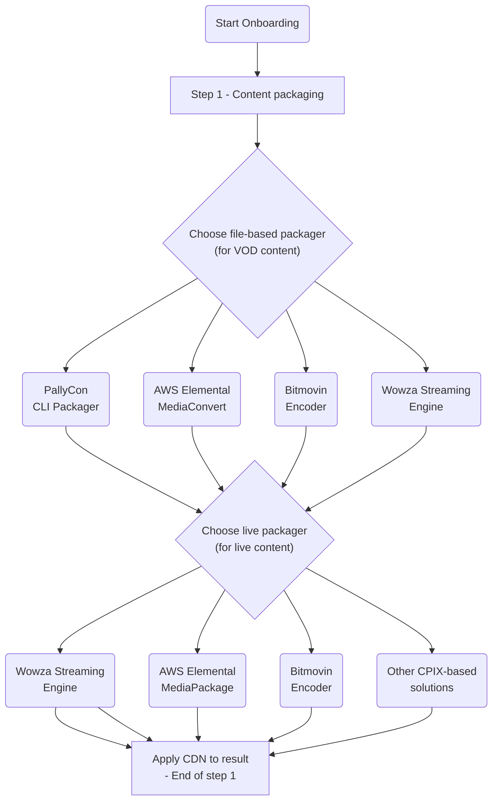
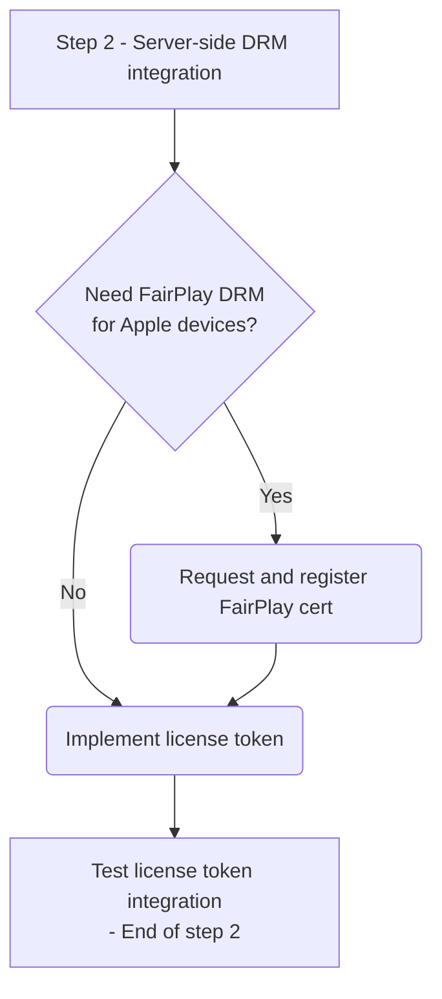
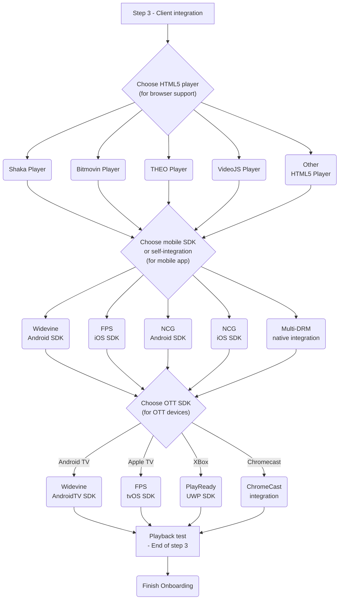

We provide onboarding guides for PallyCon Multi-DRM service, so that you can easily find guide documents that suit your various situations and requirements.

## Step 1 - Content packaging

## Step 2 - Server-side DRM integration

## Step 3 - Client integration

