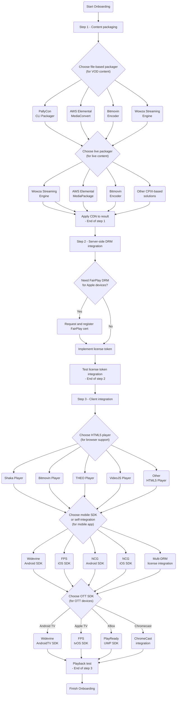

We provide onboarding guides for PallyCon Multi-DRM service, so that you can easily find guide documents that suit your various situations and requirements.

```mermaid
graph TD;
  start_onboarding(Start Onboarding) --> content_packaging["Step 1 - Content packaging"]

  content_packaging --> vod_packager{"Choose file-based packager<br>(for VOD content)"}
  vod_packager --> cli_packager(PallyCon<br>CLI Packager)
  vod_packager --> mediaconvert(AWS Elemental<br>MediaConvert)
  vod_packager --> bitmovin_vod(Bitmovin<br>Encoder)
  vod_packager --> wowza_vod(Wowza Streaming<br>Engine)

  cli_packager --> live_packager{"Choose live packager<br>(for live content)"}
  mediaconvert --> live_packager
  bitmovin_vod --> live_packager
  wowza_vod --> live_packager
  
  live_packager --> wowza_live(Wowza Streaming<br>Engine)
  live_packager --> mediapackage(AWS Elemental<br>MediaPackage)
  live_packager --> bitmovin_live(Bitmovin<br>Encoder)
  live_packager --> cpix(Other CPIX-based<br>solutions)
  
  wowza_live --> packaging_done[Apply CDN to result<br>- End of step 1]
  mediapackage --> packaging_done
  wowza_live --> packaging_done
  bitmovin_live --> packaging_done
  cpix --> packaging_done
  
  packaging_done --> drm_license[Step 2 - Server-side DRM integration]
  drm_license --> apple_support{Need FairPlay DRM<br>for Apple devices?}
  apple_support -->|Yes| fps_cert(Request and register FairPlay cert)
  apple_support -->|No| license_token(Implement license token)
  fps_cert --> license_token
  license_token --> license_test[Test license token integration<br>- End of step 2]

  license_test -->drm_client[Step 3 - Client integration]
  drm_client --> web_client{"Choose HTML5 player<br>(for browser support)"}
  web_client --> shaka_player(Shaka Player)  
  web_client --> bitmovin_player(Bitmovin Player)
  web_client --> theo_player(THEO Player)
  web_client --> videojs(VideoJS Player)
  web_client --> html5_player(Other<br>HTML5 Player)

  shaka_player --> mobile_sdk{"Choose mobile SDK<br>or self-integration<br>(for mobile app)"}
  bitmovin_player --> mobile_sdk
  theo_player --> mobile_sdk
  videojs --> mobile_sdk
  html5_player --> mobile_sdk
  mobile_sdk --> widevine_android(Widevine<br>Android SDK)
  mobile_sdk --> fps_ios(FPS<br>iOS SDK)
  mobile_sdk --> ncg_android(NCG<br>Android SDK)
  mobile_sdk --> ncg_ios(NCG<br>iOS SDK)
  mobile_sdk --> multidrm_license(Multi-DRM<br>license integration)

  widevine_android --> ott_devices{"Choose OTT SDK<br>(for OTT devices)"}
  fps_ios --> ott_devices
  ncg_android --> ott_devices
  ncg_ios --> ott_devices
  multidrm_license --> ott_devices
  ott_devices -->|Android TV| widevine_androidtv(Widevine<br>AndroidTV SDK)
  ott_devices -->|Apple TV| fps_tvos(FPS<br>tvOS SDK)
  ott_devices -->|XBox| playready_uwp(PlayReady<br>UWP SDK)
  ott_devices -->|Chromecast| chromecast(ChromeCast<br>integration)

  widevine_androidtv --> playback_test[Playback test<br>- End of step 3]
  fps_tvos --> playback_test
  playready_uwp --> playback_test
  chromecast --> playback_test

  playback_test --> finish_onboarding(Finish Onboarding)

  click cli_packager "/en/multidrm/packaging/cli-packager"
  click mediaconvert "/en/multidrm/packaging/aws-elemental/#mediaconvert"
  click mediapackage "/en/multidrm/packaging/aws-elemental/#mediapackage"
  click wowza_live "/en/multidrm/packaging/wowza-integration"
  click wowza_vod "/en/multidrm/packaging/wowza-integration"
  click bitmovin_vod "/en/multidrm/packaging/bitmovin-encoder-guide"
  click bitmovin_live "/en/multidrm/packaging/bitmovin-encoder-guide"
  click cpix "/en/multidrm/packaging/cpix-api"
  click license_token "/en/multidrm/license/license-token"
  click fps_cert "/en/multidrm/license/fps-cert-tutorial"
  click shaka_player "/en/multidrm/clients/html5-player/#shaka"
  click bitmovin_player "/en/multidrm/clients/html5-player/#bitmovin"
  click theo_player "/en/multidrm/clients/html5-player/#theo"
  click videojs "/en/multidrm/clients/html5-player/#videojs"
  click html5_player "/en/multidrm/clients/html5-player"
  click widevine_android "/en/multidrm/clients/widevine-android"
  click fps_ios "/en/multidrm/clients/fairplay-ios"
  click ncg_android "/en/multidrm/clients/ncg-android"
  click ncg_ios "/en/multidrm/clients/ncg-ios"
  click multidrm_license "/en/multidrm/license/multidrm-license"
  click widevine_androidtv "/en/multidrm/clients/widevine-androidtv"
  click playready_uwp "/en/multidrm/clients/playready-uwp"
  click chromecast "/en/multidrm/clients/chromecast-integration"

```
