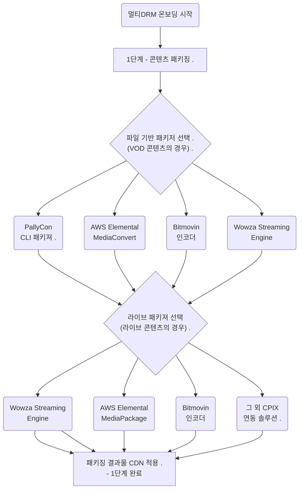
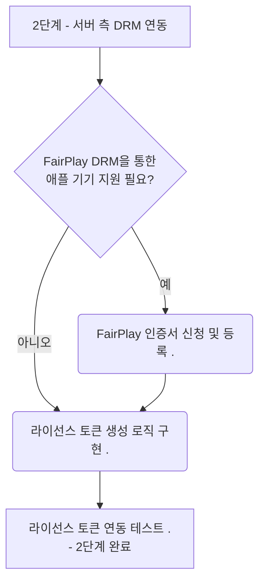
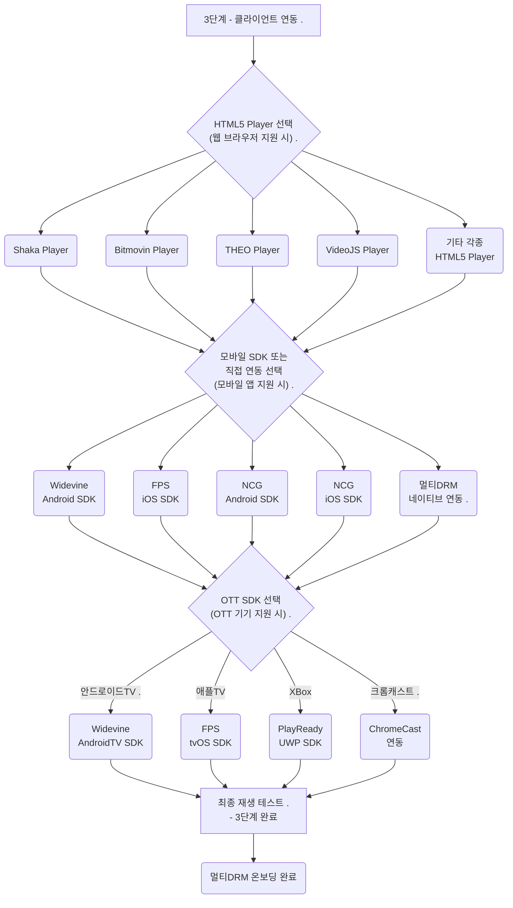

고객사의 다양한 상황과 요구사항에 맞는 가이드 문서를 쉽게 찾을 수 있도록 멀티DRM 제품에 대한 온보딩 가이드를 제공합니다. 아래 순서도의 각 단계별로 링크된 가이드 중에서 원하는 항목을 클릭해 해당 페이지로 이동할 수 있습니다.

## 1단계 - 콘텐츠 패키징

```mermaid
graph TD;
  start_onboarding(멀티DRM 온보딩 시작) --> content_packaging["1단계 - 콘텐츠 패키징 ."]

  content_packaging --> vod_packager{"파일 기반 패키저 선택 .<br>(VOD 콘텐츠의 경우) ."}
  vod_packager --> cli_packager(PallyCon<br>CLI 패키져 .)
  vod_packager --> mediaconvert(AWS Elemental<br>MediaConvert)
  vod_packager --> bitmovin_vod(Bitmovin<br>인코더)
  vod_packager --> wowza_vod(Wowza Streaming<br>Engine)

  cli_packager --> live_packager{"라이브 패키져 선택<br>(라이브 콘텐츠의 경우) ."}
  mediaconvert --> live_packager
  bitmovin_vod --> live_packager
  wowza_vod --> live_packager
  
  live_packager --> wowza_live(Wowza Streaming<br>Engine)
  live_packager --> mediapackage(AWS Elemental<br>MediaPackage)
  live_packager --> bitmovin_live(Bitmovin<br>인코더)
  live_packager --> cpix(그 외 CPIX<br>연동 솔루션 .)
  
  wowza_live --> packaging_done[패키징 결과물 CDN 적용 .<br>- 1단계 완료]
  mediapackage --> packaging_done
  wowza_live --> packaging_done
  bitmovin_live --> packaging_done
  cpix --> packaging_done

  click cli_packager "../../packaging/cli-packager"
  click mediaconvert "../../packaging/aws-elemental/#mediaconvert"
  click mediapackage "../../packaging/aws-elemental/#mediapackage"
  click wowza_live "../../packaging/wowza-integration"
  click wowza_vod "../../packaging/wowza-integration"
  click bitmovin_vod "../../packaging/bitmovin-encoder-guide"
  click bitmovin_live "../../packaging/bitmovin-encoder-guide"
  click cpix "../../packaging/cpix-api"
```

## 2단계 - 서버 측 DRM 연동

```mermaid
graph TD;
  drm_license[2단계 - 서버 측 DRM 연동] --> apple_support{FairPlay DRM을 통한 <br>애플 기기 지원 필요?}
  apple_support -->|예| fps_cert(FairPlay 인증서 신청 및 등록 .)
  apple_support -->|아니오| license_token(라이선스 토큰 생성 로직 구현 .)
  fps_cert --> license_token
  license_token --> license_test[라이선스 토큰 연동 테스트 .<br>- 2단계 완료]

  click license_token "../../license/license-token"
  click fps_cert "../../license/fps-cert-tutorial"
```

## 3단계 - 클라이언트 연동

```mermaid
graph TD;
  drm_client[3단계 - 클라이언트 연동 .] --> web_client{"HTML5 Player 선택<br>(웹 브라우저 지원 시) ."}
  web_client --> shaka_player(Shaka Player)  
  web_client --> bitmovin_player(Bitmovin Player)
  web_client --> theo_player(THEO Player)
  web_client --> videojs(VideoJS Player)
  web_client --> html5_player(기타 각종<br>HTML5 Player)

  shaka_player --> mobile_sdk{"모바일 SDK 또는 <br>직접 연동 선택<br>(모바일 앱 지원 시) ."}
  bitmovin_player --> mobile_sdk
  theo_player --> mobile_sdk
  videojs --> mobile_sdk
  html5_player --> mobile_sdk
  mobile_sdk --> widevine_android(Widevine<br>Android SDK)
  mobile_sdk --> fps_ios(FPS<br>iOS SDK)
  mobile_sdk --> ncg_android(NCG<br>Android SDK)
  mobile_sdk --> ncg_ios(NCG<br>iOS SDK)
  mobile_sdk --> multidrm_native(멀티DRM<br>네이티브 연동 .)

  widevine_android --> ott_devices{"OTT SDK 선택<br>(OTT 기기 지원 시) ."}
  fps_ios --> ott_devices
  ncg_android --> ott_devices
  ncg_ios --> ott_devices
  multidrm_native --> ott_devices
  ott_devices -->|안드로이드TV .| widevine_androidtv(Widevine<br>AndroidTV SDK)
  ott_devices -->|애플TV| fps_tvos(FPS<br>tvOS SDK)
  ott_devices -->|XBox| playready_uwp(PlayReady<br>UWP SDK)
  ott_devices -->|크롬캐스트 .| chromecast(ChromeCast<br>연동)

  widevine_androidtv --> playback_test[최종 재생 테스트 .<br>- 3단계 완료]
  fps_tvos --> playback_test
  playready_uwp --> playback_test
  chromecast --> playback_test

  playback_test --> finish_onboarding(멀티DRM 온보딩 완료)

  click shaka_player "../../clients/html5-player/#shaka"
  click bitmovin_player "../../clients/html5-player/#bitmovin"
  click theo_player "../../clients/html5-player/#theo"
  click videojs "../../clients/html5-player/#videojs"
  click html5_player "../../clients/html5-player"
  click widevine_android "../../clients/widevine-android"
  click fps_ios "../../clients/fairplay-ios"
  click ncg_android "../../clients/ncg-android"
  click ncg_ios "../../clients/ncg-ios"
  click multidrm_native "../../clients/multidrm-native-integration"
  click widevine_androidtv "../../clients/widevine-androidtv"
  click playready_uwp "../../clients/playready-uwp"
  click chromecast "../../clients/chromecast-integration"

```
