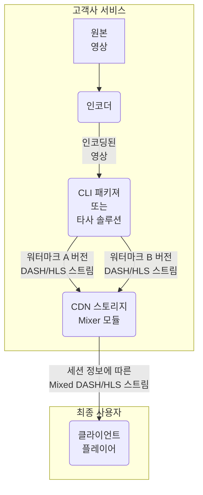

고객사의 다양한 상황과 요구사항에 맞는 가이드 문서를 쉽게 찾을 수 있도록 멀티DRM 제품에 대한 온보딩 가이드를 제공합니다.

```mermaid
graph TD;
    subgraph 고객사 서비스
    A[원본<br>영상] --> B(인코더)
    B -->|인코딩된<br>영상| C(CLI 패키져<br>또는<br>타사 솔루션)
    C -->|워터마크 A 버전<br>DASH/HLS 스트림| D(CDN 스토리지<br>Mixer 모듈)
    C -->|워터마크 B 버전<br>DASH/HLS 스트림| D
    end
    subgraph 최종 사용자
    D -->|세션 정보에 따른<br>Mixed DASH/HLS 스트림| E(클라이언트<br>플레이어)
    end
    click C "/ko/multidrm/packaging"
    click E "/ko/multidrm/clients"
```
