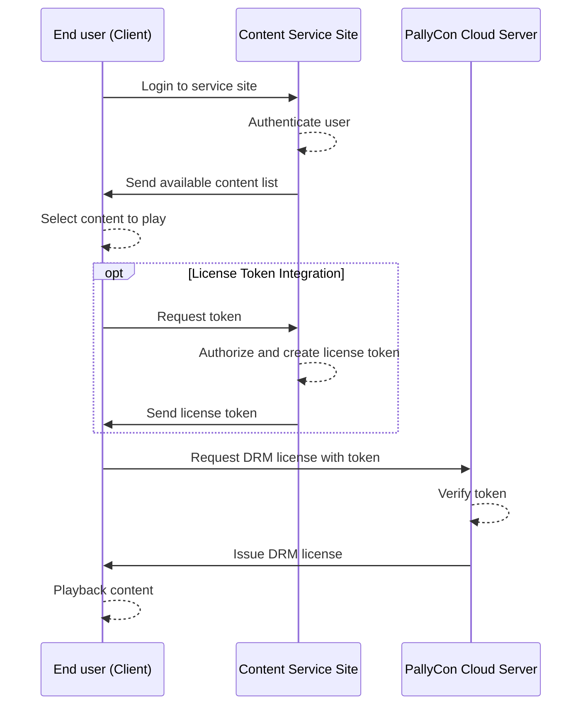
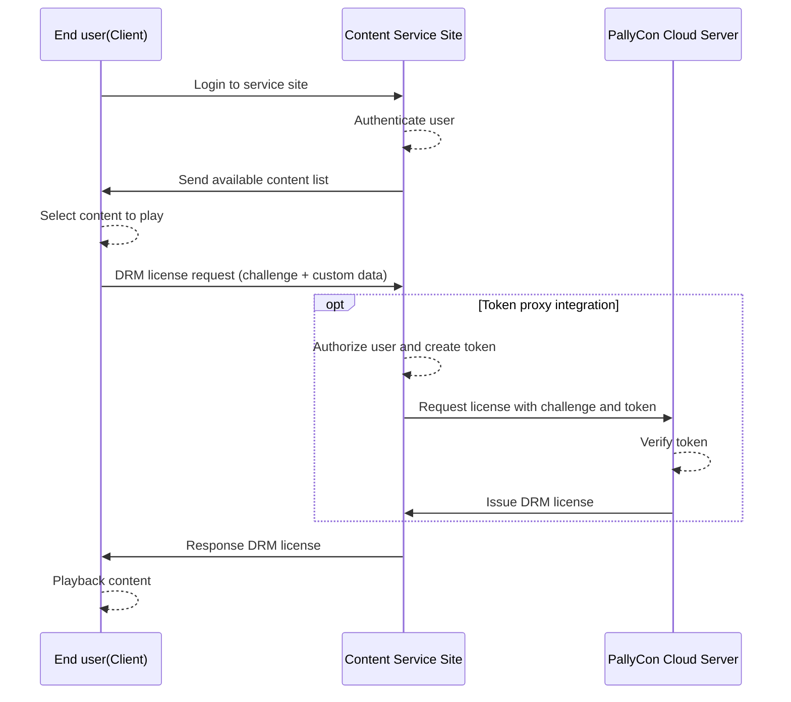

## Overview {#intro}

There are two types of methods for issuing multi-DRM (FPS, Widevine, PlayReady, NCG) licenses from PallyCon cloud server.

1. Callback type
	 - When PallyCon cloud server receives license request from multi-DRM client, it first checks service site's callback page to see if the user has valid permissions.
	 - In the case of a request from an authorized user, the service site returns information such as authentication, usage rights (unlimited, fixed period) and various security options to the PallyCon cloud server through the callback web page.
	 - PallyCon cloud server receives the response from the callback page and issues the license to the client.

2. Token type
	 - When a multi-DRM client tries to play DRM content, the client requests a token to the service site in order to acquire DRM license. The service site verifies that the user requesting the token has permission to the content, and then generates a token data according to the specification.
	 - The service site can set usage rights (expiration date or unlimited) and various security options inside of the token data. The generated token is delivered to the client as response.
	 - When a client requests a license with a token, the PallyCon cloud server validates the token and issues a license.

This document describes the second method, the specification of license token. *The callback type integration method is not recommended because delays or errors may occur depending on the situation of the customer's system. Please use the token method instead, and contact us if you want the callback method for a specific reason.*

> This document is based on version 2.0 of the license policy specification. If you need a guide to the existing version specifications, please click the button below to download the document.

{}Download License Token Guide v1.0{}

## Token License Issuance Flow {#workflow}



(1) Request a token to service site

- Client requests its service site for a token to playback DRM content.

(2) Token generation (see [Specification](#token-json) below)

- The service site checks the request received from the client and generates a token if the user has permission to use the content.
- Token includes information such as Content ID, user ID, timestamp, and license rules.

(3) Token transfer

- The service site returns the generated token to the client as a response.
> The creation of the token and the request / response function are not provided by PallyCon. The service site should implement these functions according to this guide.

(4) Request for a license

- The client places the received token(base64 string) in pallycon-customdata-v2 and requests license to PallyCon cloud server.
> For licensing requests through CustomData, please refer to the [Multi-DRM Native Integration Guide](../../clients/multidrm-native-integration/#pallycon-custom-data-v2) or [Client SDK Guide](../../clients).

(5) Issuing a license

- PallyCon cloud server validates the token and issues a license according to the rules in the token.

## Token Proxy Type License Issuance Flow

Token-based license issuance can also be handled through a proxy server at the service site, as shown below.



(1) Request DRM license to proxy server

* A client requests a DRM license to a proxy server of the service site for DRM content playback.
* The client calls the URL of the proxy server instead of PallyCon license server URL by DRM LA_URL configuration. The User ID and Content ID may be sent via custom header or URL parameter of the license request.
* License request data sent to the proxy server include challenge data generated by the client's DRM module.

(2) Authorize the user and create token

* Service site checks if the user has a right for the content using the custom data sent to the proxy server.
* The proxy server generates a license token with DRM license rules for the service's business model and security policy.

(3) Request DRM license to PallyCon server

* The proxy server requests a DRM license to PallyCon license server with the generated token and the license challenge data sent from the client.
* PallyCon server validates the token and issues DRM license using the challenge data.

(4) Response license and playback content

* The proxy server delivers the DRM license data issued by the PallyCon license server to the client.
* The client player starts playing content using the delivered DRM license.

## Token Generation Specification {#token-json}

The service site (CMS) should generates the following JSON token for the request from the client and sends the base64 encoded string as the response.

> Sample codes for generating token data are available on [Sample Download page](../../getting-started/downloads)

### Token JSON Format

```json
{
    "drm_type": "<drm type string>",
    "site_id": "<site id string>",
    "user_id": "<user id string>",
    "cid": "<content id string>",
    "policy": "<base64(aes256(license policy JSON string))>",
    "timestamp": "<token validity start time (GMT) as yyyy-mm-ddThh:mm:ssZ>",
    "hash": "<base64(sha256(hash message format))>",
    "response_format": "<response data type>",
    "key_rotation": <true|false>
}
```

|<div style="width:90px">**Name**</div> | **Type** | <div style="width:70px">**Required**</div> | **Description** |
| --- | --- | --- | --- |
| drm_type | string | No | Type of DRM ("NCG", "Widevine", "PlayReady", "FairPlay"), case sensitive, Default : "PlayReady" |
| site_id | string | Yes | Service Site ID which is issued by PallyCon Console |
| user_id | string | Yes | End-user's ID which is managed by the service site. Input "LICENSETOKEN" if there is no user ID. |
| cid | string | Yes | Unique ID of the content. The CID is used in DRM content packaging as well. (Max 200 bytes alphanumeric string) |
| policy | base64 encoded string | Yes | License policy in JSON (refer to [specification](#license-policy-json)) which is encrypted by [AES256](#aes256) and encoded as Base64 string. |
| timestamp | string | Yes | Token validity start time (usually current time) as 'yyyy-mm-ddThh:mm:ssZ'(GMT). Token is valid for 600 seconds after the timestamp. (can be adjusted on Console site)|
| hash | base64 encoded string | Yes | Hash message (refer to [specification](#hash-message)) which is hashed by SHA256 and encoded as Base64 string. |
| response_format | string | No | Response data type for token-based license requests. (Default: original) <br>- original: Responds the actual license data according to the requested DRM specification <br>- custom: Responds in JSON format including the license data and additional information (client device ID, etc.) |
| key_rotation| boolean | No | Set whether to enable key rotation (default: false) |

> **Note:**
>
> When setting "custom" type response_format, the response needs separate parsing procedure in the client. Therefore, for clients that only support general multi-DRM integration, such as HTML5 players, you must set the option to "original" to generate a token.

### Token JSON example

```json
{
    "drm_type":"Widevine",
    "site_id":"ABCD",
    "user_id":"LICENSETOKEN",
    "cid":"sample-content-id-0123",
    "policy":"uZ0ALHJDHdZKc9pICii6Hog46frSIl+to/Wbf08uqliQVjGwK0Lw40onRM743ttDledSqjD1RfgdZUqq/X44/ZMQvHob5aOsINRmQ0bx6oJofuS5RRDRKEOVdt8bW09ReOAY5skHcBNnAOzkiDW6ICGlGrFqS12v7xJKrhutYmU4uB1bgLW7pdAwX87RXJ7NBogFvWohCpcnMxgD8EV0CswNEvkmX/27iXYGmniMd2DG+iEe2CismUbpWbl6sHkLh9gw1n4OTXSfU70A0VUSUVbwWW1UXYJxutaowJvxsYKfPGsmyAGLjfsBsAJYfOiFJcVW2SbVld6E7YETTAtL/QqUwUxXGxwQ+8an3e50AbM6HXsi8h00gjiiWHTg0PUJYKJ8SA2jZcPuA+ItiEmsN+QFWuu4aJCnw6Qek3QojLhwLhY7gK3seruFg5BvJnadjkCXdzFzlT6VHiisTHa67BVMownCwx3Zh5lGIq+z2wJBcjNv8Q3QGlJSE1NJTVb4RsX9lywX63FepHVUaWcxEcr2paT1tVZA2tuOzKyUNjL8HZeWpaHMHq938r56qPu6JcdYKptzQTTvL4g4AmMt2pW9xAEAivNdZGh+4vm6foDP+cW55FpI7zNubHoYC/yxrJOg2SfCbmW3adxVeZydiVM+ujndXybx49qoWykEVhkJwj1AmDA7VEJvxI3e6kgvce95NEwuq8N1FdN1tizplOIUxlK4tey4AuHSnu48ufGr0OlUTL+o6wEjivU6n3asxvD/5bGla2CxnnnCKaGbeaucMKK7BDRq9F1SzDqRYogVBjSc5wv6105qJ7OetSEb2aP09bYGRwrO3r2/ZBValVfDqR1V9ciEOX8e6rNPFZ/YJF45PjseeC9xR1Q+4GEgSL7EUAxZkPv/+EOgnh1ACg4VxXxi4rPZ5S1Zm8PcEXpUG1JKvptI9QPLHsuooTSH19J9KPFzmjm9BgYAsPQFQy804nozWaBBkh58jaU1lJU=",
    "timestamp":"2018-04-14T23:59:59Z",
    "hash":"QkM4NDVGMDMxRUE4MDM0NUMzQUE4MTgyMTA4QTQ2QjQyNEFBNTJCNkQ1QjhGODg1NUE1MDI2NjQ2NkE2QUNBNA==",
    "response_format": "original",
    "key_rotation": false
}
```

> Note:
>
> The token and hash strings shown in the above example are not valid data. They are for reference only. For practical application, use the values generated according to this specification.

### Example of Token String

- The below string is the result of Base64 encoding for the above JSON example.

```s
ewogICAgImRybV90eXBlIjoiV2lkZXZpbmUiLAogICAgInNpdGVfaWQiOiJBQkNEIiwKICAgICJ1c2VyX2lkIjoiTElDRU5TRVRPS0VOIiwKICAgICJjaWQiOiJzYW1wbGUtY29udGVudC1pZC0wMTIzIiwKICAgICJwb2xpY3kiOiJ1WjBBTEhKREhkWktjOXBJQ2lpNkhvZzQ2ZnJTSWwrdG8vV2JmMDh1cWxpUVZqR3dLMEx3NDBvblJNNzQzdHREbGVkU3FqRDFSZmdkWlVxcS9YNDQvWk1RdkhvYjVhT3NJTlJtUTBieDZvSm9mdVM1UlJEUktFT1ZkdDhiVzA5UmVPQVk1c2tIY0JObkFPemtpRFc2SUNHbEdyRnFTMTJ2N3hKS3JodXRZbVU0dUIxYmdMVzdwZEF3WDg3UlhKN05Cb2dGdldvaENwY25NeGdEOEVWMENzd05FdmttWC8yN2lYWUdtbmlNZDJERytpRWUyQ2lzbVVicFdibDZzSGtMaDlndzFuNE9UWFNmVTcwQTBWVVNVVmJ3V1cxVVhZSnh1dGFvd0p2eHNZS2ZQR3NteUFHTGpmc0JzQUpZZk9pRkpjVlcyU2JWbGQ2RTdZRVRUQXRML1FxVXdVeFhHeHdRKzhhbjNlNTBBYk02SFhzaThoMDBnamlpV0hUZzBQVUpZS0o4U0EyalpjUHVBK0l0aUVtc04rUUZXdXU0YUpDbnc2UWVrM1Fvakxod0xoWTdnSzNzZXJ1Rmc1QnZKbmFkamtDWGR6RnpsVDZWSGlpc1RIYTY3QlZNb3duQ3d4M1poNWxHSXErejJ3SkJjak52OFEzUUdsSlNFMU5KVFZiNFJzWDlseXdYNjNGZXBIVlVhV2N4RWNyMnBhVDF0VlpBMnR1T3pLeVVOakw4SFplV3BhSE1IcTkzOHI1NnFQdTZKY2RZS3B0elFUVHZMNGc0QW1NdDJwVzl4QUVBaXZOZFpHaCs0dm02Zm9EUCtjVzU1RnBJN3pOdWJIb1lDL3l4ckpPZzJTZkNibVczYWR4VmVaeWRpVk0rdWpuZFh5Yng0OXFvV3lrRVZoa0p3ajFBbURBN1ZFSnZ4STNlNmtndmNlOTVORXd1cThOMUZkTjF0aXpwbE9JVXhsSzR0ZXk0QXVIU251NDh1ZkdyME9sVVRMK282d0VqaXZVNm4zYXN4dkQvNWJHbGEyQ3hubm5DS2FHYmVhdWNNS0s3QkRScTlGMVN6RHFSWW9nVkJqU2M1d3Y2MTA1cUo3T2V0U0ViMmFQMDliWUdSd3JPM3IyL1pCVmFsVmZEcVIxVjljaUVPWDhlNnJOUEZaL1lKRjQ1UGpzZWVDOXhSMVErNEdFZ1NMN0VVQXhaa1B2LytFT2duaDFBQ2c0VnhYeGk0clBaNVMxWm04UGNFWHBVRzFKS3ZwdEk5UVBMSHN1b29UU0gxOUo5S1BGem1qbTlCZ1lBc1BRRlF5ODA0bm96V2FCQmtoNThqYVUxbEpVPSIsCiAgICAidGltZXN0YW1wIjoiMjAxOC0wNC0xNFQyMzo1OTo1OVoiLAogICAgImhhc2giOiJRa000TkRWR01ETXhSVUU0TURNME5VTXpRVUU0TVRneU1UQTRRVFEyUWpReU5FRkJOVEpDTmtRMVFqaEdPRGcxTlVFMU1ESTJOalEyTmtFMlFVTkJOQT09IiwgCiAgICAicmVzcG9uc2VfZm9ybWF0IjogIm9yaWdpbmFsIiwKICAgICJrZXlfcm90YXRpb24iOiBmYWxzZQp9
```

## License Policy JSON Data (v2.0) {#license-policy-json}

Compared to the previous version's license policy specification, the following features have been added in version 2.0.

1. Multi-key packaging for hardware DRM and security policy support for each track
 - Defines video tracks for adaptive streaming as SD, HD, UHD, etc. according to resolution
 - Hardware DRM and various output security options can be set for each track.

2. Limiting maximum playable resolution according to business models
 - When multi-track packaging, the maximum playable resolution can be limited by using the manifest / playlist generated for each track. (allowed track types for each user account type)

3. Offline rental scenario support
  - Supports 'Dual Expiry' function to set how long the license is valid after download (rental duration) and how long the license is valid after initial playback (playback duration) separately.

You need to AES256 encrypt the JSON value composed in the format below, and the base64-encoded string of the result is used as the 'policy' value of the token JSON.

- For AES256 encryption method, refer to [specifications](#aes256).

```json
{
    "policy_version": 2,
    "playback_policy": {
        "persistent": <true|false>,
        "license_duration": <int(seconds)>,
        "expire_date": "<license expiry time (GMT) as yyyy-mm-ddThh:mm:ssZ>",
        "rental_duration": <int(seconds)>,
        "playback_duration": <int(seconds)>,        
        "allowed_track_types": <"ALL"|"SD_ONLY"|"SD_HD"|"SD_UHD1"|"SD_UHD2">
    },
    "security_policy": [
        {
            "track_type": <"ALL"|"ALL_VIDEO"|"AUDIO"|"SD"|"HD"|"UHD1"|"UHD2">,
            "widevine": {
                "security_level": <1~5>,
                "required_hdcp_version": <"HDCP_NONE"|"HDCP_V1"|"HDCP_V2"|"HDCP_V2_1"|"HDCP_V2_2"|"HDCP_NO_DIGITAL_OUTPUT">,
                "required_cgms_flags": <"CGMS_NONE"|"COPY_FREE"|"COPY_ONCE"|"COPY_NEVER">,
                "disable_analog_output": <true|false>,
                "hdcp_srm_rule": <"HDCP_SRM_RULE_NONE"|"CURRENT_SRM">
            },
            "playready": {
                "security_level": <150|2000|3000>,
                "digital_video_protection_level": <100|250|270|300|301>,
                "analog_video_protection_level": <100|150|200|201>,
                "digital_audio_protection_level": <100|250|300|301>,
                "require_hdcp_type_1": <true|false>
            },
            "fairplay": {
                "hdcp_enforcement": <-1|0|1>,
                "allow_airplay": <true|false>,
                "allow_av_adapter": <true|false>
            },
            "ncg": {
                "allow_mobile_abnormal_device" : <true|false>,
                "allow_external_display" : <true|false>,
                "control_hdcp": <0|1|2>
            }
        }
    ],
    "external_key": {
        "mpeg_cenc": [
            {
                "track_type": <"ALL"|"ALL_VIDEO"|"AUDIO"|"SD"|"HD"|"UHD1"|"UHD2">,
                "key_id" : "<hex-string>",
                "key" : "<hex-string>",
                "iv" : "<hex-string>"
            }
        ],
        "hls_aes" : [
            {
                "track_type": <"ALL"|"ALL_VIDEO"|"AUDIO"|"SD"|"HD"|"UHD1"|"UHD2">,
                "key" : "<hex-string>",
                "iv" : "<hex-string>"
            }
        ],
        "ncg":{
            "cek":"<hex-string>"
        }
    }
}
```

### Overall structure

|<div style="width:120px">**Name**</div> | **Type** | **Description** |
| --- | --- | --- |
| policy_version | 2 | Version of license policy specification (fixed value) |
| playback_policy | json | Policies related with playback (refer to [spec](#playback-policy)) |
| security_policy | json array | Policies related with security (refer to [spec](#security-policy)) |
| external_key | json | Uses external content key to generate license. (refer to [spec](#external-key)) |

### playback_policy {#playback-policy}

Set policies related to replay, such as license validity period and whether it is persistent.

- In the case of content with divided tracks by resolution, the playback policy is applied equally to all tracks.

|<div style="width:140px">**Name**</div> | <div style="width:70px">**Type**</div> | <div style="width:70px">**Default**</div> | **Description** |
| --- | --- | --- | --- |
| persistent | boolean | No | Whether the license is persistent for offline scenario. (default: false) <br>true : keep license, false : remove license after play(for streaming) |
| duration | int | 0 | License validity period. (Unit: second) Unlimited when set to 0. <br> **'expire\_date' is ignored if 'duration' is set.** |
| expire\_date | string |  | date of license expiration, GMT Time &#39;yyyy-mm-ddThh:mm:ssZ&#39; This setting cannot be used with 'duration'. |
| rental_duration | int | 0 | Set when using an offline rental scenario. (persistent true required) License validity period until the first playback starts after downloading (unit: second) |
| playback_duration | int | 0 | Set when using an offline rental scenario. (requires persistent true) License validity period after first playback starts (unit: second) |
| allowed_track_types | string | ALL | Control the content key for each track to be included in the license.<br> - Value: "ALL", "SD_ONLY", "SD_HD", "SD_UHD1", "SD_UHD2"<br> - Example: SD_ONLY-Only keys of SD and AUDIO tracks are included in the license, and HD or higher tracks cannot be played. |

### security_policy {#security-policy}

Set policies related to security such as hardware DRM and output protection level.

- In the case of content that has tracks divided by resolution, it can be applied equally to all tracks or set by tracks.
- Various output protection options are added to the version 2.0 specification.

|<div style="width:120px">**Name**</div> | **Type** | <div style="width:70px">**Default**</div> | **Description** |
| --- | --- | --- | --- |
| track_type | string | ALL | Defines the track to which the below security policies are applied<br> - Value: "ALL", "ALL_VIDEO", "AUDIO", "SD", "HD", "UHD1", "UHD2" |
| widevine | json |  | Security policies for Widevine DRM |
| playready | json |  | Security policies for PlayReady DRM |
| fairplay | json |  | Security policies for FairPlay DRM |
| ncg | json |  | Security policies for NCG DRM |

#### security_policy.widevine 

| <div style="width:120px">**Name**</div> | <div style="width:70px">**Type**</div> | <div style="width:110px">**Default**</div> | **Description** |
| --- | --- | --- | --- |
| security_level | int | 1 (WV L3) | Widevine security level setting for the track <br> (1: SW_SECURE_CRYPTO, 2: SW_SECURE_DECODE, 3: HW_SECURE_CRYPTO, 4: HW_SECURE_DECODE, 5: HW_SECURE_ALL) <br>If set to 5, playback is possible only on Widevine L1 devices. |
| required_hdcp_version | string | HDCP_NONE | Sets the required HDCP version for digital output <br> - Value: "HDCP_NONE", "HDCP_V1", "HDCP_V2", "HDCP_V2_1", "HDCP_V2_2", "HDCP_NO_DIGITAL_OUTPUT"|
| required_cgms_flags | string | CGMS_NONE | Sets the security level for analog outputs<br> - Value: "CGMS_NONE", "COPY_FREE", "COPY_ONCE", "COPY_NEVER" |
| disable_analog_output | boolean | false | Whether analog output is allowed (false: analog output is allowed) |
| hdcp_srm_rule | string | HDCP_SRM_RULE_NONE | Whether to allow the playback of the track when the HDCP device cannot process the System Renewability Message (SRM).<br> - Value: "HDCP_SRM_RULE_NONE", "CURRENT_SRM" <br> CURRENT_SRM: The track does not play on devices that do not have the latest SRM |

#### security_policy.playready 

|<div style="width:120px">**Name**</div> | <div style="width:70px">**Type**</div> | <div style="width:70px">**Default**</div> | **Description** |
| --- | --- | --- | --- |
| security_level | int | 150 | PlayReady security level for the track. (150, 2000, 3000) Set to 3000 when applying hardware DRM. |
| digital_video_protection_level | int | 100 | Output protection level for digital video (100, 250, 270, 300, 301)|
| analog_video_protection_level | int | 100 | Output protection level for analog video (100, 150, 200, 201)|
| digital_audio_protection_level | int | 100 | Output protection level for digital audio (100, 250, 300, 301)|
| require_hdcp_type_1 | boolean | false | Sets whether Type 1 (HDCP V2.2 or higher) is required when HDCP is applied according to OPL settings. (When you enable this option, HDCP 2.2 or higher is required to play the content) |

> Please refer to [this link](https://docs.microsoft.com/en-us/playready/overview/output-protection-levels) for more details of PlayReady output protection level.

#### security_policy.fairplay 

| <div style="width:140px">**Name**</div> | <div style="width:70px">**Type**</div> | **Default** | **Description** |
| --- | --- | --- | --- |
| hdcp_enforcement | int | -1 (No HDCP requirement) | HDCP version required for the track. <br> -1: HDCP not applied, 0: HDCP Type 0 (version independent), 1: HDCP Type 1 (requires 2.2 or higher) |
| allow_airplay | boolean | true | Whether to allow AirPlay |
| allow_av_adapter | boolean | true | Whether to allow av adapter |

#### security_policy.ncg 

| <div style="width:140px">**Name**</div> | <div style="width:70px">**Type**</div> | <div style="width:70px">**Default**</div> | **Description** |
| --- | --- | --- | --- |
| allow_mobile_abnormal_device | boolean | false | Whether to allow playback on jailbroken or rooted mobile devices |
| allow_external_display | boolean | false | Whether external display is allowed. (default: false) |
| control_hdcp | int | 0 | Setting for applying HDCP. (default: 0) <br>0 : No HDCP, 1 : HDCP 1.4, 2 : HDCP 2.2 |

### external_key {#external-key}

Used to issue licenses for content packaged with foreign keys not managed by the PallyCon service.

- It is divided into CENC (PlayReady, Widevine), AES (FairPlay), or NCG category to set each foreign key data.
- For CENC and AES, different keys can be set for each track.

| **Name** | **Type** | **Required** | **Description** |
| --- | --- | --- | --- |
| mpeg_cenc | json | No | CENC external key setting for PlayReady/Widevine (refer to [spec](#external-key-cenc)) |
| hls_aes | json | No | HLS AES external key setting for FairPlay Streaming (refer to [spec](#external-key-aes)) |
| ncg | json | No | NCG DRM external key setting (refer to [spec](#external-key-ncg)) |

#### external_key.mpeg\_cenc {#external-key-cenc}

| <div style="width:100px">**Name**</div> | **Type** | <div style="width:70px">**Required**</div> | **Description** |
| --- | --- | --- | --- |
| track_type | string | Yes | Defines the track to which the below external key is applied ("ALL", "ALL_VIDEO", "AUDIO", "SD", "HD", "UHD1", "UHD2") |
| key\_id | hex-string | Yes | Key ID for DASH CENC packaging(PlayReady/Widevine). 16byte hex string |
| key | hex-string | Yes | Key for DASH CENC packaging. 16byte hex string |
| iv | hex-string | No | IV for DASH CENC packaging. 16byte hex string |

#### external_key.hls\_aes {#external-key-aes}

| <div style="width:100px">**Name**</div> | **Type** | <div style="width:70px">**Required**</div> | **Description** |
| --- | --- | --- | --- |
| track_type | string | Yes | Defines the track to which the below external key is applied ("ALL", "ALL_VIDEO", "AUDIO", "SD", "HD", "UHD1", "UHD2")|
| key | hex-string | Yes | Key for HLS Sample AES packaging(FairPlay Streaming). 16byte hex string |
| iv | hex-string | Yes | IV for HLS Sample AES packaging. 16byte hex string |

#### external_key.ncg {#external-key-ncg}

| **Name** | **Type** | **Required** | **Description** |
| --- | --- | --- | --- |
| cek | hex-string | Yes | CEK for NCG packaging. 32byte hex string |

## Token JSON Examples

Create license request data by referring to the example below depending on the playback scenario and whether or not it is multi-track.

### Basic Streaming License

The license for the simple streaming playback test can be requested as below using all options as default.

```json
{
    "policy_version": 2
}
```

The license rules that are actually requested with the above settings are:

```json
{
    "policy_version": 2,
    "playback_policy": {
        "persistent": false,
        "license_duration": 0,
        "rental_duration": 0,
        "playback_duration": 0,
        "allowed_track_types": "ALL"
    },
    "security_policy": [
        {
            "track_type": "ALL",
            "widevine": {
                "security_level": 1,
                "required_hdcp_version": "HDCP_NONE",
                "required_cgms_flags": "CGMS_NONE",
                "disable_analog_output": false,
                "hdcp_srm_rule": "HDCP_SRM_RULE_NONE"
            },
            "playready": {
                "security_level": 150,
                "digital_video_protection_level": 100,
                "analog_video_protection_level": 100,
                "digital_audio_protection_level": 100,
                "require_hdcp_type_1": false
            },
            "fairplay": {
                "hdcp_enforcement": -1,
                "allow_airplay": true,
                "allow_av_adapter": true
            },
            "ncg": {
                "allow_mobile_abnormal_device" : false,
                "allow_external_display" : false,
                "control_hdcp": 0
            }
        }
    ]
}
```

### Offline license + output security application example

If you want to limit the license period to 24 hours after downloading and set output security such as HDCP, you can request an offline license as shown below.

```json
{
    "policy_version": 2,
    "playback_policy": {
        "persistent": true,
        "license_duration": 86400
    },
    "security_policy": [
        {
            "track_type": "ALL",
            "widevine": {
                "security_level": 1,
                "required_hdcp_version": "HDCP_V1",
                "required_cgms_flags": "COPY_NEVER"
            },
            "playready": {
                "security_level": 150,
                "digital_video_protection_level": 300,
                "analog_video_protection_level": 200,
                "digital_audio_protection_level": 250
            },
            "fairplay": {
                "hdcp_enforcement": 0,
                "allow_airplay": false,
                "allow_av_adapter": false
            }
        }
    ]
}
```

### Example of setting security level for each track

If you set the security level for each track for multi-key packaging content, you can request as follows.

```json
{
    "policy_version": 2,
    "playback_policy": {
        "persistent": false,
        "license_duration": 0
    },
    "security_policy": [
        {
            "track_type": "SD",
            "widevine": {
                "security_level": 1,
                "required_hdcp_version": "HDCP_NONE",
                "required_cgms_flags": "CGMS_NONE"
            },
            "playready": {
                "security_level": 150,
                "digital_video_protection_level": 100,
                "analog_video_protection_level": 100,
                "digital_audio_protection_level": 100
            },
            "fairplay": {
                "hdcp_enforcement": -1,
                "allow_airplay": true,
                "allow_av_adapter": true
            }
        },
        {
            "track_type": "HD",
            "widevine": {
                "security_level": 1,
                "required_hdcp_version": "HDCP_V1",
                "required_cgms_flags": "COPY_NEVER"
            },
            "playready": {
                "security_level": 2000,
                "digital_video_protection_level": 270,
                "analog_video_protection_level": 200,
                "digital_audio_protection_level": 250
            },
            "fairplay": {
                "hdcp_enforcement": 0,
                "allow_airplay": false,
                "allow_av_adapter": false
            }
        },
        {
            "track_type": "UHD1",
            "widevine": {
                "security_level": 5,
                "required_hdcp_version": "HDCP_V2_2",
                "disable_analog_output": true,
                "hdcp_srm_rule": "CURRENT_SRM"
            },
            "playready": {
                "security_level": 3000,
                "digital_video_protection_level": 300,
                "analog_video_protection_level": 201,
                "digital_audio_protection_level": 300,
                "require_hdcp_type_1": true
            },
            "fairplay": {
                "hdcp_enforcement": 1,
                "allow_airplay": false,
                "allow_av_adapter": false
            }
        }
    ]
}
```

### Limiting maximum resolution according to user level

If you issue streaming licenses to users who can only play up to SD tracks, you can request a license as shown below. (When using the default security policy)

You can combine the resolution control by user level (allowed_track_types) and the security level setting by track together.

> In order to control the resolution according to the user level, the content should be packaged with the `--multi-key` and `--generate_tracktype_manifests` options by PallyCon CLI packager.

```json
{
    "policy_version": 2,
    "playback_policy": {
        "persistent": false,
        "license_duration": 0,
        "allowed_track_types": "SD_ONLY"
    }
}
```

## SHA256 Hash Message Format {#hash-message}

- The hash message is used to verify the integrity of the entire token JSON value and should be generated as follows:

```s
base64( sha256( <site access key> + <drm type> + <site id> + <user id> + <cid> + <token> + <timestamp> ) )
```

1. Generate a string by concatenating the values of the access key of the service site and the values excluding the 'hash' field of the token JSON in order. Access key can be found on PallyCon Console site.
2. Generate the final hash message string by base64 encoding the sha256 hash value of the string created above.

> The resulting value of the sha256 hash function must be entered into the base64 function as a binary data, not as a string.

### SHA256 Hash Message Example

```s
Step 1. origin string
<Access Key>WidevineABCDLICENSETOKENsample-centent-id-0123uZ0ALHJDHdZKc9pICii6Hog46frSIl+to/Wbf08uqliQVjGwK0Lw40onRM743ttDledSqjD1RfgdZUqq/X44/ZMQvHob5aOsINRmQ0bx6oJofuS5RRDRKEOVdt8bW09ReOAY5skHcBNnAOzkiDW6ICGlGrFqS12v7xJKrhutYmU4uB1bgLW7pdAwX87RXJ7NBogFvWohCpcnMxgD8EV0CswNEvkmX/27iXYGmniMd2DG+iEe2CismUbpWbl6sHkLh9gw1n4OTXSfU70A0VUSUVbwWW1UXYJxutaowJvxsYKfPGsmyAGLjfsBsAJYfOiFJcVW2SbVld6E7YETTAtL/QqUwUxXGxwQ+8an3e50AbM6HXsi8h00gjiiWHTg0PUJYKJ8SA2jZcPuA+ItiEmsN+QFWuu4aJCnw6Qek3QojLhwLhY7gK3seruFg5BvJnadjkCXdzFzlT6VHiisTHa67BVMownCwx3Zh5lGIq+z2wJBcjNv8Q3QGlJSE1NJTVb4RsX9lywX63FepHVUaWcxEcr2paT1tVZA2tuOzKyUNjL8HZeWpaHMHq938r56qPu6JcdYKptzQTTvL4g4AmMt2pW9xAEAivNdZGh+4vm6foDP+cW55FpI7zNubHoYC/yxrJOg2SfCbmW3adxVeZydiVM+ujndXybx49qoWykEVhkJwj1AmDA7VEJvxI3e6kgvce95NEwuq8N1FdN1tizplOIUxlK4tey4AuHSnu48ufGr0OlUTL+o6wEjivU6n3asxvD/5bGla2CxnnnCKaGbeaucMKK7BDRq9F1SzDqRYogVBjSc5wv6105qJ7OetSEb2aP09bYGRwrO3r2/ZBValVfDqR1V9ciEOX8e6rNPFZ/YJF45PjseeC9xR1Q+4GEgSL7EUAxZkPv/+EOgnh1ACg4VxXxi4rPZ5S1Zm8PcEXpUG1JKvptI9QPLHsuooTSH19J9KPFzmjm9BgYAsPQFQy804nozWaBBkh58jaU1lJU=2018-04-14T23:59:59Z

Step 2. sha256 + base64 string (final result)
QkM4NDVGMDMxRUE4MDM0NUMzQUE4MTgyMTA4QTQ2QjQyNEFBNTJCNkQ1QjhGODg1NUE1MDI2NjQ2NkE2QUNBNA==
```

## AES256 Encryption {#aes256}

- AES256 Encryption/Decryption should be processed as below using site authentication key which is created by ‘Service Request’ on PallyCon Console site. ( The key can be found on PallyCon Console’s settings page )
- You can test AES256 encryption / decryption from the [DevConsole page](https://sample.pallycon.com/dev/devconsole/encDec.do?lang=en#aes) on the PallyCon site.

```s
AES256 Encryption
- mode : CBC
- key : 32 byte (Site key from PallyCon Console site)
- iv : 16 byte (0123456789abcdef)
- padding : pkcs7
```