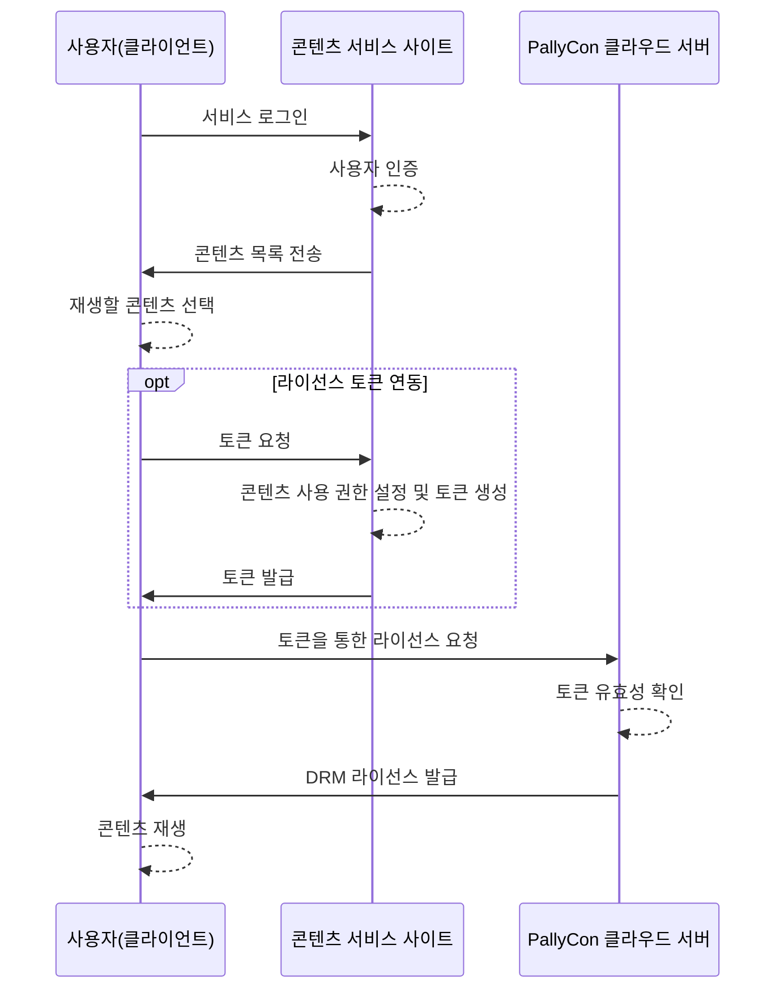
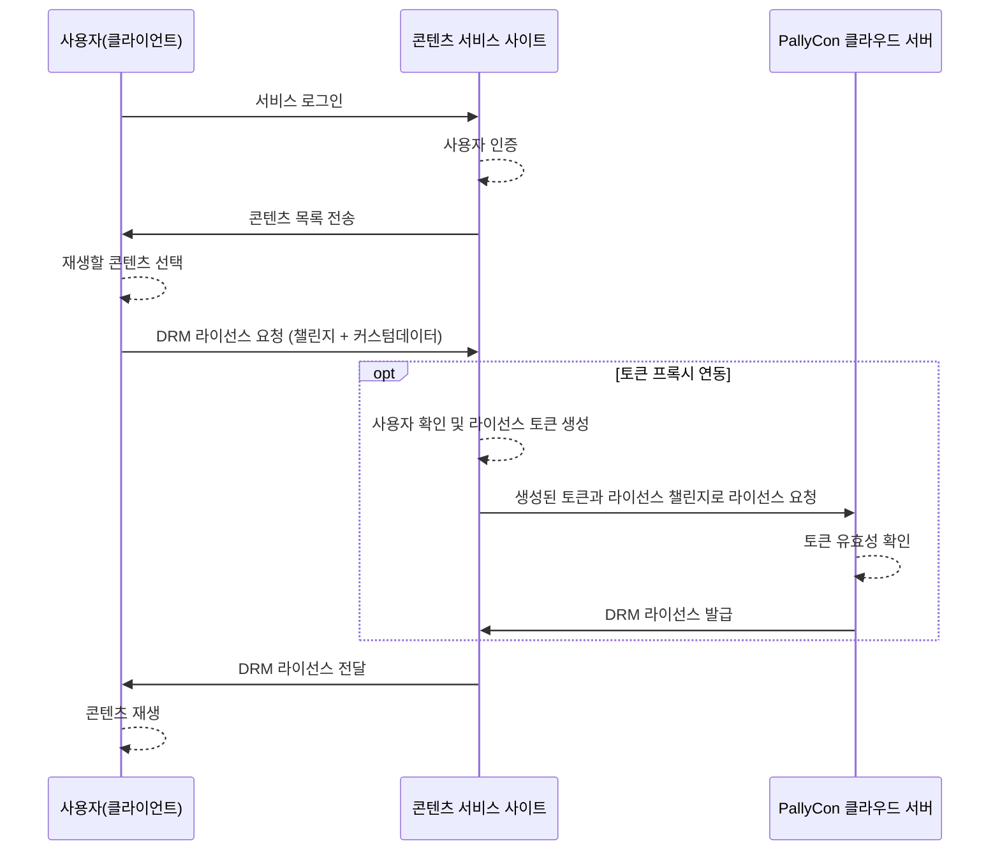

## 개요 {#intro}

PallyCon 클라우드 서버에서 멀티 DRM(FPS, Widevine, PlayReady, NCG) 라이선스를 발급하는 방식은 콜백 방식과 토큰 방식이 있습니다.

1. 콜백 방식
 - PallyCon 클라우드 서버는 멀티 DRM 클라이언트로부터 라이선스 요청을 받으면 먼저 해당 사용자가 유효한 권한이 있는지 해당 서비스 사이트의 콜백 페이지를 통해 확인합니다.
 - 권한이 있는 사용자로부터의 요청인 경우, 서비스 사이트는 콜백 웹 페이지를 통해 인증 여부, 사용 권한(무제한, 기간제), 각종 보안 옵션 등의 정보를 PallyCon 클라우드 서버에게 리턴합니다.
 - PallyCon 클라우드 서버는 콜백 페이지의 응답을 받아 클라이언트에 해당 라이선스를 발급합니다.

2. 토큰 방식
 - 멀티 DRM 클라이언트에서 콘텐츠 재생 시, 라이선스 발급을 위해 우선 서비스 사이트에 토큰을 요청합니다. 서비스 사이트는 토큰을 요청한 사용자가 콘텐츠에 대한 권한이 있는지 확인한 후, 생성 규칙에 따라 토큰 데이터를 생성해 클라이언트에 전달합니다.
 - 서비스 사이트는 토큰 데이터 내부에 콘텐츠의 사용 권한(무제한, 기간제)과 각종 보안 옵션 등을 설정할 수 있습니다.
 - 클라이언트가 토큰과 함께 라이선스를 요청하면, PallyCon 클라우드 서버는 해당 토큰의 유효성을 확인한 후 라이선스를 발급합니다.

본 문서는 두 번째 방식인 토큰 방식 라이선스 발급에 사용되는 토큰의 생성 규격에 대해 설명합니다. *콜백 방식 라이선스 연동은 고객사 시스템의 상황에 따라 재생 시점에 지연 현상이나 오류가 발생할 수 있어 권장되지 않으며, 특별한 이유로 콜백 방식 연동을 원하는 고객사는 별도로 문의해 주시기 바랍니다.*

> 본 문서는 라이선스 정책(Policy) 규격 2.0 버전을 기준으로 작성되었습니다. 기존 버전 규격에 대한 가이드가 필요한 경우, 아래 다운로드 버튼을 클릭해 해당 문서를 다운 받으시기 바랍니다.

{}라이선스 토큰 가이드 1.0 버전 다운로드{}

## 토큰 방식 라이선스 발급 과정 {#workflow}



(1) 토큰 요청

- 클라이언트는 재생하려는 콘텐츠의 DRM 라이선스 발급에 필요한 토큰을 서비스 사이트에 요청합니다.

(2) 토큰 생성 (아래 [규격](#token-json) 참조)

- 서비스 사이트는 클라이언트에서 받은 요청을 확인하고, 해당 사용자가 콘텐츠 사용 권한이 있는 경우 토큰을 생성합니다.
- 토큰에는 Content ID, 사용자 ID, 타임 스템프, 라이선스 룰 정보 등이 포함됩니다.

(3) 토큰 전달

- 서비스 사이트는 위 과정에서 생성된 토큰을 요청한 클라이언트에 전달합니다.
- 토큰의 생성 및 요청/전달 기능은 PallyCon SDK 제품으로 제공되지 않으며, 서비스 사이트 측에서 본 규격을 참고해 직접 구현하셔야 합니다.

(4) 라이선스 요청

- 클라이언트는 서비스 사이트로부터 전달받은 토큰(base64 문자열)을 pallycon-customdata-v2에 담아 PallyCon 클라우드 서버에 라이선스를 요청합니다.
- CustomData를 통한 라이선스 요청은 [멀티 DRM 네이티브 연동 가이드](../../clients/multidrm-native-integration/#pallycon-custom-data-v2) 또는 [클라이언트 연동 가이드](../../clients)를 참조하시기 바랍니다.

(5) 라이선스 발급

- PallyCon 클라우드 서버는 해당 토큰의 유효성을 확인하고 설정된 룰에 따라 라이선스를 발급합니다.

## 토큰 프록시 방식 라이선스 발급 과정

토큰 방식 라이선스 발급은 아래와 같이 서비스 사이트의 프록시 서버를 통해 처리할 수도 있습니다.



(1) 프록시 서버로 라이선스 요청

* 클라이언트(Player)에서 DRM 콘텐츠 재생을 위해 서비스 사이트의 프록시 서버로 DRM 라이선스를 요청합니다.
* DRM LA_URL 설정에 PallyCon 라이선스 서버 URL 대신 프록시 서버의 URL을 입력하며, 커스텀 헤더 또는 URL 파라미터 등의 방식으로 라이선스 발급에 필요한 User ID와 Content ID를 전달합니다.
* 프록시 서버로 전달되는 라이선스 요청에는 클라이언트의 DRM 모듈에서 생성된 챌린지 데이터가 포함됩니다.

(2) 사용자 권한 확인 및 토큰 생성

* 서비스 사이트는 프록시 서버로 전달된 사용자와 콘텐츠 정보를 이용해 해당 콘텐츠에 권한이 있는 사용자인지 확인합니다.
* 프록시 서버는 서비스 사이트의 비즈니스 모델 및 콘텐츠 보안 정책에 따라 DRM 라이선스 규칙을 설정하여 토큰을 생성합니다.

(3) 라이선스 요청 및 발급

* 프록시 서버는 생성된 토큰을 클라이언트에서 보내온 라이선스 챌린지 데이터와 함께 PallyCon 라이선스 서버에 전송해 DRM 라이선스를 요청합니다.
* PallyCon 서버는 토큰의 유효성을 확인하고 챌린지 데이터를 이용해 DRM 라이선스를 발급합니다.

(4) 라이선스 전달 및 재생

* 프록시 서버는 PallyCon 라이선스 서버로부터 발급받은 DRM 라이선스 데이터를 클라이언트에 전달합니다.
* 클라이언트 플레이어는 전달된 DRM 라이선스를 이용해 콘텐츠 재생을 시작합니다.

## 토큰 생성 규격 {#token-json}

서비스 사이트(CMS)는 클라이언트로부터의 요청에 대하여 아래와 같은 JSON 값을 생성하고, 해당 값을 Base64로 인코딩한 문자열을 클라이언트에 전달합니다.

> 토큰 데이터 생성 샘플 코드는 [샘플 다운로드 페이지](../../getting-started/downloads)에서 다운로드할 수 있습니다.

### 토큰 JSON 형식

```json
{
    "drm_type": "<DRM 종류>",
    "site_id": "<사이트 ID>",
    "user_id": "<사용자 ID>",
    "cid": "<콘텐트 ID>",
    "policy": "<base64(aes256(라이선스 정책 데이터))>",
    "timestamp": "<yyyy-mm-ddThh:mm:ssZ 형식의 토큰 유효성 발효 시간(GMT)>",
    "hash": "<base64(sha256(해시 메시지))>",
    "response_format": "<응답데이터 형식>",
    "key_rotation": <true|false>
}
```

|<div style="width:90px">**Name**</div> | **Type** | <div style="width:70px">**Required**</div> | **Description** |
| --- | --- | --- | --- |
| drm_type | string | No | DRM 종류 ("NCG", "Widevine", "PlayReady", "FairPlay"), 기본값: PlayReady |
| site_id | string | Yes | PallyCon 서비스에서 발급받은 서비스 사이트 ID |
| user_id | string | Yes | 라이선스를 요청하는 사용자의 ID (서비스 사이트에서 관리하는 유저 ID). 입력할 사용자 ID가 없을 경우, 기본값 (LICENSETOKEN) 입력 |
| cid | string | Yes | 재생하려는 콘텐츠의 고유 ID. DRM 패키징 시에 사용된 값 (최대 200바이트 영숫자) |
| policy | base64 encoded string | Yes | 발급될 라이선스의 재생 및 보안 정책 데이터([상세 규격](#license-policy-json) 참조)를 [AES256 암호화](#aes256)하고 Base64로 인코딩한 문자열 |
| timestamp | string | Yes | 토큰 유효성 발효 시간(GMT 기준) 'yyyy-mm-ddThh:mm:ssZ'. 일반적으로 현재 시간을 설정하며, 이후 기본 600초 동안 토큰이 유효함. (콘솔 사이트에서 설정 가능) |
| hash | base64 encoded string | Yes | 해시 메시지([상세 규격](#hash-message) 참조)를 SHA256으로 해시하고 Base64로 인코딩한 문자열 |
| response_format | string | No | 토큰 방식 라이선스 요청에 대한 응답 데이터 유형. (기본값: original) <br>- original: 요청한 DRM 스펙에 따른 실제 라이선스 데이터를 응답 <br>- custom: 라이선스 데이터와 추가 정보(클라이언트 기기 ID 등)를 포함한 JSON 형식으로 응답 |
| key_rotation| boolean | No | 키 로테이션 활성화 여부를 설정 (기본값: false) |

> **주의:**
> 
> "custom" 타입의 response_format 설정 시, 해당 응답은 클라이언트에서 별도의 파싱 처리가 필요합니다. 따라서 HTML5 플레이어와 같이 일반적인 멀티DRM 연동만 지원하는 클라이언트에 대해서는 해당 옵션을 "original"로 설정해 토큰을 생성해야 합니다.

### 토큰 JSON 예제

```json
{
    "drm_type":"Widevine",
    "site_id":"ABCD",
    "user_id":"LICENSETOKEN",
    "cid":"sample-content-id-0123",
    "policy":"uZ0ALHJDHdZKc9pICii6Hog46frSIl+to/Wbf08uqliQVjGwK0Lw40onRM743ttDledSqjD1RfgdZUqq/X44/ZMQvHob5aOsINRmQ0bx6oJofuS5RRDRKEOVdt8bW09ReOAY5skHcBNnAOzkiDW6ICGlGrFqS12v7xJKrhutYmU4uB1bgLW7pdAwX87RXJ7NBogFvWohCpcnMxgD8EV0CswNEvkmX/27iXYGmniMd2DG+iEe2CismUbpWbl6sHkLh9gw1n4OTXSfU70A0VUSUVbwWW1UXYJxutaowJvxsYKfPGsmyAGLjfsBsAJYfOiFJcVW2SbVld6E7YETTAtL/QqUwUxXGxwQ+8an3e50AbM6HXsi8h00gjiiWHTg0PUJYKJ8SA2jZcPuA+ItiEmsN+QFWuu4aJCnw6Qek3QojLhwLhY7gK3seruFg5BvJnadjkCXdzFzlT6VHiisTHa67BVMownCwx3Zh5lGIq+z2wJBcjNv8Q3QGlJSE1NJTVb4RsX9lywX63FepHVUaWcxEcr2paT1tVZA2tuOzKyUNjL8HZeWpaHMHq938r56qPu6JcdYKptzQTTvL4g4AmMt2pW9xAEAivNdZGh+4vm6foDP+cW55FpI7zNubHoYC/yxrJOg2SfCbmW3adxVeZydiVM+ujndXybx49qoWykEVhkJwj1AmDA7VEJvxI3e6kgvce95NEwuq8N1FdN1tizplOIUxlK4tey4AuHSnu48ufGr0OlUTL+o6wEjivU6n3asxvD/5bGla2CxnnnCKaGbeaucMKK7BDRq9F1SzDqRYogVBjSc5wv6105qJ7OetSEb2aP09bYGRwrO3r2/ZBValVfDqR1V9ciEOX8e6rNPFZ/YJF45PjseeC9xR1Q+4GEgSL7EUAxZkPv/+EOgnh1ACg4VxXxi4rPZ5S1Zm8PcEXpUG1JKvptI9QPLHsuooTSH19J9KPFzmjm9BgYAsPQFQy804nozWaBBkh58jaU1lJU=",
    "timestamp":"2018-04-14T23:59:59Z",
    "hash":"QkM4NDVGMDMxRUE4MDM0NUMzQUE4MTgyMTA4QTQ2QjQyNEFBNTJCNkQ1QjhGODg1NUE1MDI2NjQ2NkE2QUNBNA==", 
    "response_format": "original",
    "key_rotation": false
}
```

> 참고
>
> 위 예제에 사용된 값들은 실제 동작하는 데이터가 아닌 참고용이며, 실제 적용 시에는 본 규격에 따라 생성된 값을 사용해야 합니다.

### 최종 토큰 문자열 예제

- 위 예제의 토큰 JSON을 Base64 인코딩한 최종 토큰 문자열은 아래와 같습니다.

```s
ewogICAgImRybV90eXBlIjoiV2lkZXZpbmUiLAogICAgInNpdGVfaWQiOiJBQkNEIiwKICAgICJ1c2VyX2lkIjoiTElDRU5TRVRPS0VOIiwKICAgICJjaWQiOiJzYW1wbGUtY29udGVudC1pZC0wMTIzIiwKICAgICJwb2xpY3kiOiJ1WjBBTEhKREhkWktjOXBJQ2lpNkhvZzQ2ZnJTSWwrdG8vV2JmMDh1cWxpUVZqR3dLMEx3NDBvblJNNzQzdHREbGVkU3FqRDFSZmdkWlVxcS9YNDQvWk1RdkhvYjVhT3NJTlJtUTBieDZvSm9mdVM1UlJEUktFT1ZkdDhiVzA5UmVPQVk1c2tIY0JObkFPemtpRFc2SUNHbEdyRnFTMTJ2N3hKS3JodXRZbVU0dUIxYmdMVzdwZEF3WDg3UlhKN05Cb2dGdldvaENwY25NeGdEOEVWMENzd05FdmttWC8yN2lYWUdtbmlNZDJERytpRWUyQ2lzbVVicFdibDZzSGtMaDlndzFuNE9UWFNmVTcwQTBWVVNVVmJ3V1cxVVhZSnh1dGFvd0p2eHNZS2ZQR3NteUFHTGpmc0JzQUpZZk9pRkpjVlcyU2JWbGQ2RTdZRVRUQXRML1FxVXdVeFhHeHdRKzhhbjNlNTBBYk02SFhzaThoMDBnamlpV0hUZzBQVUpZS0o4U0EyalpjUHVBK0l0aUVtc04rUUZXdXU0YUpDbnc2UWVrM1Fvakxod0xoWTdnSzNzZXJ1Rmc1QnZKbmFkamtDWGR6RnpsVDZWSGlpc1RIYTY3QlZNb3duQ3d4M1poNWxHSXErejJ3SkJjak52OFEzUUdsSlNFMU5KVFZiNFJzWDlseXdYNjNGZXBIVlVhV2N4RWNyMnBhVDF0VlpBMnR1T3pLeVVOakw4SFplV3BhSE1IcTkzOHI1NnFQdTZKY2RZS3B0elFUVHZMNGc0QW1NdDJwVzl4QUVBaXZOZFpHaCs0dm02Zm9EUCtjVzU1RnBJN3pOdWJIb1lDL3l4ckpPZzJTZkNibVczYWR4VmVaeWRpVk0rdWpuZFh5Yng0OXFvV3lrRVZoa0p3ajFBbURBN1ZFSnZ4STNlNmtndmNlOTVORXd1cThOMUZkTjF0aXpwbE9JVXhsSzR0ZXk0QXVIU251NDh1ZkdyME9sVVRMK282d0VqaXZVNm4zYXN4dkQvNWJHbGEyQ3hubm5DS2FHYmVhdWNNS0s3QkRScTlGMVN6RHFSWW9nVkJqU2M1d3Y2MTA1cUo3T2V0U0ViMmFQMDliWUdSd3JPM3IyL1pCVmFsVmZEcVIxVjljaUVPWDhlNnJOUEZaL1lKRjQ1UGpzZWVDOXhSMVErNEdFZ1NMN0VVQXhaa1B2LytFT2duaDFBQ2c0VnhYeGk0clBaNVMxWm04UGNFWHBVRzFKS3ZwdEk5UVBMSHN1b29UU0gxOUo5S1BGem1qbTlCZ1lBc1BRRlF5ODA0bm96V2FCQmtoNThqYVUxbEpVPSIsCiAgICAidGltZXN0YW1wIjoiMjAxOC0wNC0xNFQyMzo1OTo1OVoiLAogICAgImhhc2giOiJRa000TkRWR01ETXhSVUU0TURNME5VTXpRVUU0TVRneU1UQTRRVFEyUWpReU5FRkJOVEpDTmtRMVFqaEdPRGcxTlVFMU1ESTJOalEyTmtFMlFVTkJOQT09IiwgCiAgICAicmVzcG9uc2VfZm9ybWF0IjogIm9yaWdpbmFsIiwKICAgICJrZXlfcm90YXRpb24iOiBmYWxzZQp9
```

## 라이선스 정책 JSON 데이터 (v2.0) {#license-policy-json}

이전 버전의 라이선스 정책 규격과 비교해 2.0 버전에서는 아래와 같은 기능이 추가되었습니다.

1. 하드웨어 DRM 적용을 위한 멀티 키 패키징 및 트랙별 보안 레벨 지원
 - 어댑티브 스트리밍을 위한 비디오 트랙을 해상도에 따라 SD, HD, UHD 등으로 정의
 - 하드웨어 DRM 여부와 각종 출력 보안 옵션을 트랙 별로 세분화해 설정 가능

2. 사용자 등급에 따른 최대 재생 가능 해상도 제한
 - 멀티 트랙 패키징 시 트랙별로 생성되는 Manifest/Playlist를 이용해 사용자 등급 별 최대 해상도 제한 가능

3. 오프라인 렌탈 시나리오 지원
 - 콘텐츠 다운로드 후 저장 가능한 기간(rental duration)과 최초 재생 후 이용 가능 기간(playback duration)을 각각 지정하는 'Dual Expiry' 기능 지원

아래 형식으로 구성된 JSON 값을 AES256으로 암호화하고, 해당 결과를 Base64로 인코딩한 문자열을 토큰 JSON의 'policy' 값으로 사용합니다.

> AES256 암호화 방식은 [해당 규격](#aes256)을 참고하시기 바랍니다.

```json
{
    "policy_version": 2,
    "playback_policy": {
        "persistent": <true|false>,
        "license_duration": <int(seconds)>,
        "expire_date": "<yyyy-mm-ddThh:mm:ssZ 형식의 만료 시간(GMT)>",
        "rental_duration": <int(seconds)>,
        "playback_duration": <int(seconds)>,
        "allowed_track_types": <"ALL"|"SD_ONLY"|"SD_HD"|"SD_UHD1"|"SD_UHD2">
    },
    "security_policy": [
        {
            "track_type": <"ALL"|"ALL_VIDEO"|"AUDIO"|"SD"|"HD"|"UHD1"|"UHD2">,
            "widevine": {
                "security_level": <1~5>,
                "required_hdcp_version": <"HDCP_NONE"|"HDCP_V1"|"HDCP_V2"|"HDCP_V2_1"|"HDCP_V2_2"|"HDCP_NO_DIGITAL_OUTPUT">,
                "required_cgms_flags": <"CGMS_NONE"|"COPY_FREE"|"COPY_ONCE"|"COPY_NEVER">,
                "disable_analog_output": <true|false>,
                "hdcp_srm_rule": <"HDCP_SRM_RULE_NONE"|"CURRENT_SRM">
            },
            "playready": {
                "security_level": <150|2000|3000>,
                "digital_video_protection_level": <100|250|270|300|301>,
                "analog_video_protection_level": <100|150|200|201>,
                "digital_audio_protection_level": <100|250|300|301>,
                "require_hdcp_type_1": <true|false>
            },
            "fairplay": {
                "hdcp_enforcement": <-1|0|1>,
                "allow_airplay": <true|false>,
                "allow_av_adapter": <true|false>
            },
            "ncg": {
                "allow_mobile_abnormal_device" : <true|false>,
                "allow_external_display" : <true|false>,
                "control_hdcp": <0|1|2>
            }
        }
    ],
    "external_key": {
        "mpeg_cenc": [
            {
                "track_type": <"ALL"|"ALL_VIDEO"|"AUDIO"|"SD"|"HD"|"UHD1"|"UHD2">,
                "key_id" : "<hex-string>",
                "key" : "<hex-string>",
                "iv" : "<hex-string>"
            }
        ],
        "hls_aes" : [
            {
                "track_type": <"ALL"|"ALL_VIDEO"|"AUDIO"|"SD"|"HD"|"UHD1"|"UHD2">,
                "key" : "<hex-string>",
                "iv" : "<hex-string>"
            }
        ],
        "ncg":{
            "cek":"<hex-string>"
        }
    }
}
```

### 전체 구성

|<div style="width:120px">**Name**</div> | **Type** | **Description** |
| --- | --- | --- |
| policy_version | 2 | 라이선스 정책 규격의 버전 정보 (고정값) |
| playback_policy | json | 재생과 관련된 정책 설정 |
| security_policy | json array | 보안 관련 정책 설정 |
| external_key | json | 재생할 콘텐츠의 키. 키 정보를 PallyCon 클라우드 서버에 저장하지 않고 별도로 관리하는 경우에 사용합니다.  |

### playback_policy 

라이선스 유효 기간, Persistent 여부 등 재생과 관련된 정책을 설정합니다.

- 해상도 별 트랙이 나누어진 콘텐츠의 경우, playback policy는 모든 트랙에 동일하게 적용됩니다.

|<div style="width:140px">**Name**</div> | <div style="width:70px">**Type**</div> | <div style="width:70px">**Default**</div> | **Description** |
| --- | --- | --- | --- |
| persistent | boolean | false | 오프라인용 라이선스 저장 여부. <br>true : 라이선스 유지, false : 재생 후 라이선스 제거(스트리밍) <br> false로 설정 시 license_duration과 expire_date 옵션은 정상 동작하지 않습니다. |
| license_duration | int | 0 | 라이선스 유효 기간 (단위: 초) 0으로 설정 시 무제한. 이 옵션과 아래 만료 날짜 옵션 중 하나만 설정 가능합니다. |
| expire_date | string |  | 라이선스 만료 날짜, GMT 표기 'yyyy-mm-ddThh:mm:ssZ' <br> license_duration 항목과 함께 사용된 경우, 이 항목은 무시됩니다. |
| rental_duration | int | 0 | 오프라인 렌탈 시나리오 사용 시 설정. (persistent true 필요) 다운로드 후 최초 재생 시작 시점까지 라이선스 유효 기간 (단위: 초)|
| playback_duration | int | 0 | 오프라인 렌탈 시나리오 사용 시 설정. (persistent true 필요) 최초 재생 시작 이후 라이선스 유효 기간 (단위: 초) |
| allowed_track_types | string | ALL | 라이선스에 포함될 트랙 별 콘텐츠 키를 제어.<br> -입력값: "ALL", "SD_ONLY", "SD_HD", "SD_UHD1", "SD_UHD2" 중 하나 <br> -예: SD_ONLY - SD와 AUDIO 트랙의 키만 라이선스에 포함되어 HD 이상 트랙은 재생 불가 |

### security_policy 

하드웨어 DRM 여부, 외부 출력 보호 수준 등의 보안과 관련된 정책을 설정합니다.

- 해상도 별 트랙이 나누어진 콘텐츠의 경우, 모든 트랙에 동일하게 적용하거나 트랙 별 설정이 가능합니다.
- 기존 규격에서 지원되지 않던 각종 외부 출력 보호 옵션을 각 DRM 별로 설정 가능합니다.

|<div style="width:120px">**Name**</div> | **Type** | <div style="width:70px">**Default**</div> | **Description** |
| --- | --- | --- | --- |
| track_type | string | ALL | 아래 각종 보안 정책이 적용될 트랙을 정의<br> - 입력값: "ALL", "ALL_VIDEO", "AUDIO", "SD",  "HD",  "UHD1", "UHD2" 중 하나 |
| widevine | json |  | Widevine DRM에 해당되는 보안 옵션 |
| playready | json |  | PlayReady DRM에 해당되는 보안 옵션 |
| fairplay | json |  | FairPlay DRM에 해당되는 보안 옵션 |
| ncg | json |  | NCG DRM에 해당되는 보안 옵션 |

#### security_policy.widevine 

| <div style="width:120px">**Name**</div> | <div style="width:70px">**Type**</div> | <div style="width:100px">**Default**</div> | **Description** |
| --- | --- | --- | --- |
| security_level | int | 1 (WV L3) | 해당 트랙에 대한 Widevine security level 설정 (1:SW_SECURE_CRYPTO, 2:SW_SECURE_DECODE, 3:HW_SECURE_CRYPTO, 4:HW_SECURE_DECODE, 5:HW_SECURE_ALL) <br> 5로 설정하면 Widevine L1 기기에서만 재생 가능 |
| required_hdcp_version | string | HDCP_NONE | 디지털 출력에 대한 보안(HDCP) 레벨 설정<br> - 입력값: "HDCP_NONE", "HDCP_V1", "HDCP_V2", "HDCP_V2_1", "HDCP_V2_2", "HDCP_NO_DIGITAL_OUTPUT" 중 하나 |
| required_cgms_flags | string | CGMS_NONE | 아날로그 출력에 대한 보안(CGMS-A) 레벨 설정<br> - 입력값: "CGMS_NONE", "COPY_FREE", "COPY_ONCE", "COPY_NEVER" 중 하나 |
| disable_analog_output | boolean | false | 아날로그 출력 허용 여부 (false: 아날로그 출력 허용) |
| hdcp_srm_rule | string | HDCP_SRM_RULE_NONE | HDCP 기기가 SRM(System Renewability Message)을 처리하지 못하는 경우에 해당 트랙의 재생 여부 설정. CURRENT_SRM: 최신 SRM 적용 안되는 기기에서는 해당 트랙 재생 안됨 <br> - 입력값: "HDCP_SRM_RULE_NONE", "CURRENT_SRM" 중 하나 |

#### security_policy.playready 

|<div style="width:150px">**Name**</div> | **Type** | <div style="width:70px">**Default**</div> | **Description** |
| --- | --- | --- | --- |
| security_level | int | 150 | 해당 트랙에 대한 PlayReady security level. (150, 2000, 3000) 하드웨어 DRM 적용 시 3000으로 설정. |
| digital_video_protection_level | int | 100 | 디지털 비디오 출력에 대한 보안 레벨 설정 (100, 250, 270, 300, 301) |
| analog_video_protection_level | int | 100 | 아날로그 비디오 출력에 대한 보안 레벨 설정 (100, 150, 200, 201)|
| digital_audio_protection_level | int | 100 | 디지털 오디오 출력에 대한 보안 레벨 설정 (100, 250, 300, 301) |
| require_hdcp_type_1 | boolean | false | OPL 설정에 따라 HDCP가 적용될 때, Type 1(HDCP V2.2 이상)이 요구되는지 여부를 설정. (true 설정 시 HDCP 2.2 이상 필요) |

> PlayReady Output Protection Level 설정값에 대한 자세한 정보는 [이곳](https://docs.microsoft.com/en-us/playready/overview/output-protection-levels)을 참고하시기 바랍니다.

#### security_policy.fairplay 

| <div style="width:130px">**Name**</div> | <div style="width:70px">**Type**</div> | <div style="width:60px">**Default**</div> | **Description** |
| --- | --- | --- | --- |
| hdcp_enforcement | int | -1 | 해당 트랙에 대한 HDCP 적용 여부 및 HDCP 버전. <br> -1: HDCP 미적용, 0: HDCP Type 0(버전 무관), 1: HDCP Type 1(2.2 이상 필요) |
| allow_airplay | boolean | true | AirPlay 허용 여부 |
| allow_av_adapter | boolean | true | 디지털 AV 어댑터를 통한 출력 허용 여부 |

#### security_policy.ncg 

| **Name** | <div style="width:70px">**Type**</div> | <div style="width:60px">**Default**</div> | **Description** |
| --- | --- | --- | --- |
| allow_mobile_abnormal_device | boolean | false | 탈옥 또는 루팅된 모바일 기기에서의 재생 허용 여부 |
| allow_external_display | boolean | false | 외부 출력 허용 여부 |
| control_hdcp | int | 0 | 외부 출력 시 HDCP 적용 설정. 0: HDCP 미적용, 1: HDCP 1.4, 2: HDCP 2.2 |

### external_key 

PallyCon 서비스에서 관리하지 않는 외부 키로 패키징된 콘텐츠에 대한 라이선스 발급에 사용됩니다.

- CENC(PlayReady, Widevine), AES(FairPlay), 또는 NCG 카테고리로 나누어 각각의 외부 키 데이터를 설정합니다.
- CENC와 AES의 경우에는 트랙 별로 다른 키를 설정할 수 있습니다.

| **Name** | **Type** | **Required** | **Description** |
| --- | --- | --- | --- |
| mpeg_cenc | json | No | CENC 외부 키 정보 설정 - PlayReady/Widevine ([상세 규격](#external-key-cenc) 참조) |
| hls_aes | json | No | HLS AES 외부 키 정보 설정 - FairPlay Streaming ([상세 규격](#external-key-aes) 참조) |
| ncg | json | No | NCG 외부 키 정보 설정 ([상세 규격](#external-key-ncg) 참조) |

#### external_key.mpeg_cenc

| <div style="width:70px">**Name**</div> | **Type** | <div style="width:70px">**Required**</div> | **Description** |
| --- | --- | --- | --- |
| track_type | string | Yes | 아래 외부 키가 적용될 트랙을 정의 ("ALL", "ALL_VIDEO", "AUDIO", "SD", "HD", "UHD1", "UHD2")|
| key_id | hex-string | Yes | DASH CENC 패키징(PlayReady/Widevine) 시 사용한 key ID 16byte hex string 값 |
| key | hex-string | Yes | DASH CENC 패키징 시 사용한 key 16byte hex string 값 |
| iv | hex-string | No | DASH CENC 패키징 시 사용한 iv 16byte hex string 값 |

#### external_key.hls_aes 

| <div style="width:70px">**Name**</div> | **Type** | <div style="width:70px">**Required**</div> | **Description** |
| --- | --- | --- | --- |
| track_type | string | Yes | 아래 외부 키가 적용될 트랙을 정의 ("ALL", "ALL_VIDEO", "AUDIO", "SD", "HD", "UHD1", "UHD2")|
| key | hex-string | Yes | HLS Sample AES 패키징(FairPlay Streaming) 시 사용한 key 16byte hex string 값 |
| iv | hex-string | Yes | HLS Sample AES 패키징 시 사용한 iv 16byte hex string 값 |

#### external_key.ncg 

| **Name** | **Type** | **Required** | **Description** |
| --- | --- | --- | --- |
| cek | hex-string | Yes | NCG 패키징 시 사용한 cek 32byte hex string 값 |

## JSON 예제

재생 시나리오와 멀티 트랙 여부 등에 따라 아래와 같은 예제를 참고해 라이선스 요청 데이터를 생성합니다.

### 기본 스트리밍 라이선스 예제

단순 스트리밍 재생 테스트를 위한 라이선스는 모든 옵션을 기본값으로 사용해 아래와 같이 요청 가능합니다.

```json
{
    "policy_version": 2
}
```

위 설정으로 실제 요청되는 라이선스 규칙은 다음과 같습니다.

```json
{
    "policy_version": 2,
    "playback_policy": {
        "persistent": false,
        "license_duration": 0,
        "rental_duration": 0,
        "playback_duration": 0,
        "allowed_track_types": "ALL"
    },
    "security_policy": [
        {
            "track_type": "ALL",
            "widevine": {
                "security_level": 1,
                "required_hdcp_version": "HDCP_NONE",
                "required_cgms_flags": "CGMS_NONE",
                "disable_analog_output": false,
                "hdcp_srm_rule": "HDCP_SRM_RULE_NONE"
            },
            "playready": {
                "security_level": 150,
                "digital_video_protection_level": 100,
                "analog_video_protection_level": 100,
                "digital_audio_protection_level": 100,
                "require_hdcp_type_1": false
            },
            "fairplay": {
                "hdcp_enforcement": -1,
                "allow_airplay": true,
                "allow_av_adapter": true
            },
            "ncg": {
                "allow_mobile_abnormal_device" : false,
                "allow_external_display" : false,
                "control_hdcp": 0
            }
        }
    ]
}
```

### 오프라인 라이선스 + 출력 보안 적용 예제

다운로드 후 24시간 동안 재생 가능하고 HDCP 등 출력 보안을 설정하는 경우, 아래와 같이 오프라인용 라이선스를 요청 가능합니다.

```json
{
    "policy_version": 2,
    "playback_policy": {
        "persistent": true,
        "license_duration": 86400
    },
    "security_policy": [
        {
            "track_type": "ALL",
            "widevine": {
                "security_level": 1,
                "required_hdcp_version": "HDCP_V1",
                "required_cgms_flags": "COPY_NEVER"
            },
            "playready": {
                "security_level": 150,
                "digital_video_protection_level": 300,
                "analog_video_protection_level": 200,
                "digital_audio_protection_level": 250
            },
            "fairplay": {
                "hdcp_enforcement": 0,
                "allow_airplay": false,
                "allow_av_adapter": false
            }
        }
    ]
}
```

### 트랙 별 보안 레벨 설정 예제

멀티 키 패키징 콘텐츠에 대하여 트랙 별로 보안 레벨을 설정하는 경우, 아래와 같이 요청 가능합니다.

```json
{
    "policy_version": 2,
    "playback_policy": {
        "persistent": false,
        "license_duration": 0
    },
    "security_policy": [
        {
            "track_type": "SD",
            "widevine": {
                "security_level": 1,
                "required_hdcp_version": "HDCP_NONE",
                "required_cgms_flags": "CGMS_NONE"
            },
            "playready": {
                "security_level": 150,
                "digital_video_protection_level": 100,
                "analog_video_protection_level": 100,
                "digital_audio_protection_level": 100
            },
            "fairplay": {
                "hdcp_enforcement": -1,
                "allow_airplay": true,
                "allow_av_adapter": true
            }
        },
        {
            "track_type": "HD",
            "widevine": {
                "security_level": 1,
                "required_hdcp_version": "HDCP_V1",
                "required_cgms_flags": "COPY_NEVER"
            },
            "playready": {
                "security_level": 2000,
                "digital_video_protection_level": 270,
                "analog_video_protection_level": 200,
                "digital_audio_protection_level": 250
            },
            "fairplay": {
                "hdcp_enforcement": 0,
                "allow_airplay": false,
                "allow_av_adapter": false
            }
        },
        {
            "track_type": "UHD1",
            "widevine": {
                "security_level": 5,
                "required_hdcp_version": "HDCP_V2_2",
                "disable_analog_output": true,
                "hdcp_srm_rule": "CURRENT_SRM"
            },
            "playready": {
                "security_level": 3000,
                "digital_video_protection_level": 300,
                "analog_video_protection_level": 201,
                "digital_audio_protection_level": 300,
                "require_hdcp_type_1": true
            },
            "fairplay": {
                "hdcp_enforcement": 1,
                "allow_airplay": false,
                "allow_av_adapter": false
            }
        }
    ]
}
```

### 사용자 등급에 따른 해상도 제어 예제

SD 트랙까지만 재생 가능한 사용자에게 스트리밍 라이선스를 발급하는 경우, 아래와 같이 라이선스를 요청할 수 있습니다. (보안 정책 기본값 사용 시)
사용자 등급별 해상도 제어(allowed_track_types)와 트랙 별 보안 레벨 설정을 함께 조합해 사용 가능합니다.

> 사용자 등급에 따른 해상도 제어를 위해서는 CLI 패키져에서 `--multi-key`와 `--generate_tracktype_manifests` 옵션으로 멀티 패키징된 콘텐츠가 필요합니다.

```json
{
    "policy_version": 2,
    "playback_policy": {
        "persistent": false,
        "license_duration": 0,
        "allowed_track_types": "SD_ONLY"
    }
}
```

## SHA256 해시 메시지 형식 {#hash-message}

- 해시 메시지는 전체 토큰 JSON 데이터의 무결성을 검증하기 위해 사용되며, 아래와 같은 방법으로 생성되어야 합니다.

```s
base64( sha256( <site access key> + <drm type> + <site id> + <user id> + <cid> + <policy>> + <timestamp> ) )
```

1. 서비스 사이트의 access key와 토큰 JSON 데이터의 'hash' 필드를 제외한 값들을 순서대로 연결시킨 문자열을 생성합니다. access key는 PallyCon 콘솔 사이트에 로그인하여 확인 할 수 있습니다.
2. 위에서 생성된 문자열의 sha256 해시값을 base64 인코딩하여 최종 해시 메시지 문자열을 생성합니다.

> sha256 해시 함수의 결과 값은 문자열로 변환하지 않고 바이너리 데이터 형태 그대로 base64 함수에 입력되어야 합니다.

### SHA256 해시 메시지 예제

```s
1단계 원본 문자열
<Access Key>WidevineABCDLICENSETOKENsample-centent-id-0123uZ0ALHJDHdZKc9pICii6Hog46frSIl+to/Wbf08uqliQVjGwK0Lw40onRM743ttDledSqjD1RfgdZUqq/X44/ZMQvHob5aOsINRmQ0bx6oJofuS5RRDRKEOVdt8bW09ReOAY5skHcBNnAOzkiDW6ICGlGrFqS12v7xJKrhutYmU4uB1bgLW7pdAwX87RXJ7NBogFvWohCpcnMxgD8EV0CswNEvkmX/27iXYGmniMd2DG+iEe2CismUbpWbl6sHkLh9gw1n4OTXSfU70A0VUSUVbwWW1UXYJxutaowJvxsYKfPGsmyAGLjfsBsAJYfOiFJcVW2SbVld6E7YETTAtL/QqUwUxXGxwQ+8an3e50AbM6HXsi8h00gjiiWHTg0PUJYKJ8SA2jZcPuA+ItiEmsN+QFWuu4aJCnw6Qek3QojLhwLhY7gK3seruFg5BvJnadjkCXdzFzlT6VHiisTHa67BVMownCwx3Zh5lGIq+z2wJBcjNv8Q3QGlJSE1NJTVb4RsX9lywX63FepHVUaWcxEcr2paT1tVZA2tuOzKyUNjL8HZeWpaHMHq938r56qPu6JcdYKptzQTTvL4g4AmMt2pW9xAEAivNdZGh+4vm6foDP+cW55FpI7zNubHoYC/yxrJOg2SfCbmW3adxVeZydiVM+ujndXybx49qoWykEVhkJwj1AmDA7VEJvxI3e6kgvce95NEwuq8N1FdN1tizplOIUxlK4tey4AuHSnu48ufGr0OlUTL+o6wEjivU6n3asxvD/5bGla2CxnnnCKaGbeaucMKK7BDRq9F1SzDqRYogVBjSc5wv6105qJ7OetSEb2aP09bYGRwrO3r2/ZBValVfDqR1V9ciEOX8e6rNPFZ/YJF45PjseeC9xR1Q+4GEgSL7EUAxZkPv/+EOgnh1ACg4VxXxi4rPZ5S1Zm8PcEXpUG1JKvptI9QPLHsuooTSH19J9KPFzmjm9BgYAsPQFQy804nozWaBBkh58jaU1lJU=2018-04-14T23:59:59Z

2단계 sha256 + base64 문자열 (최종 형태)
QkM4NDVGMDMxRUE4MDM0NUMzQUE4MTgyMTA4QTQ2QjQyNEFBNTJCNkQ1QjhGODg1NUE1MDI2NjQ2NkE2QUNBNA==
```

## AES256 암호화 {#aes256}

- AES256 암호화/복호화 처리는 PallyCon 콘솔 사이트에서 서비스 사이트 생성 시 발급 되는 사이트 키 값을 이용하여 아래와 같이 처리합니다. ( PallyCon 콘솔 사이트의 셋팅 페이지에서 확인 )
- PallyCon 사이트의 [DevConsole 페이지](https://sample.pallycon.com/dev/devconsole/encDec.do?lang=ko#aes)에서 AES256 암호화/복호화를 테스트할 수 있습니다.

```s
- mode : CBC
- key : 32 byte (PallyCon 서비스 사이트에서 발급된 사이트 키)
- iv : 16 byte ( 0123456789abcdef )
- padding : pkcs7
```
