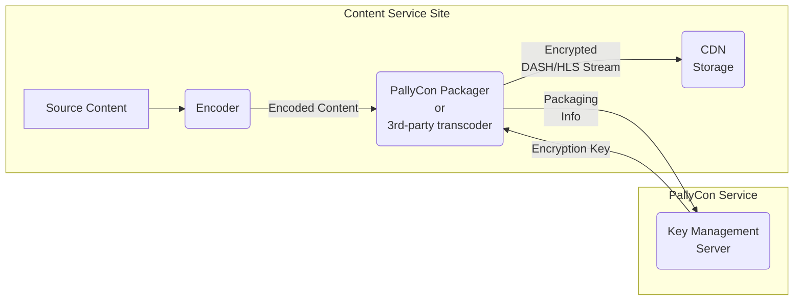

---
# Course title, summary, and position.
linktitle: 2. Content Packaging
weight: 2

# Page metadata.
title: Content Packaging
summary: Describe a variety of content packaging methods, including PallyCon Packager, AWS Elemental Media Services, Wowza Streaming Engine, and PallyCon Packaging Services.
date: "2018-09-09T00:00:00Z"
lastmod: "2020-09-16T00:00:00Z"
draft: false  # Is this a draft? true/false
toc: false  # Show table of contents? true/false
type: book  # Do not modify.

# Add menu entry to sidebar.
# - name: Declare this menu item as a parent with ID `name`.
# - weight: Position of link in menu.
menu:
  multidrm:
    parent: Multi-DRM Guide
    name: Content Packaging
    weight: 2
---

In order to apply PallyCon Multi-DRM service, you must first perform packaging processes to encrypt your contents. The below documents describe a variety of content packaging methods, including PallyCon Packager, AWS Elemental Media Services, Wowza Streaming Engine, and PallyCon Packaging Services.

  

    

      

        <h3 class="card-title">CLI Packager Guide</h3>
        
PallyCon CLI Packager is a content packager which supports command line interface of Windows and Linux. This document explains how to use the PallyCon CLI Packager.

        <a href="./cli-packager" class="btn btn-primary">Read More</a>
      

    

  

  

    

      

        <h3 class="card-title">CPIX API Guide</h3>
        
Describes how to use CPIX API that can easily integrate PallyCon Multi-DRM with encoder / transcoder solutions that support CPIX-based key exchange.

        <a href="./cpix-api" class="btn btn-primary">Read More</a>
      

    

  

  

    

      

        <h3 class="card-title">AWS Elemental Integration</h3>
        
PallyCon service supports the content packaging integration using the SPEKE API provided by AWS Elemental Media Service. This document explains how to use the API to work with AWS Elemental Media Services.

        <a href="./aws-elemental" class="btn btn-primary">Read More</a>
      

    

  

  

    

      

        <h3 class="card-title">Wowza Integration Guide</h3>
        
PallyCon Wowza SDK is a plugin module of Wowza Streaming Engine that supports streaming service with DASH (CENC) and HLS (FPS or NCG) content by packaging original MP4 video or live stream in real time. This document explains how to use the Wowza plug-in provided by the SDK.

        <a href="./wowza-integration" class="btn btn-primary">Read More</a>
      

    

  

  

    

      

        <h3 class="card-title">Bitmovin Encoder Integration Guide</h3>
        
When using Bitmovin encoding service, multi DRM packaging is possible through CPIX or SPEKE API integration with PallyCon KMS(Key Management Server). This document explains how to create DASH/HLS content with multi-DRM using examples written based on the Bitmovin Java SDK.

        <a href="./bitmovin-encoder-guide" class="btn btn-primary">Read More</a>
      

    

  

