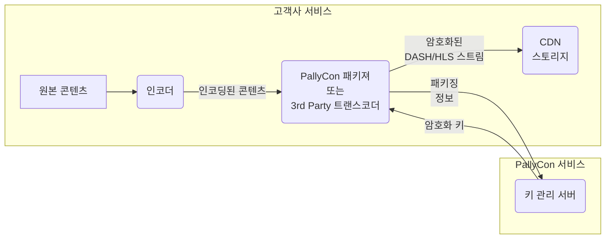

---
# Course title, summary, and position.
linktitle: 2. 콘텐츠 패키징
weight: 2

# Page metadata.
title: 콘텐츠 패키징
date: "2018-09-09T00:00:00Z"
lastmod: "2018-09-09T00:00:00Z"
draft: false  # Is this a draft? true/false
toc: false  # Show table of contents? true/false
type: book  # Do not modify.

# Add menu entry to sidebar.
# - name: Declare this menu item as a parent with ID `name`.
# - weight: Position of link in menu.
menu:
  multidrm:
    weight: 2
    parent: 멀티DRM 가이드
    name: 콘텐츠 패키징
---

PallyCon 서비스를 적용하기 위해서는 가장 먼저 콘텐츠를 암호화하는 패키징 과정을 수행해야 합니다. 아래 문서들은 PallyCon 패키져, AWS Elemental 미디어 서비스, Wowza Streaming Engine, PallyCon 패키징 서비스 등 다양한 콘텐츠 패키징 방식을 설명합니다.

  

    

      

        <h3 class="card-title">CLI 패키져 가이드</h3>
        
PallyCon CLI 패키져는 Windows와 Linux의 command line interface를 지원하는 콘텐츠 패키져입니다. 본 문서는 CLI 패키져의 사용 방법을 설명합니다.

        <a href="./cli-packager" class="btn btn-primary">바로가기</a>
      

    

  

  

    

      

        <h3 class="card-title">CPIX API 가이드</h3>
        
CPIX 기반의 키 연동을 지원하는 인코더/트랜스코더 솔루션과 PallyCon 멀티 DRM을 쉽게 연동할 수 있는 CPIX API에 대하여 설명합니다.

        <a href="./cpix-api" class="btn btn-primary">바로가기</a>
      

    

  

  

    

      

        <h3 class="card-title">AWS Elemental 연동</h3>
        
PallyCon 서비스는 AWS Elemental 미디어 서비스에서 제공하는 SPEKE API를 이용한 콘텐츠 패키징 연동을 지원합니다. 본 문서는 해당 API를 이용하여 AWS Elemental 미디어 서비스를 연동하는 방법을 설명합니다.

        <a href="./aws-elemental" class="btn btn-primary">바로가기</a>
      

    

  

  

    

      

        <h3 class="card-title">Wowza 연동 가이드</h3>
        
PallyCon Wowza 연동 SDK는 Wowza Streaming Engine의 확장 모듈로, 원본 MP4 영상 또는 라이브 스트림을 실시간으로 패키징해 DASH(CENC)와 HLS(FPS 또는 NCG) 콘텐츠로 스트리밍 서비스를 할 수 있도록 지원하는 제품입니다. 본 문서는 SDK에서 제공하는 Wowza 플러그인의 사용 방법을 설명합니다.

        <a href="./wowza-integration" class="btn btn-primary">바로가기</a>
      

    

  

  

    

      

        <h3 class="card-title">Bitmovin 인코딩 연동 가이드</h3>
        
Bitmovin 인코딩 서비스 이용 시, PallyCon KMS(Key Management Server)와의 CPIX 또는 SPEKE API 연동을 통해 멀티 DRM 패키징이 가능합니다. 본 문서는 Bitmovin Java SDK를 기반으로 작성된 예제를 이용해 멀티 DRM이 적용된 DASH/HLS 콘텐츠를 생성하는 방법을 설명합니다.

        <a href="./bitmovin-encoder-guide" class="btn btn-primary">바로가기</a>
      

    

  

