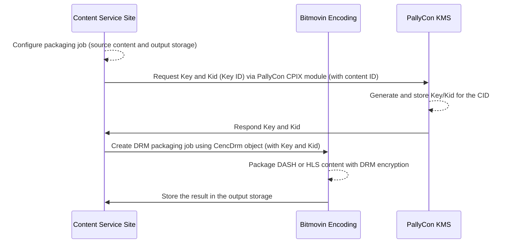
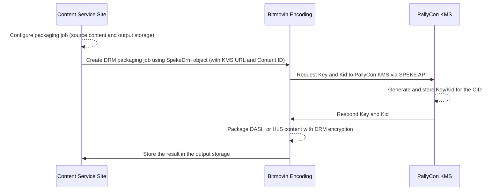

## Overview

When using [Bitmovin encoding service](https://bitmovin.com/encoding-service), multi DRM packaging is possible through [CPIX or SPEKE API integration]({}) with PallyCon KMS(Key Management Server).

This document explains how to create DASH/HLS content with multi-DRM using examples written based on the Bitmovin Java SDK.

## Requirements

- Commercial account of Bitmovin Encoding service: permission required for DRM API
- Use of [Bitmovin Encoding Java SDK](https://github.com/bitmovin/bitmovin-api-sdk-java)
- PallyCon Multi DRM service account: trial or commercial

> If you want to integrate Bitmovin encoding service in language other than Java, refer to Java example code below and use Bitmovin SPEKE API in the relevant language.

## Sample Download

You can download the Bitmovin encoding integration example (Java version) by clicking the following button.

{}Download Sample{}

## DRM Packaging Process

### Using PallyCon CPIX API



### Using Bitmovin SPEKE API



## Configurations by Integration Types

### Type 1 - Using PallyCon CPIX Module

This type of integration uses a Java library pre-combiled for PallyCon CPIX specification.

First add the below items to the environment configuration of Bitmovin.

```
//required
PALLYCON_ENC_TOKEN= {{KMS token shown on PallyCon Console site}}
//required
PALLYCON_LICENSE_URL=https://license.pallycon.com/ri/licenseManager.do
//required
CONTENT_ID= {{ unique ID of your content for the packaging }}
```

Configure the integration using the below functions in the sample source (`CencDrmContentProtectionByPallyCon.java`).

- For DASH Widevine DRM: createDrmConfigCencDash function
- For HLS FairPlay DRM: createDrmConfigFairPlay function

### Type 2 - Using Bitmovin SPEKE API

This type of integration uses SPEKE API instead of PallyCon CPIX module.

Fist add the below items to the environment configuration of Bitmovin.

```
//required
PALLYCON_KMS_URL=https://kms.pallycon.com/cpix/getKey?enc-token=
//required
PALLYCON_ENC_TOKEN= {{KMS token shown in PallyCon Console site}}
//required
CONTENT_ID= {{ unique ID of your content for the packaging }}
// FairPlay Required
DRM_FAIRPLAY_IV = {{ IV defined by PallyCon. Please contact us for it. }}
```

Configure the integration using the below functions in the sample source.

- For DASH Widevine DRM: createDrmConfigSpekeDash function
- For HLS FairPlay DRM: createDrmConfigSpekeHls function

## Note about Bitmovin Encoding Version

As of the end of February 2020, SPEKE API integration works only with the latest build of Bitmovin encoding. To do this, the versioning code is added to the `CreateEncoding` function in the sample source as shown below.

```java
encoding.setEncoderVersion("2.39.0");
```

Once the above version has been officially released and applied to the service by default, you will need to remove the above code to take advantage of the version of Bitmovin Encoding server that will be updated after 2.39.0.

## How to Run The Sample

### Linux

Execute run_example.sh with the name of the java source file(`src/main/java`) as first parameter, followed by a list of configuration parameters if needed.

```bash
run-example.sh CencDrmContentProtectionByPallyCon BITMOVIN_API_KEY=your-api-key HTTP_INPUT_HOST=my-storage.biz
```

### Windows

Execute run_example.bat with the name of the java source file as first parameter, followed by a list of configuration parameters if needed.

```bash
run-example.bat CencDrmContentProtectionByPallyCon BITMOVIN_API_KEY=your-api-key HTTP_INPUT_HOST=my-storage.biz
```

***