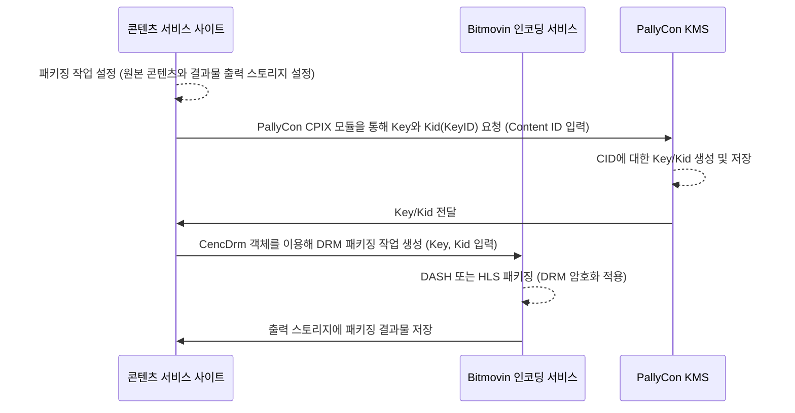
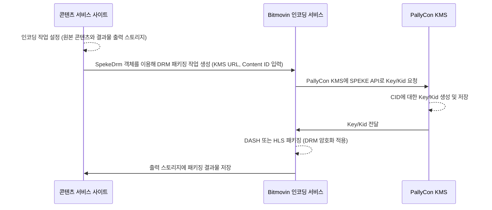

## 개요

[Bitmovin 인코딩 서비스](https://bitmovin.com/encoding-service) 이용 시, PallyCon KMS(Key Management Server)와의 [CPIX 또는 SPEKE API 연동]({})을 통해 멀티 DRM 패키징이 가능합니다.

본 문서는 Bitmovin Java SDK를 기반으로 작성된 예제를 이용해 멀티 DRM이 적용된 DASH/HLS 콘텐츠를 생성하는 방법을 설명합니다.

## 요구사항

- Bitmovin 인코딩 서비스 상용 계정: DRM 연동 API 권한 필요
- [Bitmovin 인코딩 Java SDK](https://github.com/bitmovin/bitmovin-api-sdk-java) 사용
- PallyCon 멀티 DRM 서비스 계정: 트라이얼 또는 상용 계정

> Java 이외의 언어로 Bitmovin 인코딩 서비스를 연동하고자 하는 경우, 아래 Java 예제 코드를 참고해 해당 언어로 Bitmovin SPEKE API를 이용하면 연동이 가능합니다.

## 연동 예제 다운로드

다음 버튼을 클릭해 Bitmovin 인코딩 연동 예제(Java 버전)를 다운로드할 수 있습니다.

{}예제  다운로드{}

## DRM 패키징 프로세스

### PallyCon CPIX API 연동 시



### Bitmovin SPEKE API 연동 시



## 방식 별 연동 설정

### 연동 방식 1 - PallyCon CPIX Module 사용

이 방식은 PallyCon에서 빌드한 Java 라이브러리 형태의 CPIX 모듈을 사용합니다.

먼저 Bitmovin 환경 구성에 아래 항목을 추가합니다.

```
//required
PALLYCON_ENC_TOKEN= {{PallyCon Console 에서 발급받은 kms 토큰}}
//required
PALLYCON_LICENSE_URL=https://license.pallycon.com/ri/licenseManager.do
//required
CONTENT_ID= {{ 패키징할 콘텐츠의 고유 ID }}
```

샘플 소스(`CencDrmContentProtectionByPallyCon.java`)의 아래 함수들을 사용하여 연동을 설정합니다.

- DASH Widevine DRM: createDrmConfigCencDash 함수 사용  
- HLS FairPlay DRM: createDrmConfigFairPlay 함수 사용 

### 연동 방식 2 - Bitmovin SPEKE API 사용

이 방식은 PallyCon CPIX 모듈 대신 아래와 같은 SPEKE API를 사용합니다.

먼저 Bitmovin 환경 구성에 아래 항목을 추가합니다.

```
//required
PALLYCON_KMS_URL=https://kms.pallycon.com/cpix/getKey?enc-token=
//required
PALLYCON_ENC_TOKEN= {{PallyCon Console 에서 발급받은 kms 토큰}}
//required
CONTENT_ID= {{ 패키징할 콘텐츠의 고유 ID }}
// FairPlay Required
DRM_FAIRPLAY_IV = {{ PallyCon에서 정의한 IV값. 별도 문의로 요청 필요. }} 
```

샘플 소스의 아래 함수들을 사용하여 연동을 설정합니다.

- DASH Widevine DRM: createDrmConfigSpekeDash 함수 사용
- HLS FairPlay DRM: createDrmConfigSpekeHls 함수 사용

## Bitmovin 인코딩 버전 관련 유의사항

2020년 2월말 현재, SPEKE API 연동은 Bitmovin 인코딩 최신 빌드 버전에서만 정상 동작합니다. 이를 위해 샘플 소스의 `CreateEncoding` 함수에 아래와 같이 버전 설정 코드가 추가되어 있습니다.

```java
encoding.setEncoderVersion("2.39.0");
```

위 버전이 공식 릴리즈되어 서비스에 기본 적용된 후에는, 위 코드를 제거해야 2.39.0 버전 이후로 업데이트되는 Bitmovin 인코딩 서버 버전을 이용할 수 있습니다.

## 예제 실행 방법

### Linux

`src/main/java` 폴더의 java 소스 파일을 첫번째 매개 변수로 입력하여 아래와 같이 `run_example.sh` 파일을 실행합니다.

```bash
run-example.sh CencDrmContentProtectionByPallyCon BITMOVIN_API_KEY=your-api-key HTTP_INPUT_HOST=my-storage.biz
```

### Windows

`src/main/java` 폴더의 java 소스 파일을 첫번째 매개 변수로 입력하여 아래와 같이 `run_example.bat` 파일을 실행합니다.

```bash
run-example.bat CencDrmContentProtectionByPallyCon BITMOVIN_API_KEY=your-api-key HTTP_INPUT_HOST=my-storage.biz
```
